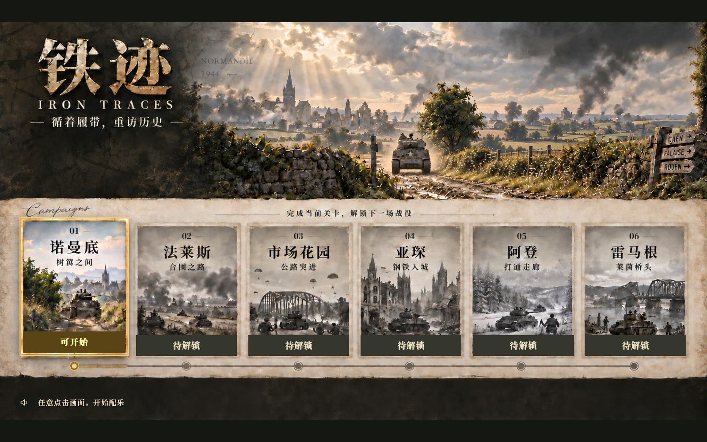
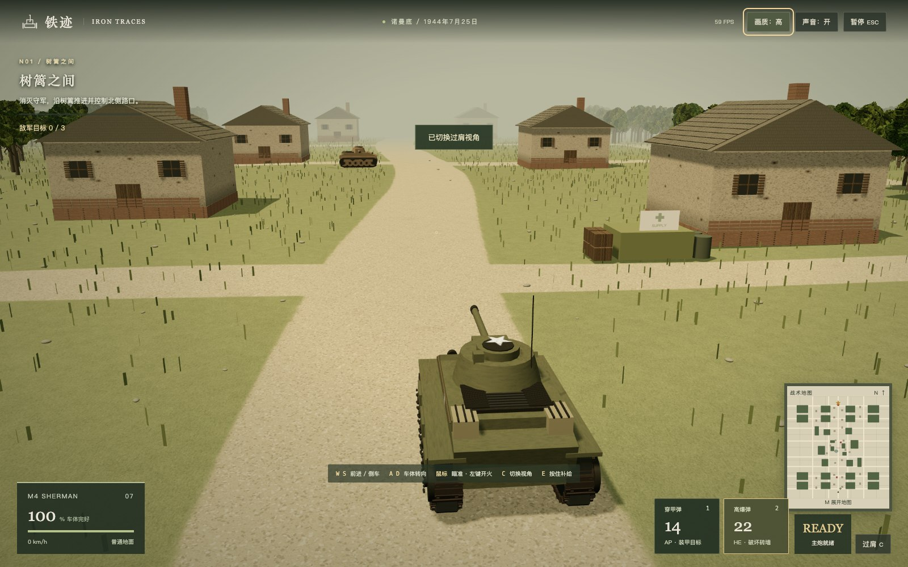
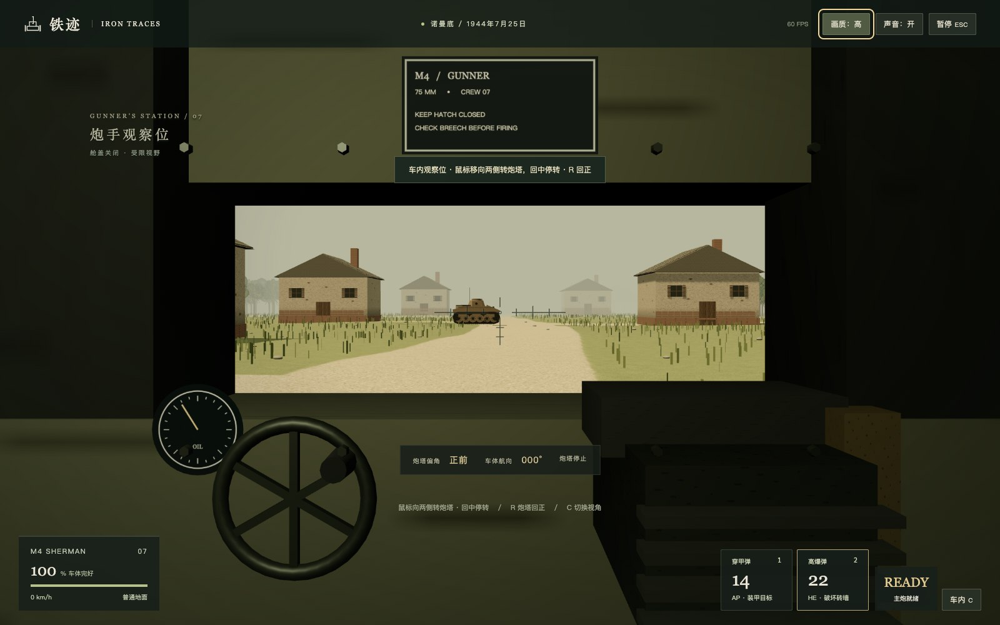
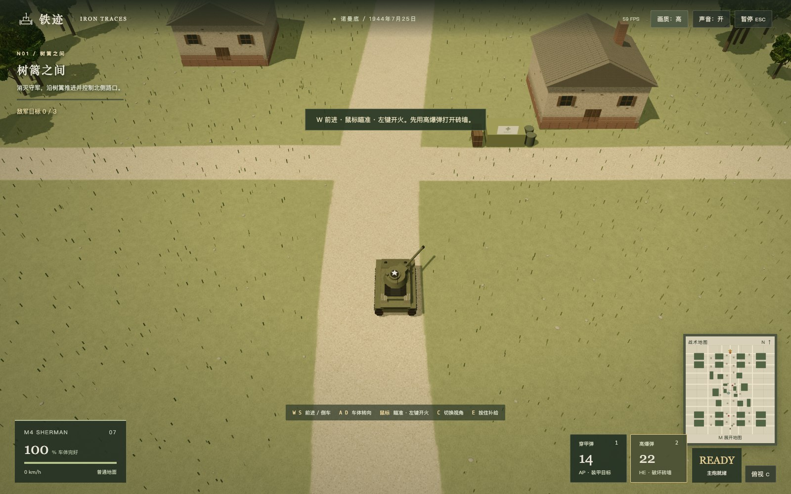
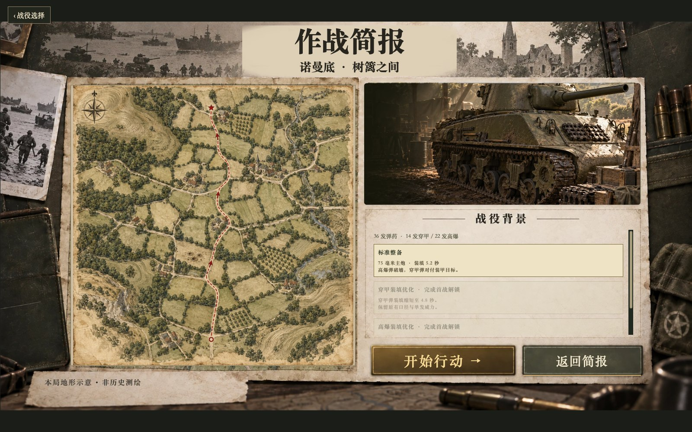
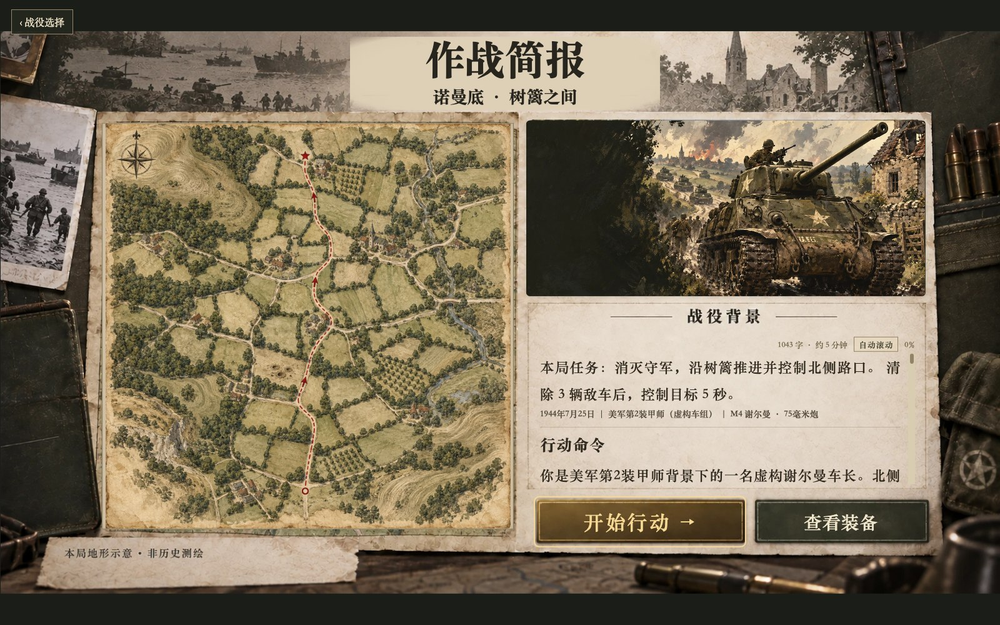
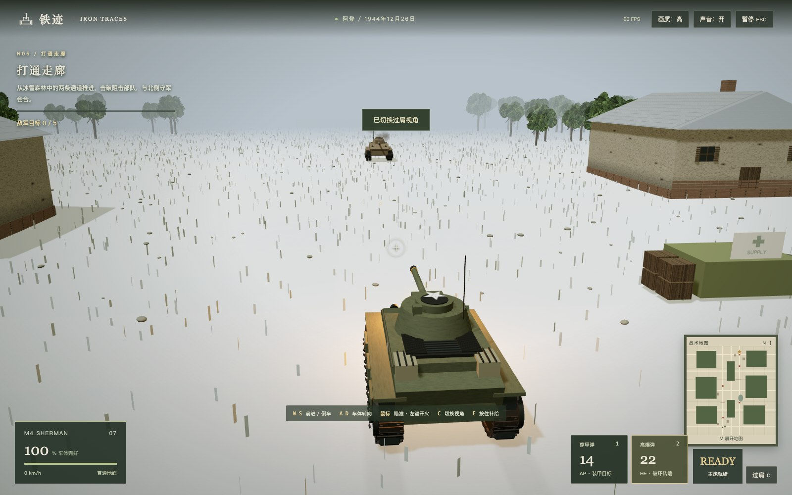
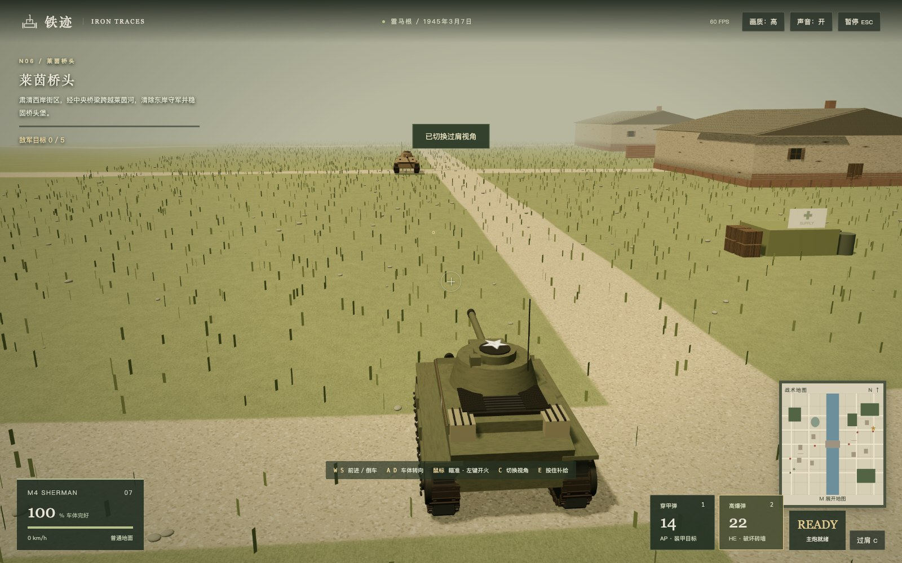

<div align="center">

# 铁迹 · IRON TRACES

### 炮弹已经出膛。接下来的五秒，你躲在哪里？

**[立即开战 · Web 版](https://iron-traces.zixin.uk/)　｜　[备用入口](https://iron-traces.pages.dev/)**

浏览器里的二战坦克战役 · 单人闯关 · 三种视角 · 戴上耳机更带感

</div>



你刚把谢尔曼开过村口，远处的敌车已经转过炮塔。开炮，倒车，退回房屋后面。装填条还在走，耳机里那阵发动机声却越来越近。你可以绕出去抢一个射击角度，也可以用高爆弹轰开挡路的砖墙。最让人攥紧鼠标的，是炮弹打空以后，你发现自己还停在路中央。

**《铁迹》把“坦克大战”的痛快，放进了一场需要看地形、听动静、把握开火时机的 3D 战斗里。** 不用下载客户端，打开网页就能出发。从诺曼底的乡间路口一路打到莱茵河畔，清除守军，控制目标，把下一场战役亲手解锁。想先试试手感？进入第一关，踩下油门。

## 关上舱盖，战场突然变了

俯视时，你能看清道路和掩体，挑选推进路线。按一次 **C**，镜头落到坦克身后，车体占住画面下方，敌车就在前方的村屋之间。再按一次，你坐进车内观察位：视野缩成一扇窗口，侧面的情况得转过去看，地图也不再替你标出敌车。

同一条路，三种走法。喜欢掌控全局，就从上方寻找机会；想把一场遭遇战打得手心冒汗，就试着在车内完成它。





## 这一炮很爽，下一炮要等

主炮有装填时间，弹药也有数量。穿甲弹留给装甲目标，高爆弹用来拆掉砖墙；打完一炮，是继续追上去，还是先找个地方让装填条走完？通关后可以解锁装填优化，出发前在整备页选择升级。战场上的补给点能帮你重新站稳脚跟，前提是你得先把坦克开过去。

地形会让冒进付出代价。沼泽拖住速度，树林挡住车体，房屋切断视线。砖墙却可以打掉：路被堵住时，主炮也能替你开路。驶过的地面会留下履带痕迹，命中会迸出火花，受损车辆逐渐冒烟、起火。敌车开始燃烧的那一刻，你会很想立刻去找下一个目标。先看一眼自己的弹药。





## 戴上耳机，别只盯着准星

远处的发动机是一团低沉的轰鸣，靠近后，机械细节才逐渐清楚。炮声有方向，墙后的声音会变闷，切进车内也能听到隔音带来的变化。你自己的谢尔曼与敌车使用不同的发动机录音：玩家音源取自谢尔曼实录，敌车目前共用 Tiger 131 虎式实录剪成的循环。

首页则把节奏慢下来。坦克在动态封面中驶近，贝多芬《第七交响曲》第二乐章响起，你可以先翻开下一份简报，再决定什么时候出发。浏览器首次进入时，点击画面即可开始配乐，左下角可以静音。

## 战役背景：从诺曼底到莱茵河

1944年夏，纳粹德国仍占据着西欧大片土地。6月6日，盟军在诺曼底登陆，从法国北部开辟新的进攻方向。但登上海滩只是开始：通往内陆的道路、村庄和桥梁仍需要逐一夺取。《铁迹》的六场战役，取材于此后西线从法国向德国推进的历程。它们之间有突破与追击，也有受挫、围困和代价沉重的反攻。游戏把这段历史中的局部任务交到你手里；真实战场上，完成这些任务依靠的是许多部队的共同作战。

**诺曼底 · 1944年夏。** 登陆后的战斗很快深入乡间。树篱、土堤和村屋把视线切成碎片，装甲部队难以自由展开。英军、加拿大军队在卡昂方向作战，美军则在西侧寻找突破机会。7月底的“眼镜蛇行动”推动美军突破德军防线，战局逐渐转向大范围机动。第一关选取的，正是这种从狭窄道路向前打开缺口的处境：路口拿不下来，后面的车辆就无法顺利通过。[历史资料：加拿大退伍军人事务部](https://veterans.gc.ca/en/remembrance/military-history/second-world-war/d-day-and-battle-normandy)

**法莱斯 · 1944年8月。** 随着盟军向南突破再转向包围，德军在法莱斯一带陷入险境。加拿大、波兰、美国及其他盟军部队参与压缩包围圈，德军则试图从尚未封闭的缺口撤出。大量人员和装备在战斗中损失，但仍有部队逃脱。这里的争夺关系到撤退通道能否维持，也关系到德军还能带走多少力量继续抵抗。游戏中的“合围之路”，由这一背景改编。[历史资料：诺曼底战役](https://veterans.gc.ca/en/remembrance/military-history/second-world-war/d-day-and-battle-normandy)

**市场花园 · 1944年9月。** 盟军希望通过荷兰的一连串桥梁快速北进，在阿纳姆跨过下莱茵河。空降兵先夺桥，地面部队沿公路接应；这项计划把前方守桥部队的命运，与后方纵队的推进速度紧紧连在一起。道路拥堵、德军抵抗和接应延误使行动受挫，最终未能达成阿纳姆渡河目标。游戏里的公路突进取材于这场接应作战；玩家通关不代表历史上的整场行动取得成功。[历史资料：英国国家陆军博物馆](https://www.nam.ac.uk/explore/market-garden)

**亚琛 · 1944年秋。** 战线来到德国边境，盟军面对齐格菲防线和更加艰难的推进。亚琛的争夺把战斗带进城区，街道、建筑与防御阵地让装甲车辆必须谨慎行动。夺下一段街道，并不意味着附近的抵抗已经消失。游戏以城区推进呈现这一阶段的压力：前进距离可能不长，暴露车体的位置却会决定你能否继续向前。[历史资料：美国陆军历史中心《齐格菲防线战役》](https://history.army.mil/Publications/Publications-Catalog/Siegfried-Line-Campaign/)

**阿登 · 1944年12月。** 德军于12月16日在阿登发动大规模反攻，试图突破盟军战线。冬季的森林和道路再次成为争夺焦点，巴斯托涅这一交通枢纽被围，守军与援军需要打通联系。游戏把任务放在解除围困的背景下：沿道路击破阻击，与北侧守军会合。那条走廊意味着增援、弹药和伤员运输终于有路可走，而反攻中的其他战斗仍在继续。[历史资料：美国陆军历史中心 · 阿登—阿尔萨斯战役](https://history.army.mil/Research/Reference-Topics/Army-Campaigns/Brief-Summaries/World-War-II/World-War-II-European-African-Middle-Eastern-Theater/)

**雷马根 · 1945年3月。** 莱茵河是盟军进入德国腹地必须面对的重要障碍。3月7日，美军第9装甲师在雷马根夺取仍然屹立的鲁登道夫桥，获得了在东岸建立桥头堡的机会。随后，抢修、架桥和持续输送部队与夺桥本身一样关键。最后一关围绕渡河与巩固桥头展开：冲过桥面之后，还得守住出口，让后续部队跟上。[历史资料：美国陆军工兵部队](https://www.usace.army.mil/Media/Fact-Sheets/Fact-Sheets-View/Article/4466425/135-battle-of-the-remagen-bridgehead/)

六关按历史时间排列，但不代表同一辆谢尔曼、同一个车组真实参加了全部战役。游戏使用虚构车组与简化的局部地图，让你在出发前了解战局，再亲手面对一次推进、一次接应或一次渡河的选择。







**[轮到你了。进入第一关 →](https://iron-traces.zixin.uk/)**

## 上手就开

推荐使用带键鼠、支持 WebGL 2 的桌面浏览器。**W / S** 前进与倒车，**A / D** 转动车体，鼠标瞄准、左键开炮。**1 / 2** 切换穿甲弹与高爆弹，**C** 切换视角，**E** 按住补给，**M** 展开地图，**Esc** 暂停。车内视角下把鼠标移向两侧转动炮塔，按 **R** 回正。画质可在流畅、标准和高之间切换。

当前是持续迭代的单人 Web 版本。以上图片均为游戏运行截图；首页、简报与整备页内使用生成插画及生成视频，战斗场景由 Three.js 实时渲染。后两关截图在独立演示存档中解锁拍摄，正常游玩需依次通关。

## 在本地运行

项目使用 Three.js、TypeScript 和 Vite。需要 Node.js 20.19+。

```sh
cd iron-traces
npm ci
npm run dev
```

打开 http://127.0.0.1:8874/ 。`npm run build` 构建，`npm test` 运行测试，`npm run preview` 预览静态产物。

游戏代码与素材在 [`iron-traces/`](iron-traces/)，完整设计计划、原型与参考资料在 [`tank-battle-design/`](tank-battle-design/)。运行时素材已随项目打包，游玩不需要 OpenRouter 或其他模型密钥；重新生成视频素材时才需要相应服务的凭证。

<details>
<summary>Cloudflare 部署</summary>

使用 Pages 直接上传，未配置 GitHub 自动部署。

```sh
cd iron-traces
npm ci
npm run build
npx wrangler@4.86.0 pages deploy dist --project-name iron-traces --branch main
```

部署需要对应 Cloudflare 账户权限。自定义域名为 `iron-traces.zixin.uk`，原入口 `iron-traces.pages.dev` 保留。

</details>

## 历史与素材

本作以真实战役为背景，局部地图、敌情、虚构车组及胜利规则为游戏改编，不是历史交战的精确复刻。简报插画不是历史照片，车型音效也尚未逐一匹配所有敌车。

第三方素材沿用各自许可，详见[音频署名](iron-traces/public/audio/CREDITS.md)与[素材来源](iron-traces/docs/asset-sources/)。仓库公开不代表所有素材均为公有领域；项目原创代码尚未另外授予开源许可。
