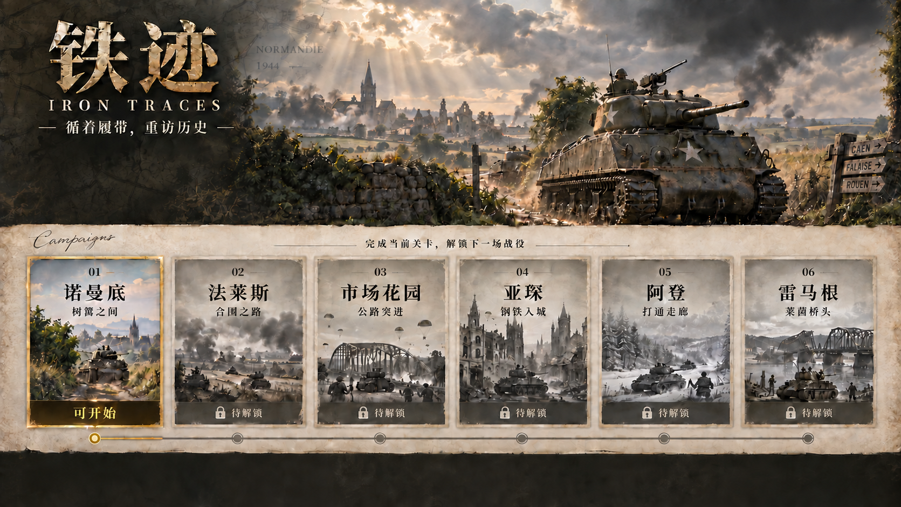

# 铁迹 · Iron Traces

在线试玩：https://iron-traces.pages.dev/

基于 Three.js、TypeScript 和 Vite 的二战背景坦克游戏，附完整设计文档与生成素材。



## 运行

需要 Node.js 20.19+ 和支持 WebGL 2 的桌面浏览器。

```sh
cd iron-traces
npm ci
npm run dev
```

打开 http://127.0.0.1:8874/ 。构建：`npm run build`；验证：`npm test`；静态预览：`npm run preview`。

## 内容

- 六关：诺曼底、法莱斯、市场花园、亚琛、阿登、雷马根，通关后依次解锁。
- 512 × 512 米战场、俯视 / 过肩 / 车内视角，弹药与装填升级。
- 沼泽、树林、可破坏墙体、桥梁，履带痕迹、受损烟火、方向音效。
- 手绘地图风格简报、历史来源、车组与任务说明。
- H3 生成的 15 秒 2K 首页视频、贝多芬第七交响曲第二乐章录音配乐。

W/S 行驶，A/D 转向，鼠标瞄准与射击，1/2 切换弹种，C 切换视角，E 补给，M 地图，Esc 暂停。浏览器可能要求点击画面后才允许有声配乐播放。

## 文件

- `iron-traces/`：可运行游戏、测试、素材和验证记录。
- `tank-battle-design/`：完整设计计划、原型、参考资料及打包版本。

素材均已本地打包，运行游戏不需要 OpenRouter 或其他模型密钥。视频生成脚本只在重新生成素材时需要单独的 API 凭证。

## 历史与许可

这是历史背景下的游戏改编，地图、敌情、车组和胜利规则并非真实交战复刻。生成图片不是历史照片。

第三方音频等素材沿用各自许可，详见 [音频署名](iron-traces/public/audio/CREDITS.md) 和 [素材资料](iron-traces/docs/asset-sources/)。本仓库公开不等同于所有素材均为公有领域；未另外授予项目原创代码的开源许可。

## Cloudflare 部署

本次使用 Pages 直接上传，未配置 GitHub 自动部署。

```sh
cd iron-traces
npm ci
npm run build
npx wrangler@4.86.0 pages deploy dist --project-name iron-traces --branch main
```

部署需要具备对应 Cloudflare 账户权限的本机登录。
