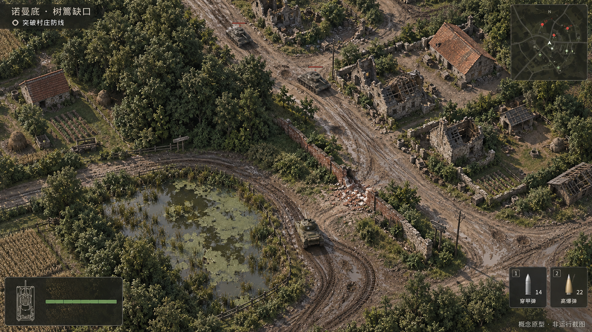
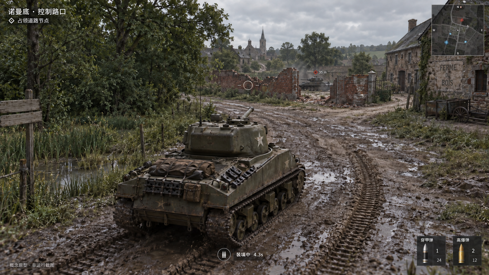
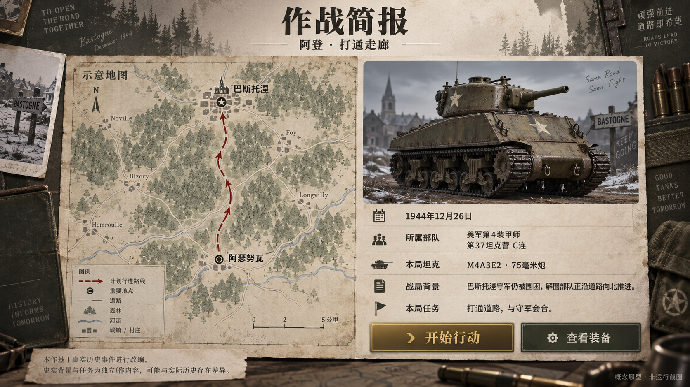
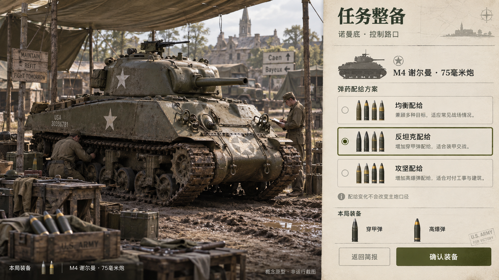
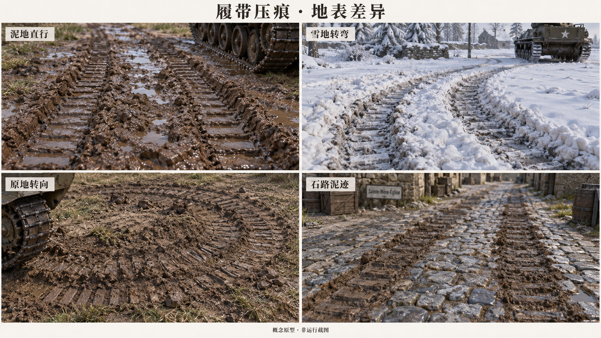

# 钢铁防线：二战坦克战役

## 完整设计与实施计划

版本：设计基线 1.0。交付日期：2026 年 9 月 10 日。

这份文档将用户逐步确认的要求扩展为可讨论、可实施、可验收的设计基线。交付物是设计说明与生成的概念原型，游戏程序尚未制作；文中的性能数字、平衡数值、地图尺寸与时间节奏均是实施起点，不能理解为已经完成的测量。历史背景、游戏改编和测试结果是三种不同信息，全文分别表达。文末的质量检查仅针对本次文档和图片，不代表未来游戏已经通过验收。

用户要求的核心体验贯穿全书：电脑浏览器中的写实坦克作战；俯视与过肩两种视角；三个二战战役、六场有不同目标的任务；每局交代时局、部队、车型和行动缘由；任务之间调整武器与弹药配置；沼泽减速、密林阻挡、墙体可破坏；敌我坦克都会在地面留下符合履带运动的痕迹；声音不仅提供氛围，也帮助玩家理解驾驶、命中与威胁。

### 如何使用这份文档

如果关注游戏是否符合想象，先看原型图，再阅读第 01、04、05 至 10、21、23、25 章。这条路径覆盖玩家体验、每局简报、完整关卡、履带压痕、声音与界面。概念图采用 ImageGen 生成，用于检查构图、信息层级和战场观感。图中出现的地形比例、车型细节、文字、标识和轨迹都需要在正式资产制作时重新核对，不能因为画面逼真就视为通过军史或物理验证。

如果准备开始开发，先阅读第 27、28 章，再按模块阅读具体章节。应先实现一个同时包含两种视角、三种地形、一次墙体破坏、一段履带痕迹与一组声音反馈的代表场景，通过后再扩成六局。先写全部剧情、堆满所有资产、最后补控制和碰撞，会让最重要的体验问题发现得过晚。相反，代表场景必须从第一天就允许实际驾驶、瞄准、开炮、看见通路变化并重新开始，才能判断计划中的规则是否真正形成游戏。

如果负责历史、文案或资产审核，先阅读第 02、03、04、11、19 章与文末来源。审核重点不是给每一段游戏任务寻找一场完全相同的历史事件，而是防止把设计出来的事件写成史实。具体部队的行动、坦克型号的年代、口径和可用弹种有各自的证据链；“该车存在于这一时期”不等于“该车确实在这条道路上完成了文中全部动作”。剧情采用真实历史背景下的合成车组和局部任务，让这种边界在玩家进入战场前就能被理解。

### 已确认的范围

本版以单人坦克操控为中心，不新增步兵职业、多人联机、账号经济、开放世界或现代武器。友军、后勤与其他兵种可以作为环境叙事、任务对象或受控背景单位出现，但不会将坦克游戏扩成完整军队指挥模拟。不会把六场任务解释为一个车组横跨东线和西线的旅行，也不会让库存、勋章或升级无说明地穿越不同军队的后勤体系。

设备范围是电脑浏览器，键盘和鼠标优先。原型阅读页可以在窄窗口阅读，但这不等于已经承诺手机游戏操控。普通和低两档画质覆盖首版调优，不用一个未经验证的“超高画质”开关替代实际性能管理。所有画质等级都应保留关键地形、弹道结果、敌我标识和任务提示；允许减少的是表现精度、远处细节和非关键粒子，而不是玩家做判断所需的信息。

游戏采用任务间整备。武器成长不是凭空给旧炮增加伤害，而是让玩家在符合时代和任务需要的装备、配给及准备程度之间选择。加强装甲和加强炮火是不同变化，界面不得用一个笼统的“升级”箭头掩盖。无法核实的弹药型号不进入玩家文案；已有可信型号也不能为了平衡随意改称历史数据。凡由游戏设计赋予的装填时间、命中容差和生命值，都属于游戏标定。

本次输出完整 Markdown、带目录的本地阅读版以及五张原型图片。遵照用户最新要求，不导出 PDF。本次不部署公开网站、不生成可游玩的游戏，也不调用需要额外购买的声音或模型服务。以后实施游戏时，免费素材的下载、归档和授权仍需单独核对；史料网站的访问许可并不自动赋予其照片、徽章和录音的再分发权。

### 统一阅读约定

“史实”指已由列出的来源支持的信息；“改编”指为单人关卡设计的压缩地图、合成车组、触发事件或胜负规则；“设计初值”指供第一轮实现使用的数字；“待实测”指必须通过未来真实运行才能下结论的项目。读者看到“应当”“目标”“验收时”时，应将其理解为后续工作要求，而不是本轮已经发生的事实。

章节按主责划分：关卡章决定该局发生什么，战斗章决定炮火如何计算，仿真章决定状态何时变化，地表章决定环境怎样反馈，声音和界面章决定玩家如何接收信息，实施章决定如何验证。后续修订某项规则时，必须检查它所影响的其他界面和数据，不能只修改文案。例如，把一场任务的坦克换成另一型号后，简报模型、炮口位置、装甲规则、弹药库存、装填提示、音效匹配以及测试预期都需要同步，单改名称并不构成一次有效换装。

### 原型图阅读索引

P01 检查俯视战斗的地形辨识、炮战距离和主要界面位置；P02 检查过肩视角的驾驶空间、近景履带痕迹和墙体缺口；P03 检查简报能否让玩家理解日期、部队、本车与任务；P04 检查任务间整备能否区分配给选择与真实武器变化；P05 检查泥地、雪地、原地转向和石路上的压痕是否具有不同的材料逻辑。所有图片均为概念原型，不是运行截图。图片旁的审阅说明会指出应保留的方向和正式实现需要修正的细节。

> 篇幅核验：30 章正文按保守口径统计为 **101,343 个汉字**；标题、表格、来源列表、代码、目录、原型图说明及重复长段落不计入此数。详细记录见 [字数与结构检查](qa/字数与结构检查.json)。

## 正文章节目录

- [第01章 产品愿景与体验边界](#第01章-产品愿景与体验边界)
- [第02章 历史改编方法、资料层级与史实一致性](#第02章-历史改编方法资料层级与史实一致性)
- [第03章 每局背景、所属军队与车组身份的叙事结构](#第03章-每局背景所属军队与车组身份的叙事结构)
- [第04章 作战简报的信息设计、文案与完整流程](#第04章-作战简报的信息设计文案与完整流程)
- [第05章 K01：库尔斯克南线·守住通路](#第05章-k01库尔斯克南线守住通路)
- [第06章 K02：库尔斯克南线·局部反击](#第06章-k02库尔斯克南线局部反击)
- [第07章 N01：诺曼底·树篱缺口](#第07章-n01诺曼底树篱缺口)
- [第08章 N02：诺曼底·控制路口](#第08章-n02诺曼底控制路口)
- [第09章 A01：阿登·补给路口](#第09章-a01阿登补给路口)
- [第10章 A02：阿登·打通走廊](#第10章-a02阿登打通走廊)
- [第11章 坦克车型、车组身份与可感知的车辆特性](#第11章-坦克车型车组身份与可感知的车辆特性)
- [第12章 武器、弹种、装甲与命中反馈](#第12章-武器弹种装甲与命中反馈)
- [第13章 任务间换装、补给维修与成长节奏](#第13章-任务间换装补给维修与成长节奏)
- [第14章 敌我平衡、难度与玩家学习](#第14章-敌我平衡难度与玩家学习)
- [第15章 驾驶输入与车辆运动](#第15章-驾驶输入与车辆运动)
- [第16章 敌人感知、寻路与攻击决策](#第16章-敌人感知寻路与攻击决策)
- [第17章 任务状态机、重试与进度保存](#第17章-任务状态机重试与进度保存)
- [第18章 战场系统协作、异常恢复与运行公平性](#第18章-战场系统协作异常恢复与运行公平性)
- [第19章 战场空间、写实美术与资产制作要求](#第19章-战场空间写实美术与资产制作要求)
- [第20章 沼泽、密林、可破坏墙与统一地表模型](#第20章-沼泽密林可破坏墙与统一地表模型)
- [第21章 双履带压痕的完整设计](#第21章-双履带压痕的完整设计)
- [第22章 双视角、瞄准、遮挡与画面可读性](#第22章-双视角瞄准遮挡与画面可读性)
- [第23章 音效设计与战场声音矩阵](#第23章-音效设计与战场声音矩阵)
- [第24章 空间声音、混音、资源与听测](#第24章-空间声音混音资源与听测)
- [第25章 全流程游戏界面与中文文案](#第25章-全流程游戏界面与中文文案)
- [第26章 可访问性、设置、提示与体验验证](#第26章-可访问性设置提示与体验验证)
- [第27章 项目架构、数据契约与资产管理](#第27章-项目架构数据契约与资产管理)
- [第28章 分阶段执行路线与可验收门槛](#第28章-分阶段执行路线与可验收门槛)
- [第29章 测试计划与代表性验收用例](#第29章-测试计划与代表性验收用例)
- [第30章 性能预算、质量审查与交付追踪](#第30章-性能预算质量审查与交付追踪)

## 第01章 产品愿景与体验边界

### 1.1 玩家应当获得的核心体验

这款游戏让玩家在一辆坦克的尺度上理解一段战役：先知道自己为何来到这里，再判断这辆车适合怎样作战，最后通过移动、观察、射击和保持通路完成一项有明确意义的任务。历史背景不是加载画面的装饰，坦克参数也不是独立的百科条目。两者必须在一局之内形成可感知的关系。玩家在简报中读到后方通路必须保持开放，进入战场后就应看见这条路如何连接阵地与补给位置，并在敌军试图切断它时明白自己为什么需要调转炮塔。

产品的主要乐趣来自连续的小判断。面前是一段能够打穿的墙，侧面是一片能够通过却会减速的湿地，远处还有一条已经暴露的道路；玩家要在通行时间、暴露方向和剩余弹药之间取舍。成功之后，地面留下的履带轨迹能帮助玩家看懂自己刚才的选择。这种因果比单纯提高爆炸规模更重要：墙被摧毁后确实出现通道，沼泽减速确实改变脱离危险所需的时间，车身侧面暴露确实带来不同的受击风险。

第一版不要求玩家先掌握复杂装甲理论。玩家可以凭直觉开始操作，同时逐渐发现车辆、地形和目标之间的联系。解释应当出现在能够帮助下一步行动的位置，例如本车介绍说明“正面接敌时仍需寻找遮蔽，换位时尤其注意侧面”，首次战斗再用能够观察到的结果建立理解。游戏不把历史知识测验设置为进入战场的门槛，也不以背诵数据替代驾驶与战斗的学习。

### 1.2 目标用户与进入门槛

主要用户是能够使用电脑键鼠、愿意尝试坦克战斗、但未必熟悉二战编制和车型命名的普通玩家。军事爱好者应能从年代、部队背景、车型外观和来源说明中获得可信感；初次接触这一题材的人则应能迅速回答三个问题：我属于哪一方，我这辆坦克最需要注意什么，我现在要去哪里。文案和界面的优先级以这三个问题为基准，不能因为资料丰富就把完整编制表堆在首次进入画面上。

游戏在浏览器中运行，因此进入过程应当尊重轻量体验。首次打开可以先看到标题、三战役入口与简短操作说明，资源加载期间保留可读的任务背景。玩家开始一局前不需要注册账号，也不需要加入房间。音频需要用户交互后启用的浏览器限制，应通过“开始行动”这一自然操作解决，而不是增加一页技术授权说明。若声音尚不可用，文字提示和可视反馈仍须足以完成任务。

军事术语在第一次出现时附带行动解释。例如“炮塔转向”后面说明炮管能够独立于车身转动，“穿甲弹”后面说明用于对付装甲目标。后续界面使用短称，避免每次装填都重复教学。专业玩家可以直接关闭操作提示，但历史背景与本车身份仍保留入口，因为它们属于每局内容，而非仅供新手阅读的教程。难度设计、具体装甲模型和射击数值由后续章节负责，本章只确定阅读负担不能代替战斗难度。

### 1.3 一局的完整体验弧线

一局从作战简报开始，以任务结果和下一阶段变化结束。简报阶段帮助玩家建立目标、地理关系与车辆认知；进入战场后先给出能够辨认的出发区域，再让第一项威胁验证这些信息。玩家不应刚结束阅读就出现在无掩护交火中心，因为这会迫使他立即应付操作，却无法把刚获得的背景与空间联系起来。出发区域的安全程度由关卡安排，但从简报到控制车辆的方向感必须连续。

中段应出现需要重新判断路线或优先级的变化。例如原本用于推进的缺口开始遭到火力封锁，玩家可以倒回墙后、观察另一侧道路，或者利用自己先前打出的通路转移。变化必须由敌情、目标状态或环境的可观察反馈引起，不能只在任务列表上无声增加一条命令。需要紧急处理的事情同时用空间标记、短文字和提示声表达；玩家处于任一视角，都应能理解“发生了什么”和“应关注哪里”。

结束阶段先告诉玩家实际结果，再提供统计。守住通路意味着相应目标仍保持可用，控制路口意味着交战条件已经满足，失败则指出哪一个任务条件被破坏。击毁数量可以成为复盘材料，却不能自动覆盖任务成败。一个玩家可能击毁较少车辆，却通过及时回防完成目标；结算应当承认这种行动价值。下一局介绍承接经过确认的结果，不将可重复游玩的失败记录写成战役历史，也不把一次重试解释成角色在世界中复活。

### 1.4 写实感的取舍顺序

本项目的写实首先体现在空间、材质、年代和行为的可信关系。坦克有体积与惯性倾向，炮塔和车身的动作能够区分，开炮和装填具有清晰先后，泥雪与硬路面对行驶留下不同痕迹。视觉效果应服务这些关系，而不是追求看起来复杂却不影响理解的细节。远景中的一个型号正确、轮廓稳定的坦克，比堆满细小附件却难以识别方向的车辆更有用。

第二层是历史语境的可信。库尔斯克的玩家身份、诺曼底的部队背景、阿登解围部队所在的方向必须一致；不同年份的装备不能因为“升级后更厉害”而随意混入同一局。第三层才是战术模拟深度。第一版允许把真实世界中极为复杂的装甲、观察、通信和维修过程压缩为可读规则，但每项压缩都应有稳定表现，并在车辆介绍或玩法说明中明确属于游戏规则。

当写实表现与可读性发生冲突，首先保留决定行动所需的信息，再降低无关细节。例如树冠遮住玩家坦克时，可以局部淡化遮挡，但不应因此把树林的不可通行边界也隐藏掉；过肩视角需要收近镜头避开墙体时，准星和炮管方向仍须保持可理解。此类调整不是取消写实目标，而是让玩家能够通过画面理解同一套战场关系。具体渲染与镜头方案在后续章节展开。

### 1.5 两种视角属于同一场战斗

俯视和过肩视角为同一车辆、同一战场状态提供不同观察方式。俯视帮助玩家规划线路、理解敌我相对位置和观察障碍变化；过肩帮助玩家感受车体重量、炮塔转向、局部遮蔽和近地行驶。视角切换不改变弹种、装填进度、敌军位置或车辆碰撞规则，也不产生短暂无敌。玩家应当能够在俯视中决定绕到一段墙后，再切到过肩确认炮管已经越过墙角，而不是重新学习另一套战斗系统。

两种视角的信息量可以不同，但任务权利应相同。过肩视角看不到身后道路，因此小地图和据点受袭提示需要补足方向；俯视视角能够看见更多地表，却不应无条件显示隐藏敌人的完整位置。两种视角都使用相同的敌情公开规则，只是表达方式不同。否则切换视角会退化为获取全知信息的按钮，玩家也会把镜头当作规则漏洞，而不是观察工具。

原型评审必须分别观察两种视角下的完整小段体验。只展示漂亮过肩截图无法证明路线可读，也不能证明俯视时车辆不会被树冠掩盖；只展示俯视运行则无法证明近景地面、履带压痕和镜头避障成立。本文所配生成图用来确定气氛、构图和信息层级，必须注明“概念原型，非运行截图”。它们不承担性能、操作手感或碰撞正确性的证据作用。

### 1.6 成长与战役转换的边界

任务间的换装升级让玩家在两场相连任务之间形成准备与回报。升级的意义是获得一种能够应对下一阶段问题的装备选择，而不是在战斗中拾取星星后让坦克突然改变年代。整备阶段解释新配给适合的目标和需要牺牲的条件，作战简报再显示本局实际携带的配置。玩家选了某种配给，就必须在战场中看见对应弹药、数量与说明，而不能出现文字更新、实际车辆仍沿用旧设置的情况。

三个战役章节采用不同车组与各自进度。玩家从库尔斯克切换到诺曼底时，是进入另一段历史背景下的任务，不是把同一名角色和同一辆坦克跨越阵营迁移。章节选择界面以日期、地点、所属军队和当前任务阶段建立区分；不能用一条连续个人经验等级暗示三支车组共享生涯。全局可以记录完成情况和已读资料，但装备与战斗准备在各章内部保存。

这一边界也帮助解释重玩。重玩第一局可以恢复该局初始整备，不需要因为玩家曾经完成后续任务，就让早期任务自动拥有后期装备。章节内已解锁内容的展示方式由进度章节规定，但任何重玩入口都必须在开始前清楚显示“此次采用的配置”。玩家无需记住上一次保存位置，也不会因为曾经进入别章而误带不属于当前年代的装备。

### 1.7 战争题材的表达尺度

本项目围绕装甲车辆、任务责任和战场环境展开，不以血腥场面或夸大杀伤数字制造成就感。战斗反馈应让玩家知道目标是否失去战斗能力、道路是否开放、补给是否受到威胁；这些结果已经足以形成紧张感。胜利文案采用“通路保持畅通”“任务区域已控制”“可以继续推进”等具体表述，避免把破坏本身写成情绪化赞颂。

真实部队与历史人物的出现需要控制语义。玩家属于某支历史部队背景下的虚构车组，不因此代替所有参战者，也不被包装为独自决定整场战役的人。对真实车辆事迹的借鉴同样如此：关卡可以让玩家体验一段走廊突破中的压力，却不能让结算宣称这辆受玩家控制的单车完成了所有部队的工作。表现联合作战的存在，可以借助简报、远方活动和任务后续说明，首版不必为此扩张成完整步兵指挥游戏。

场景中的村庄、道路和补给设施应有使用痕迹与功能关系，但不加入与任务无关的可破坏民用目标来奖励玩家。墙体破坏服务开辟通路和改变遮蔽，碎片和烟尘承担结果反馈。环境破坏范围与美术资源细节在后续章节限定，本章只确定它应解释战斗行动的后果，而不演变成一套与目标无关的破坏积分活动。

### 1.8 产品完成的可观察标准

第一版完成意味着陌生玩家能够顺着实际界面开始一局，说明自己扮演的军队与本车特点，在战场中完成主要操作，并理解胜负原因。验收不能只让开发者按熟悉路线演示。观察者应记录玩家在哪个画面迟疑、把哪个地物误判为可通行、是否注意到目标变化，以及失败后是否知道下次需要调整什么。这些记录用来修正文案、视觉区分与流程，不用于评价玩家是否“足够认真”。

与本章直接相关的测试可采用复述法：读完简报后，请首次体验者用自己的话说出身份、局势、本车一个优势和一个限制，以及本局主要目标。遗漏身份时应先检查层级与措辞；误把演绎任务当作真实逐车记录时，应调整改编标记的位置；认为换装是永久跨章升级时，应检查章节与整备关系。复述应在实际界面中进行，不能把原始文案单独发给测试者后便认定流程通过。

运行稳定、帧率目标、声音正确性和任务可完成性另有专项验收。本章不预先宣称这些目标已经达成。设计交付阶段的完成证据是清晰的规则、互相一致的内容结构和可供评审的概念画面；未来游戏实现阶段才以实际键鼠操作、录屏和测试记录证明成品。两类证据保持明确，才能让下一阶段的工作量和风险被如实理解。

## 第02章 历史改编方法、资料层级与史实一致性

### 2.1 从历史处境提取任务问题

战役改编从“部队面临什么问题”开始，而不是先挑著名名称再套用同一张防守地图。库尔斯克章节的设计问题是如何在受压的防线中保持关键联系，并在局部条件允许时重新取得道路节点；诺曼底章节关注受地形分割的推进与缺口利用；阿登章节关注有限通路、补给连续性和向被围地域推进的任务压力。这些问题决定地图关系与目标措辞，具体交火脚本仍是为单人游戏编写的合成任务。

每个历史处境只抽取能够被本项目系统表达的部分。若一项史实主要依赖大量步兵协同、工程作业或跨日后勤，而首版无法让玩家观察其过程，就在背景中说明它的存在，不把它伪装成一次简单占点。相反，通路是否开放、车辆能否穿越、目标受到哪个方向的威胁，可以通过现有地形和战斗系统直接表达，适合成为任务核心。这样能够保留历史因果，同时避免用一辆坦克代替整个战役组织。

改编的主要单位是作战情境，不是特定战斗录像的逐秒复制。地图距离、参战规模与事件间隔需要压缩，任务可能把若干相近问题组合进同一局。每章说明这一点，每局资料页再指出最关键的改编范围。玩家无需阅读长篇免责声明，但能在需要时分辨真实日期和部队背景，与为了游戏而创建的路线、目标区和出敌时序。

### 2.2 资料层级与证据用途

资料分为战役背景、部队行动、车辆技术和影像外观四类，各自回答不同问题。军史机构的战役概述适合确认时间、总体态势与地形影响，却通常不足以确认某辆车在某一分钟的位置。车辆博物馆文章可以帮助确认车型年代和主要特征，但不能自动证明某部队某连在当天使用了该配置。影像可以支持可见的炮塔形状或附件布置，却不宜只凭模糊照片推断不可见装甲厚度。

优先使用官方军史出版物、博物馆资料、档案目录与经过身份确认的实物研究。来源是否官方并不免除比对责任；官方公开文章也可能是面向公众的简述，或引用了尚需回查的口述材料。制作人员必须记录每条资料究竟支撑什么，不能因为页面包含相关关键词，就把整章所有精确陈述都归给同一链接。来源记录保留文章标题、机构、访问日期、对应结论和需要进一步确认的边界。

玩家界面不呈现完整研究台账。短简报末尾提供“历史资料与改编”入口，点开后按问题列出少量可读来源，例如“战役背景”“本局部队”“本车年代”。详细台账随设计文件与内容资产保存，供作者和审核者查阅。来源链接本身不作为游戏运行的外部依赖；网络暂时不可用时，本地简报仍应完整显示已审核文字，打开外部资料失败也不能中断本局准备。

### 2.3 已核实背景与使用上限

库尔斯克部分可依据坦克博物馆资料确认：战役于一九四三年七月开始，苏军准备了多层防御；当时的七十六毫米炮型T-34面对部分重装甲目标存在局限，T-34/85尚未就绪。本文据此限定年代和叙事方向，不把博物馆概述当作每个虚构地图节点的出处。[坦克博物馆战役背景](https://tankmuseum.org/background-battle-kursk/)、[库尔斯克苏军坦克](https://tankmuseum.org/soviet-tanks-kursk/)

诺曼底部分使用英国国家陆军博物馆对树篱乡野的介绍，以及美国陆军刊载的眼镜蛇行动文章，支撑地形对推进的影响和一九四四年七月下旬的突破背景。第2装甲师背景下的两局仍属于合成改编，不把本计划中的某堵墙、某个村口和某条巡逻路线写成已经查证的历史坐标。[诺曼底战役](https://www.nam.ac.uk/explore/normandy-campaign)、[眼镜蛇行动与诺曼底突破](https://www.army.mil/article/42658/operation_cobra_and_the_breakout_at_normandy)

阿登部分以美国陆军军史专题确认冬季反攻、森林道路和巴斯托涅背景；关于一九四四年十二月二十六日的推进，使用陆军对第4装甲师第37坦克营C连及Assenois路线的记述。该记录描述的是坦克、步兵等力量共同参与的行动，因此本局的单车控制只能代表其中一段体验。[阿登战役专题](https://www.army.mil/botb/)、[Cobra King与解围纵队](https://www.army.mil/article-amp/17393/cobra_king_led_4th_armored_division_column_that_relieved_bastogne_during_battle_of_the_b)

### 2.4 区分事实、合理重建和游戏设定

内容制作时为陈述附上三个内部类别。“历史事实”需要来源直接支持，例如日期、部队名称或车型存在时间；“合理重建”表示依据已知环境做出的视觉和空间推定，例如未有精确地图支持的农舍布局；“游戏设定”表示为玩法明确创造的目标、出发位置、区域边界或性能参数。内部类别不等于每句话都要在画面里挂标签，而是确保所有公开表述都能追溯其性质。

面向玩家的文字用自然表达保持区分。事实写成陈述句；合理重建在资料页说明“局部地形依据战区特征重建”；游戏设定写成“本局任务要求”“本关地图”“游戏中的装填表现”。当同一段兼有历史与任务命令时，先用一句交代历史阶段，再以“本局中，你的车组负责……”转入具体行动。这样读者不会误把设计师制定的守点时间或路线名称当成档案中的原始命令。

精确度越高，证据要求越高。仅知道部队参加战役时，可以使用该部队背景下的虚构车组；未确认连级编制就不继续补造连号。仅知道某车型适逢该年代时，不推断某辆有名车辆在本局开始时携带的每一种炮弹。出现资料空缺时，优先降低叙述精度或保持虚构身份，不能通过拼接多个相似来源制造看似完整的记录。这一原则既减少错误，也让后续核验有明确范围。

### 2.5 来源冲突的处理

不同来源对日期、数量和行动顺序存在差异时，先检查它们是否采用不同统计范围和时间口径。整个战役、某次攻势、某一作战阶段的起止日可能不同；在不同日子统计的车辆数量也不能直接互相否定。编辑先写清要回答的问题，再比较来源是否真正指向同一对象。若不影响游戏身份和时间背景，就使用能够稳定支持的粗粒度表达，避免在简报中加入与玩家任务无关的争议数字。

本次已出现一个实际例子：阿登军史专题采用十二月十六日作为德军攻势开始日期，而二〇〇九年的Cobra King公众文章使用十二月十五日。设计采用前者确认战役开始时间，后者只用于有对应支撑的解围部队与路线背景。这不是宣称已经解决所有历史研究分歧，而是在当前制作范围内给不同来源划定用途，并防止复制一篇相关文章时将其中所有日期无差别带入游戏。

若冲突直接决定玩家身份、车型或任务前提，则暂停该项内容定稿，不停止其他独立制作。背景文本可以暂用较宽的阶段描述，原型中明确标出待核验字段。提交审核时同时保留候选说法、来源和对游戏的影响，让负责人据证据决定。不能让美术先把不确定车号大面积绘制进贴图，再把“修改成本太高”作为接受错误史实的理由。

### 2.6 历史参数与游戏参数分开管理

车辆介绍可展示有来源支持的主炮口径、用途、结构特征和年代信息；实际战斗所采用的移动、转向、装填与耐久表现属于游戏标定。两种参数分别命名和保存，界面避免把抽象评分与历史测量值放在同一行而不作说明。玩家看到“游戏中：装填节奏较慢”时，应理解这是当前版本的操作体验，不是对所有历史车组效率的绝对结论。

许多真实性能依赖地面、车况、距离、弹药和操作者，单一数字无法覆盖所有条件。首版优先以稳定且可观察的特征解释本车，少用没有上下文的精密小数。确需展示真实数值时，注明适用配置和来源；确需展示游戏数值时，注明它随平衡更新可能调整。装备改变后的优缺点应来自当前实际配置，不由文案作者凭车型印象编写。

历史事实错误与游戏平衡调整采用不同修订理由。若发现车型年代不符，需要更换身份、模型和相关简报；若某种弹药在游戏中过强，则调整规则与玩家说明，不反向篡改历史参数以解释变化。版本记录区分这两类改动，可以帮助评审者理解修订是在提高资料准确度，还是改善玩法。具体数值和战斗模型由装备与战斗章节确定，本章不替它们设定伤害、速度或装填时间。

### 2.7 地图压缩与地理命名

游戏地图必须标明其空间性质。作为合成改编的村落、道路节点与补给位置可以使用功能性称呼，例如“村口通路”“西侧缺口”“北向道路”，避免给虚构地物套上真实村庄名称后产生精确复原的印象。阿登最后一局涉及真实推进路线背景时，可在战区概览展示相关地名，但局部战斗地图另标“任务化重建”，不声称每段道路、林缘或院墙都对应原始地形。

距离压缩后仍需保留关系。通路必须连接需要联系的区域，补给节点应位于推进线的合理位置，树林和湿地应改变路线选择，而不是随意放置的装饰。若地图缩小导致玩家从出发点就能看见全部目标，应通过地形组织和视线安排保留阶段感，而不是在文案里声称距离遥远。场景可观察到的关系应支持简报，文字不能被用来补救明显矛盾的布局。

地图图例必须与实际地物相符。简报把某区域画为不可通行密林，战场就应有清晰的边缘和可识别道路；若局部林地只是视觉背景，则不要采用同样的阻挡图例。墙体可破坏是玩法规则，来源页应说明其破坏程度经过简化。原型图可以示意林缘、泥地和道路关系，但生成画面中偶然出现的河流、桥梁、旗帜或额外车型不能自动成为批准内容。

### 2.8 翻译、称谓与展示一致性

中文界面统一使用一个主要译名，首次需要时附原文，后续使用短称。部队称谓、战役名称、车辆型号和地名分别维护词表，防止同一单位在简报、结算和地图中出现不同译法。缩写可保留在车型名称中，但旁边应有中文用途说明；不能把读懂复杂型号后缀当作理解坦克特点的前提。全角与半角、日期格式和数字显示也应统一，使阅读注意力留在内容上。

兵种、国家和部队层级不能互相替代。“美军”说明国家与军队归属，“第4装甲师”说明组织背景，“第37坦克营C连”说明在有证据时能够继续细分的单位。界面应逐层呈现而不是只给一个徽章。徽章素材尚未核验时，文字身份照常显示，不能用通用星形标记代替所有组织信息，更不能用生成图里看似合理的章纹作为史实证据。

历史人物姓名如无必要不进入首版虚构车组叙事。使用“你的车组”“本车”“友军前出部队”等称呼，可以避免把具体玩家行为附会到真实个人。若资料页介绍真实车辆或车组事迹，采用第三人称，并与本局操控身份分栏呈现。这样既保留历史背景，也避免让一次任意操作或失败重试被误解为对真实参与者经历的重演。

### 2.9 资料审核与发布前冻结

每局内容定稿前进行一次身份链核对：战役阶段、时间范围、所属部队、车型与实际配给是否相互兼容。核对必须沿着最终游戏读取的数据进行，不能只审查一份独立文稿。若配置中的车型已经调整，简报模型、特性卡、字幕与资料页都要进入变更范围。发现一处不一致时，先追查共用字段或复制来源，防止逐页手改后留下其他位置的旧内容。

内容冻结不意味着所有细节都已经精确复原，而是所有公开陈述都有相应确定性，所有改编都有明确边界。仍待核实且不影响核心体验的装饰细节，可以采用中性处理；影响身份的疑点必须解决或降低精度后才对外显示。制作团队应保留一份“不得推导”的清单，例如不能由车型服役年份推导某连必然装备，也不能由战役冬季发生推导每一天都在降雪。

历史资料的图片授权与事实引用分开审核。能够阅读一张博物馆照片，不代表可以把它打包成游戏纹理；公开网页能够支持一条背景事实，也不代表其全部照片都可再分发。概念图使用生成服务形成独立的视觉方案，正式资产仍需来源和许可记录。此处的审核旨在确保交付物可持续使用，不向玩家流程增加与游戏任务无关的审批页面。

## 第03章 每局背景、所属军队与车组身份的叙事结构

### 3.1 用四个问题组织每局叙事

每局叙事依次回答“发生在什么时候和哪里”“当前局势为什么需要这次行动”“我属于谁并负责什么”“本次行动怎样才算完成”。四个问题形成由大到小的收束关系。第一句给出时空位置，第二段解释行动原因，随后落到玩家车组，最后进入地图与目标。读者不应先看到一串命令，再到资料页寻找自己究竟站在哪一方。

背景正文控制在足以独立阅读的短篇幅，详情通过展开阅读提供。正文中的每一句都要与本局行动有关：它可以解释通路的重要性、推进为何受阻、补给为何需要保护，也可以说明下一阶段的威胁。对于仅提供宏观知识却不帮助理解当前情境的内容，放入章节资料页。这样既满足每局都有相应背景的要求，也避免六局都重复一段二战概述。

叙事不依赖配音成立。第一版没有对白配音，因此主信息必须以清晰中文呈现，提示音只承担提醒作用。画面上的文字可以有军事简报的语气，但不能为了模拟电报而省略关键因果。诸如“即刻向北，务必完成”缺少对象与原因；“北向道路连接后续部队，先控制路口，再保持通路可用”则让行动优先级可理解。文字语气应简洁、克制，并保持指代清楚。

### 3.2 章节背景与本局态势分工

章节背景负责介绍共同历史框架，包括战役阶段、主要地理特征和玩家所属军队；本局态势只说明此刻发生的变化。第一次进入章节时可以展示较完整概览，进入第二局则重点讲前次行动之后任务为何改变。不能只是把“第一任务”换成“第二任务”而重复全文，否则玩家会认为背景与实际玩法没有关系，并逐渐跳过所有文字。

第二局至少有一项明确延续和一项明确变化。延续可以是同一车组与同一战役位置，变化可以是从防守转为反击、从打开缺口转为保持路口、从保护补给转为向前推进。变化必须在地图构图和目标列表中体现。简报说“现在需要巩固占领区”，实际目标就不应仍只有到达终点；简报说“新的配给帮助应对装甲威胁”，本车卡就要说明此次具体变化。

玩家从章节选择直接重玩第二局时，仍需要一段可以独立理解的承接文字。该文字描述任务的设计前提，而不假定本次会话刚完成上一局。可以写“前一阶段已为后续行动创造通路”，避免用“你刚刚以完美表现完成……”这种依赖未知游玩记录的称赞。前次实际统计若要呈现，应放在记录区域，不能自动写入历史叙述正文。

### 3.3 玩家身份卡的内容层次

身份卡采用“国家与军队—部队背景—本局车组身份”三层结构。第一层保证初学者认识阵营，第二层提供历史定位，第三层说明玩家操控的是虚构车组或任务化角色。对于有来源支持的更细单位，可展开显示；资料不足时停在已确认层级，不用随机编号填满空间。身份卡在每局简报固定位置出现，避免玩家因视觉布局变化而漏读所属部队。

虚构车组不需要强行加入姓名、人物头像和长篇传记。第一版用岗位与任务责任建立代入感：玩家操控一辆坦克，承担车长层面的观察与决策，同时通过简化操作完成驾驶和射击。这不是对真实车组分工的完整模拟，文字应说明控制抽象，避免让玩家误以为历史坦克由一人同时承担所有工作。真实岗位人数等资料只有在核验后才进入详情，不作为首屏必须记忆的内容。

身份在战斗中保持可查，但不占据持续注意力。暂停菜单的本局资料能够再次显示所属部队、车型与任务背景；战斗主界面只保留与当前行动有关的信息。跨章进入时再次明确身份转换，以日期、场景与标题完成过渡，不通过阵营颜色这一单一视觉信号承担全部区分。对色觉差异玩家，文字和图形轮廓同样要能表达阵营与目标性质。

### 3.4 让坦克特性成为行动语言

本车介绍应以“适合做什么”“需要避开什么”“本局如何利用”三部分组织。车型与主炮是身份信息，优势与限制是理解信息，建议打法是行动信息。只列装甲、速度、火力三根评分条，会让玩家知道某项高低，却不明白如何使用；增加一句“利用可通行道路换位，避免让侧面长时间停在开阔处”，才把抽象特征转成可以尝试的动作。

特性描述不得许诺绝对结果。即便某车防护更强，也不写“正面不会被击穿”；即便某种炮弹适合反装甲，也不写“一炮摧毁所有坦克”。建议说明它提高何种能力以及仍需关注的条件，具体概率或数值由战斗规则决定。玩家实际遇到未能击穿时，应该能够回到说明中找到合理限制，而不是发现产品文案承诺与游戏结果相反。

同一车型在不同任务中的介绍可共享稳定身份，但“本局用途”必须随目标变化。守住通路时强调观察接近方向和保留回防路线；局部反击时强调准备突破点、确认侧面遮蔽和到达后重新组织位置。这样避免重复一篇坦克百科，同时不因任务变化而虚构新的物理性能。历史参数、游戏表现和战术建议在视觉上分组，但都指向同一实际载具配置。

### 3.5 敌情叙事与信息可靠程度

简报提供的是行动前能够合理获知的敌情，不是把关卡内部完整配置展示给玩家。已确认方向可以用明确箭头或区域表达，推测威胁使用带有不确定性措辞的说明，未知区域保持未标注。文字中的“发现”“可能”“尚未确认”应与地图符号对应，使玩家知道哪些信息值得依赖、哪些需要进入战场后验证。不能一边称敌情未知，一边在背景图上精确标出全部敌车。

不确定性必须公平。玩家可以不知道敌人精确到达时间，但应该知道任务存在可能遭到反击的风险；可以不知道林缘后有几辆车，却不应被毫无提示的瞬间必败事件惩罚。简报与场内反馈共同建立预期，地图和声音在新威胁进入可感知范围时提供线索。这里确定的是叙事和信息公开原则，敌军触发条件、路线与战斗平衡由关卡章节具体制定。

敌情发生变化时，新的信息必须带有来源层次，但首版不必模拟完整无线电系统。可以使用“前方观察到装甲目标”“补给点遭到攻击”等简短事件文字，不虚构未实现的友军侦察员实时通信。若来源只是游戏目标检测，使用客观状态表达即可。没有对白配音时，文字的停留和日志回看尤其重要，不能让唯一的目标变化消息被烟尘或开炮瞬间遮住后永久消失。

### 3.6 履带压痕如何参与叙事

地面压痕既是材质反馈，也能讲述玩家刚刚做过的事。车辆在村口停下、倒回墙后，再通过炸开的缺口转向，道路上应留下相应连续痕迹。任务结束时，从俯视回看这些轨迹，玩家能够理解自己如何改变战场路线。简报可以在首次介绍地形时指出泥雪会保留行驶痕迹，但不能把它宣传成尚未实现的完整侦察追踪系统。

第一版中痕迹主要供视觉观察，不为玩家提供自动敌军定位，也不承诺敌人会依据印痕追猎。若后来扩展足迹侦察，需要另行定义出现时间、真假信息和敌我判断规则。当前版本的叙事应忠于实际能力：告诉玩家这些痕迹来自行驶，并让它们与地形表现一致即可。不能在背景文案中要求“追踪履带找到敌军基地”，却没有可验证的追踪任务逻辑。

战场预置旧压痕与实时压痕需要有所区分。旧痕可以帮助场景建立已经发生行动的感觉，但不应直接暴露本局尚未出现敌人的精确路线；实时痕迹则来自车辆行为。概念图中的压痕允许强化可读性以展示目标效果，图注须说明它是视觉原型。未来验收再检查轨迹与实际车辆路径是否对应，不能凭生成图中的漂亮轮辙认定该系统已经实现。

### 3.7 失败、重试与情境连续性

失败信息先说明可观察原因，如任务通路被切断或需要保护的目标失去功能，再给出重试入口。语气保持客观，不用侮辱玩家的军事口令，也不把系统失败条件解释为玩家背叛所属部队。重试回到该局准备状态，玩家可以再次阅读背景、本车限制和任务地图，已有阅读习惯不应迫使他重复等待固定动画。

重试时简报默认保留当前任务的必要信息，并突出与失败原因相关的规则入口。例如玩家因绕行过久未能回防，界面可以提供目标说明位置，而不擅自替玩家更换装备或降低敌人强度。战斗统计可以帮助复盘，但历史背景保持不变。不能根据一次失败动态改写真实战役结果，也不能因为玩家成功便宣称历史上该次行动毫无损失。

章节完成后的收束文字采用双层表达：第一层描述本次游戏任务结果，第二层说明这一阶段在更大战役中的位置。两层之间有清楚标题或语句过渡，避免让玩家把自己的一组击毁数字当成史实。对于后续历史过程，只保留必要且有来源的简介；不需要为首版六局加入长篇史诗结尾。完成感来自目标的兑现与下一段背景的理解，而不是将有限任务无限放大。

### 3.8 文案如何与其他系统交接

叙事作者交付每局短背景、身份信息、本车行动说明、目标理由和结果文案，同时给出每项引用或改编属性。关卡作者提供实际目标、区域名称与阶段变化，载具作者提供已锁定车型和装备特征，界面作者负责可读层级。任何一方调整相关内容，都应通知其他数据消费者。文字不能被当作最后贴上的包装，因为许多流程错误正来自它与实际状态脱节。

交接时以玩家场景核对而非只比字段。选中一局后，逐句检查“你所属的单位”是否等于本局身份；旋转载具时，检查外观与名称是否一致；进入任务后，检查简报地图标出的通路是否存在；切换配给后，检查本车特性是否仍适用。这个过程可以在内容原型中先做逻辑核对，真正的运行验证留到游戏实现阶段完成，并保留未验证项。

文本变更应保留原因。若将“防守巴斯托涅城内补给点”改为“保护进攻部队临时补给节点”，应记录这是修正第4装甲师角色与位置关系，而非普通润色。若将“摧毁全部敌人”改为“保持目标区域可用”，则属于任务语义变化，必须检查胜负条件。编辑记录简短明确即可，但能够防止后续美术、字幕或教程从旧稿恢复已纠正错误。

## 第04章 作战简报的信息设计、文案与完整流程

### 4.1 首屏的信息顺序

简报首屏的阅读顺序为任务名与时空标记、当前局势、玩家身份、本车摘要、行动目标。任务名说明要做什么，时空标记说明发生在哪里，背景解释为什么，身份和本车让玩家知道自己可以依靠什么，目标最后把这些信息落实到下一步行动。布局采用清楚的主次关系，不用六个同等大小的卡片要求玩家自行决定顺序。

首屏允许玩家在不展开资料的情况下开始行动，但应完整显示所属军队、实际车型和主要胜负条件。背景短文约一百五十至二百五十个汉字，车型摘要用少量完整句子说明优点与限制。需要更深入资料的人可以展开“历史与改编”“本车详情”，返回后保持阅读位置。展开内容不改变战斗配置，也不会触发开始计时。

“开始行动”是首屏唯一的主操作，其他操作视觉上次一级。按钮附近显示当前视角设置和已经确定的本局配置概要，避免玩家因在整备页修改内容后回到简报而忘记选择。未完成必要资源加载时，按钮明确显示准备状态与正在加载的类别；不使用永久旋转图标让玩家猜测。加载失败的处理由技术章节规定，简报保留已可读内容，不能整页清空。

### 4.2 历史背景与战术地图的相互解释

背景文本和地图应能够互相指认。文字提到“连接后续部队的通路”时，地图上对应道路使用相同名称；提到“需要控制的路口”时，有明确目标区域而不是一个难以判断大小的小点。把鼠标移到目标说明上，可以高亮对应区域；选择地图中的任务区域，也显示同一段简短解释。这种联系不需要复杂动画，关键是使用同一命名与同一目标来源。

战术地图展示已知的地形类别、出发点、任务区域和补给位置。为避免阅读混乱，普通道路、沼泽、密林与可毁墙体使用不同图形语言，颜色只作辅助。地图不需要在简报里复制全部写实场景细节，而应把影响路线的结构简化出来。装饰性的树影或纸张纹理不能遮住图例，也不能把可破坏墙段画成与永久边界完全相同的粗线。

地图上的方位与进入战场时保持一致。若开场镜头朝向与地图上方不同，应通过出发点朝向箭头与短过渡清楚表达，不能突然旋转到相反方向。视角切换也不改变地图指北基准。玩家在首屏规划向某侧道路移动后，进入战场应能立刻找到对应地标；这一要求可通过实际初次体验验证，不能只检查地图贴图是否正确加载。

### 4.3 可旋转载具展示的任务价值

载具展示使用本局实际车型，允许拖动观察车身、炮塔与炮管。默认角度同时展示前部和侧面，使玩家能够辨认朝向与主要轮廓。模型展示的目标是帮助认识自己即将驾驶的车辆，不必制作独立高精度博物馆场景。灯光和背景应足以看清坦克结构，不能为了戏剧感让全部细节陷入阴影，也不能让炮管超出容器后被无意裁掉。

与模型相邻的特性卡采用固定顺序：本车名称与年代、主要用途、优势、限制、本局建议。点击特性可以让相应区域轻微高亮，例如阅读侧面防护限制时提示车身侧部的位置；高亮只是解释结构，不显示未经验证的装甲厚度热图。历史与游戏参数的区分持续可见，不通过需要悬停才能发现的小问号承担全部说明。

模型尚未加载完成时，名称、文字特点与配置清单先显示，玩家不必等一段无信息动画。若低画质模式使用简化模型，车型轮廓和已选择装备仍须正确。生成的简报原型图可用于确定信息布局，但其中的模型、徽章、炮管长度和中文文字均需人工核对。生成图不能直接替代读取真实配置的界面，也不能证明未来旋转交互已经成立。

### 4.4 配给变化在简报中如何显现

整备完成返回简报时，界面展示最终已选配置，而非整备页曾经预览过的候选。只有发生变化的项目使用简洁的“本次变化”提示，其余保持稳定，帮助玩家快速理解换装结果。例如弹药配给调整后，应说明本局新增用途、可用数量和相应限制；若车型发生变化，则模型、名称、特点和操作建议同时更新。哪些换装在历史上成立，由装备章节和资料审核共同决定。

玩家从简报进入整备再返回时，背景阅读位置和地图缩放不必重置。返回后的配置提示不能遮盖主要目标，也不能自动播放长篇解锁庆祝动画。一次准备流程应让玩家觉得自己在整理行动方案，而不是在多个互不相干的商店页面间移动。第一版无局内即时升级，因此首屏必须使玩家在开战前看清选择，避免把战斗中无法改变的事项隐藏到深层菜单。

配置确认不另加重复弹窗。点击“开始行动”采用当时已经确定并显示的配置；若仍有未完成选择，按钮旁直接说明缺少什么，并带回对应位置。不能在战斗开始后才弹出“请选择弹药”。进入任务后再次查看简报时，显示“本局出发配置”与当前状态的关系，避免将已经消耗的弹药数量误认为本车最初配给。具体状态保存由进度章节负责。

### 4.5 六局简报的差异化短示例

以下是表达结构示例，用于说明各局该强调什么，不替代关卡章节的完整脚本，也不新增未经核实的参战细节。涉及局部道路和目标的句子均属于任务化设定。正式背景文字仍需根据最终关卡配置扩展到首屏目标篇幅，并与实际车型、配给和胜负条件核对。

**K01 库尔斯克南线·守住通路。**“一九四三年七月上旬，库尔斯克南线的防御承受压力。本局中，你操控苏军第1坦克集团军背景下的一支虚构车组，驾驶T-34/76一九四三型，负责村落至后方的通路。先辨认两侧接近方向，再利用遮蔽保持道路可用。”车型摘要强调机动与换位，并说明面对更坚固目标时需要谨慎选择接敌条件。此局的首屏重点是认识防御责任，不以大量战役结局知识抢占注意力。

**K02 库尔斯克南线·局部反击。**“前一阶段为继续行动保留了联系。本局任务转为夺回道路节点，并在到达后稳固阵地。你仍属于本章车组背景，出发前已完成新的配给准备；观察能够突破的墙段，也要为到达后的回转留下空间。”这里突出角色连续而任务改变，本车卡明确仍采用符合一九四三年阶段的装备，不能以T-34/85作为跨越年代的奖励。地图重点由被保护通路转向夺取后需要维持的节点。

**N01 诺曼底·树篱缺口。**“一九四四年七月下旬，诺曼底突破行动进入新的阶段。本局中，你属于美军第2装甲师背景下的虚构车组，驾驶七十五毫米炮谢尔曼，在受树篱与村落分割的战场寻找推进通道。先观察道路出口，再打开任务要求的缺口。”此局介绍重点是有限视线与通行关系，不把所有植被都说成可碾压。地图预览帮助玩家区分密林边界、道路和能够破坏的墙体。

**N02 诺曼底·控制路口。**“推进已经改变了附近的路线关系，但占领路口还不足以保证后续通行。本局先控制目标区域，再应对来自已提示方向的反击。出发前检查适合当前装甲威胁的配给，并为转移到另一侧路口保留路径。”本局身份延续诺曼底车组，装备介绍读取最终核实配置，不在示例里提前指定尚未锁定的具体变型。首屏必须解释从突破转为保持控制的目标变化。

**A01 阿登·补给路口。**“一九四四年十二月下旬，阿登方向的道路关系影响着部队行动。本局中，你属于第4装甲师进攻部队背景下的虚构车组，负责保护推进中的临时补给节点。你位于解围推进的一侧，任务是让前方行动仍能得到支持。”这段文字明确玩家并非第4装甲师被围在巴斯托涅城内的车组。地形说明突出冬季道路与林间通路，车型特点由实际获配车辆呈现。

**A02 阿登·打通走廊。**“一九四四年十二月二十六日，第4装甲师的推进与巴斯托涅解围相关。本局借鉴第37坦克营C连沿Assenois方向的行动，你驾驶M4A3E2完成其中一段任务化重建的走廊突破。保持推进，也注意已经通过路段的连续性。”本局强调真实行动背景与单车改编的界限，结果文案描述游戏走廊任务的完成，不宣称玩家独自解救整座城市。历史车辆的更细身份说明在核验资料后进入详情页。

### 4.6 从选择任务到实际出发

玩家选中任务后，系统先确定本次章节、任务和准备状态，再进入简报。身份、模型、装备和地图必须从同一份本局内容读取，不能先显示上一局的缓存信息然后逐项替换。资源尚未齐全时，页面可以渐进显示，但每个已显示内容都必须属于当前任务。快速切换不同章节时，旧加载结果不能覆盖后来选中的任务。

点击开始后先关闭简报交互，再完成战场准备与输入接管。鼠标的首次点击不能同时被解释为对菜单按钮确认和坦克开炮。过肩模式涉及指针控制时，应通过明确操作接管鼠标，并保留退出提示；具体浏览器行为由输入章节负责。本章要求过渡不消耗战斗时间，不让玩家在看不到战场时受到攻击，也不让出发动画与实际坦克位置脱节。

首次进入一局可以用短暂镜头帮助关联简报地图与出发点，重试允许直接跳过。开场完成后目标提醒只保留必要摘要，历史正文不继续遮住操作区域。玩家能够随时暂停查看背景，但不能让“资料页关闭”与“恢复战斗”采用模糊的同一个无标签区域。每次状态变化都应有明确可见的操作结果，避免玩家以为仍在阅读，战斗实际上已经继续。

### 4.7 暂停回看与重试流程

战斗中通过暂停菜单查看“本局简报”，世界仿真保持暂停，音频按暂停规则处理。回看资料不会刷新敌情或重置目标，也不会把当前任务恢复为出发状态。背景和身份保持原文；当前目标旁边可以显示已完成与进行中的区别，但历史背景不得被战斗实时状态改写。关闭详情返回暂停菜单，再由明确的“继续行动”恢复游戏。

失败重试回到本局简报时，保留快速开始入口，同时让目标与本车限制仍然可读。玩家若希望调整本局允许改变的准备项，可以进入对应整备；没有可选项时，不显示一个空的整备按钮。重试采用关卡起始状态这一规则需要在相关入口用短句说明，避免玩家误以为当前剩余弹药和受损状态会继续。跨章进度不因这次重试被删除。

如果玩家在简报阅读途中切到其他浏览器标签，返回时仍停留在原阅读状态。开始按钮没有被点击，就不能因为后台加载结束而自动开局；已经暂停回看，也不能因为窗口重新获得焦点而自动恢复。这里的核心是行动必须由明确操作触发。音频、计时和输入的具体边界由技术章节实现，并在真实浏览器里检查，静态原型只验证文案和状态说明。

### 4.8 文案原则与错误示例

背景文案使用具体主语、时间和因果，避免“战火纷飞，命运在你手中”这一类可以贴到任何战役的句子。第一句话就应让玩家知道当前阶段，后面的内容解释本局行动。任务动词采用观察、控制、保持、突破、保护等能够对应系统条件的表达；“英勇作战”“扭转乾坤”不能作为目标，因为玩家无法据此判断完成状态。

车型描述避免广告式绝对词。错误示例是“无敌装甲让你横扫战场”，正确方向是“本车适合承担更强的正面压力，但仍需要注意暴露角度与侧面威胁”；错误示例是“火力全面升级”，正确方向是明确此次配给改变了哪类目标应对能力。真实数值尚未核实或游戏参数尚未标定时，保留类别性说明，不用虚构精确值让界面显得完整。

来源与改编说明采用直接语言。“本局地图、交战规模与事件顺序为游戏重建；日期、部队背景和车型年代参考所列资料”足以表达边界，不需要长篇自我辩护。对尚未确认内容，内部稿明确标记，玩家版则删除该精确陈述或用已核实范围替代。不能把“可能真实”“据说如此”当作所有资料缺口的通用遮掩，也不能让模型生成的文案自动成为史实。

### 4.9 阅读性、可访问性与视觉气氛

简报可以使用纸张、军用地图和档案卡的视觉元素，但文字仍要达到现代屏幕阅读的清晰程度。背景纹理只承担气氛，不穿过正文笔画；正文使用足够字号、行距和对比度，不模仿模糊打字机墨迹。长段落按内容分组，重要信息通过标题、位置和少量强调建立层级，避免所有数字都加粗造成没有重点。

颜色不独自承担阵营、危险与完成状态。身份旁有完整文字，任务状态有图标与词语，地形图例兼有纹样。界面动画可以帮助从地图区域移向对应文字，但应短而可跳过。玩家调整低画质后，阅读层级不变，不能为了减少渲染负担而缩小正文或移除关键标记。屏幕比例变化时，本车模型可以调整占比，所属部队和目标条件仍必须直接可见。

音效在简报中保持克制。页面切换和配置确认可以有低强度反馈，背景环境声只建立场景感，不能掩盖玩家自己的阅读或与战斗炮声混淆。没有对白配音时，文本不能按固定播放时长自动翻页。阅读速度由玩家决定；开始前的长时间停留应被视为正常行为，不以倒计时制造压力，也不在此时消耗补给或触发敌人推进。

### 4.10 内容错误与资源失败的可见处理

关键内容缺失时应停止该任务进入，而不是用另一辆坦克或另一战役文字静默补位。若实际车型配置找不到对应模型，可以显示清楚的准备失败与返回入口；若只是可选的详情照片缺失，仍可保留已审核的文字继续阅读。区分关键和非关键资源，才能避免一个资料图加载失败阻塞全部游戏，也避免不完整身份以看似正常的页面进入战斗。

本局存在待核验历史字段时，制作预览使用醒目标记，正式交付前需要解决或移除该精确说法。审阅者应能直接从界面看见问题，不依赖隐藏日志。生成的概念画面若出现伪造徽章、错误炮塔或文字乱码，在文档中注明原型表达范围，并在最终原型图选择时优先消除明显错误；不能以“只是概念图”为理由保留会误导身份的核心问题。

资源重试只重做失败准备，不重置玩家已经选好的章节与配置。加载状态应指出正在准备地图、车辆或声音等可理解类别，不把内部文件路径和技术错误堆在主界面。详细诊断保留在开发记录，普通玩家看到的是可以返回、重试或继续阅读的明确路径。成功进入之后，再由真实运行测试确认没有旧状态残留；本设计不预先把这些处理描述为已经验证。

### 4.11 简报的验收与交接

内容验收逐局进行，不能只验证通用模板。六局中，每局都检查背景时空是否正确、所属军队是否清楚、车型与实际配置是否一致、主要目标是否可复述、改编边界是否可找到。第二局尤其检查相对前局的变化，阿登第一局尤其检查进攻部队与被围守军的位置区分，库尔斯克两局检查未混入后来的T-34/85。具体配给由装备审核确认后再纳入完整检查。

交互验收覆盖首次阅读、展开资料、模型旋转、进入整备后返回、开始行动、暂停回看、失败重试和切后台返回。每个场景记录观察到的结果及尚未验证项。截图可以证明文字与布局，操作录像可以证明状态转换，配置读回可以帮助定位数据一致性，但任何单一种证据都不能替代全部验证。生成原型图仅证明期望构图和视觉方向，不列入运行通过记录。

验收还需要一次面向内容理解的观察。让未参与制作的人阅读实际简报，询问他现在属于哪个军队、为何执行任务、本车有何优缺点，以及哪部分为游戏改编。如果他能复述历史背景却找不到开始按钮，属于流程问题；如果能立即开始却说不清身份，属于信息层级问题；如果把虚构节点当作精确史实，属于措辞和边界问题。修订应针对出现的问题，不通过增加更多文字掩盖原有不清楚之处。

### 本部分资料与后续核验事项

本部分实际查阅了坦克博物馆的库尔斯克背景与苏军坦克文章、英国国家陆军博物馆的诺曼底介绍、美国陆军的眼镜蛇行动文章、阿登军史专题及Cobra King行动记述。各链接已附在对应背景段落。它们用于确认有限的历史框架，本文其余流程、界面、文案规则和任务例句属于设计方案。

后续仍需在正式内容冻结前核验：第1坦克集团军与两局拟定阶段的对应材料，第2装甲师在拟定诺曼底任务日期的行动范围，诺曼底第二局及阿登第一局的最终车型与配给，M4A3E2详情页所需的具体历史参数，以及全部部队标识与车辆外观参考。M4A3E2车型识别资料页本轮访问受到限流，因此此处未补写车辆编号、装甲厚度或具体配弹。所有运行交互、阅读理解、性能和声音效果均待游戏实现后实际测试。

## 第05章 K01：库尔斯克南线·守住通路

### 这一局让玩家理解什么

本局放在一九四三年七月上旬的库尔斯克南线背景中。历史依据只承担两项说明：德军发起攻势，苏军依靠准备好的纵深防御应对；当时的苏军坦克战斗并不等于车辆在开阔地无掩护地相互冲撞。村落、补给通道、反坦克工事和预备队共同构成防御。游戏中的村名、道路形状、敌军到达次序与玩家车组均为合成设计，不映射某个真实村落的一次逐车战斗。[坦克博物馆：库尔斯克战役背景](https://tankmuseum.org/background-battle-kursk/)

玩家属于以苏军第1坦克集团军为历史背景的虚构车组，驾驶 T-34/76 1943 型。简报首先讲清楚“守住道路是为了让后方运输继续”，然后才展示击毁敌车的次要统计。本局不设可随意炸掉的抽象老鹰基地，而以真实可读的通路状态作为核心目标：敌人持续控制南侧道路出口，就意味着运输通道被切断。玩家不能靠躲在角落等计时结束取胜，也不必消灭每一辆远处撤退的车辆。

车型卡应突出机动性与正面攻击重装甲目标的局限。原型 T-34 使用七十六点二毫米炮，T-34/85 在该战役时尚未就绪；这一事实限制美术模型、解锁树与弹药介绍。本局通过侧向接敌和借障碍转移引导玩家理解车辆特性，不能把简介写成“全方面优于敌军”。所有速度、耐久和命中数仍采用全书战斗系统的游戏标定，不直接从博物馆简介推导。[坦克博物馆：库尔斯克的苏军坦克](https://tankmuseum.org/soviet-tanks-kursk/)

六局共用第12至13章的弹药、装填、伤害和墙段耐久规则，任务脚本不得再维护一套同名参数。任务间的配给与装填改善属于游戏抽象，单发炮弹威力不随关卡升级；所有关卡重试均从本局起点恢复整备状态，不提供中途检查点。

### 一张有纵深的防守地图

地图初始设计为东西二百四十米、南北二百八十米的可玩区域，北方为来敌方向。南侧出口是保护区，中央有三十六米宽的村落带；东西两侧各有一条可以绕过村落的路线。全局采用米为设计单位，原点在地图中心，坐标只服务关卡制作，正式界面用地名和方向帮助玩家理解。以下尺寸、时限与数量均为待实机调优的游戏初值。

| 区域 | 中心位置 | 通行与掩护 | 战术作用 |
|---|---|---|---|
| 南侧通路 | 南一百米 | 宽十四米，不能被永久堵死 | 主要保护对象 |
| 村落主街 | 地图中央 | 两侧砖墙，街面可通行 | 最短交火路线 |
| 西侧低洼地 | 西七十五米 | 二十四米沼泽带 | 较慢但较隐蔽的回防线 |
| 东侧树林道路 | 东八十米 | 道路宽十一米，林体不可穿越 | 敌军侧翼进攻线 |
| 南西整备院 | 西四十五、南七十米 | 单入口院落，可破墙另开出口 | 一次维修与补弹 |

村落至少有两组可破坏砖墙，墙后都必须存在实际可通行空间。第一组位于玩家初始阵地旁，用于不受压力地理解“炸墙可以改变路线”；第二组位于东侧回防捷径，需要玩家主动决定是否提前打开。毁墙也会失去遮蔽，关卡不能把所有墙都设计成无代价的开门按钮。密林边界以连续树干、树根和灌木显示，单株装饰树不单独制造不可读的碰撞陷阱。

沼泽的作用是拖慢转移，不是随机吞车。坦克进入后速度变为同状态正常速度的百分之四十五，炮塔仍能转动并开火。低洼地外围留一条干土窄路，驾驶准确的玩家可以绕开深泥，但无法以车身只触碰一像素的方式规避全部减速。地表判定必须与履带接触区域一致，过肩画面应看得到泥水、履带下陷观感和变深的双轨印痕。

### 开始后的事件节奏

简报结束后，玩家先在南侧道路外的停靠点获得二十秒无敌情准备期。画面标出通路、整备院与第一处防守位置，但不强制玩家沿箭头行驶。玩家首次移动、转炮塔、射击和切换视角后，相应提示自行消退；熟悉操作的玩家可以直接提前触发“就位”，不得被完整教程锁住。准备期结束时，地图北边出现扬尘和方向提示，再经过八秒才进入可交火范围。

第一阶段为两辆中等威胁敌车沿主街前进，两车间隔十二秒进入。敌车以接近通路为目标，不会在玩家面前停住等死。首辆车在遭到侧面攻击后寻找附近掩护，第二辆继续推进，迫使玩家在补杀与阻止漏车之间做选择。阶段结束条件为两车被击毁或退出战场，最长一百二十秒后只更新战况，不额外凭空生成惩罚波。

第二阶段在第一阶段结束后二十五秒开始，包含三辆敌车，其中两辆从主街推进，一辆从东侧树林道路侧袭。侧袭车辆必须从边界驶入并留下可见履带印，不允许在林内直接生成。东侧预警先出现发动机方向声和侦察文字“东侧道路发现履带车辆”，小地图只标示道路入口范围，玩家亲眼看到后才显示准确车辆标记。这样可以让声音提供线索，而不直接把隐藏情报变成全图雷达。

第三阶段安排两辆敌车同时压迫两个入口，总活动敌车上限为四辆。若前一阶段残余单位仍在战区，新车等待容量空出后进入，等待状态不影响时间统计。终局持续九十秒，通路只要没有被连续控制二十秒就保持可用。敌车进入南侧保护区且没有玩家阻挡时，占领进度开始增加；玩家驶入争夺区会暂停增长，击退敌车后进度以相同速度回退。战斗最后一个条件是敌军离开保护区，而不是要求玩家清除地图边缘的每个目标。

### 两种能成立的防守方案

稳健方案是先炸开东侧回防墙，停在村落南边，用主街墙角限制同时暴露的敌车数量。玩家看到东侧预警后可用已经打开的捷径转移，代价是开口可能成为敌军的新射界。该打法消耗两到三发用于地形的炮弹，却降低后段回防风险。关卡设计应允许玩家以较少击毁数完成任务，不把效率评价全部押在火力统计上。

主动方案是利用西侧干土窄路前出，从侧面攻击首波，随后沿自己的履带轨迹撤回。这样更早解除正面压力，但如果继续追击第二阶段的主街敌车，东侧道路可能出现漏车。玩家需要理解战场上的压痕既是历史痕迹，也是已经走过路线的证据；它能帮助低头观察时判断自己是否驶回沼泽，却不能代替敌情侦察。敌车印痕与玩家印痕只在纹理和宽度上符合车辆，不以红蓝发光颜色泄露阵营。

整备院提供一次维修和一次弹药补给，二者可分开使用。维修要求车辆停稳八秒并且六秒内没有受到命中，补弹需要四秒；离开或遭攻击只中断当前进度，不吞掉尚未完成的资源。院墙可以打穿形成第二出口，敌军也能利用这个开口，因此玩家提前改造补给点是一项选择。补给储量在任务开始时固定，不能通过在院门反复进出刷出额外弹药。

### 镜头、失败与可观察验收

俯视镜头的默认高度应一次容纳村落主街与最近一条侧路，但不覆盖整个地图。过肩镜头突出墙角探头与炮塔方向，南侧通路被威胁时用屏幕边缘箭头提示，无需强迫切回俯视。玩家按 M 打开地图或简报时，单人仿真、占领进度与音频一起暂停；关闭后继续原状态。主街的树冠淡化只改善本车可见性，不删除树干碰撞，也不能让敌方车辆透过墙体完整显现。

失败画面要说清楚“南侧通路被连续控制二十秒”或者“本车失去战斗能力”，并显示导致失败的最后路线。不能只写“任务失败”然后让玩家猜发生了什么。重试恢复任务起始装备、补给储量、墙体和全部履带印痕；玩家上次选择的视角与音量保留。首次失败后提供一条与原因对应的建议，例如“东侧捷径尚未打开，回防时间较长”，但不替玩家自动拆墙或削弱敌军。

验收时需要观察准备阶段能够直接结束，三段攻击来自合法入口，敌方寻路不会穿过树林，沼泽中的敌我车辆都按相同比例减速。分别用主街固守和西侧机动完成一次流程，记录是否存在必需的隐形触发器。让敌车进入保护区后亲自核对进度增长、争夺暂停和退出回退；在补给进度临近结束时受击，检查资源是否只在成功时扣减。最后以过肩视角倒车返回自己的轨迹，确认泥地双履带压痕没有悬空、断成不相关直线，任务重开后也没有残留。

## 第06章 K02：库尔斯克南线·局部反击

### 从保住通路到夺回主动

本局延续同章车组，但不声称复原某次具有精确时刻和车号的反击。第一局成功只能说明游戏中的运输通路仍然可用，第二局据此构造一项局部任务：趁对方前沿部队尚未稳定，夺回连接村落与侧翼道路的节点，修复己方防御的连续性。简报必须写明这是一张压缩的合成战场，不能以玩家上一局击毁七辆车为事实去解释真实库尔斯克战局。

坦克仍为 T-34/76 1943 型，任务间的变化表现为弹药配给与整备状态。车体、炮塔、炮口外形和车型卡保持一致，不在章节结尾突然出现八十五毫米炮。整备界面提供均衡、反装甲、破障三种选择：均衡保留两种弹药的相同余量，反装甲增加穿甲弹比例，破障增加高爆弹比例；后二者还分别改善对应弹种的装填组织，具体数量和时间以第13章为准。选择不增加单发穿透或伤害，也不能在进入地图后无代价切换整个配给包。

这一局训练玩家主动选择接敌位置。敌人在已知道路节点周边布置警戒，玩家掌握两条可行动的接近路线，但没有每辆敌车的实时位置。第一局教玩家“别漏掉道路”；第二局要求玩家“先决定从哪条道路进去”。胜利由夺点、清除直接威胁和建立稳定连通组成，单纯在地图边缘绕行或击毁巡逻车都不能替代目标。

### 地图是一枚可拆开的锁

可玩区域为东西三百米、南北二百六十米。玩家从南西角出发，目标节点位于东北侧。中央横向的密林将战场切成上下两片，只有西侧坡口、中央墙院和东侧低洼地三种通行结构。中央墙院入口被砖墙与残障压缩，但墙体可破；低洼地是完整可通的沼泽，较少正面火力，却显著延长驶入驶出的时间。地图不提供跨越林体的捷径。

| 路线 | 设计长度 | 主要代价 | 获得的优势 |
|---|---|---|---|
| 西侧坡口 | 约二百一十米 | 正面观察较早，途中掩护少 | 干土地面，撤退容易 |
| 中央墙院 | 约一百五十米 | 需要拆墙，出口必须侦察 | 最短路线，可创造交叉射界 |
| 东侧沼泽 | 约二百四十米 | 减速且转移耗时 | 从节点侧后方接近 |

目标点不是画在空地上的光圈，而是一处道路交叉口与旁边的观察岗。占领范围以路障、路牌和停靠标记自然限定，半径十八米；环形进度仅在玩家已经进入附近时出现。交叉口北边有六十米长的增援道路，玩家夺点后敌方反击沿它进入。西侧另留一条退出道路，避免敌车在主路被堵住后全部挤成一团。

中央墙院有前后两道墙。只打掉前墙会把玩家引入一个可以安全停顿的院落，后墙尚未破坏时不会受到目标点的直接瞄准；打掉后墙则同时获得通路和风险。墙院内部至少有一个能完成原地转向的十三米宽空间，测试时必须使用实际车体碰撞体确认。不能根据静态模型看起来有缝就认为坦克能过，也不能让倒塌碎片在视觉上开放而仍留有整面隐形墙。

### 分阶段事件与主动触发

任务开始后二十秒内没有对玩家的强制攻击。地图显示三条已知通行结构，但用虚线说明侦察信息可能不完整。西侧安排一辆巡逻车，中央安排两辆守备车，目标点后方安排一辆预备车。四辆车全部具有边界或停靠位置，不因玩家选择路线而瞬移。巡逻车在自己的可观察区域发现玩家后，经过六秒警报延迟再向中央守备共享最后已知位置。

玩家可以绕过巡逻，但不能利用极远距离射击永不触发反应。任何命中敌车、摧毁警戒区墙体或进入敌车视线的行为都会进入警戒态；一次远处的炮声只让敌车调整朝向和观察，不立即获得精确坐标。警报触发后中央两车可以离开原位，但仍优先保护节点；这会让开墙吸引敌车和从东侧绕行形成真正不同的打法。

占领开始条件为玩家进入目标半径、目标内没有活跃敌车、最近五秒未受到直接命中。连续停留十五秒完成夺取；占领中离开会暂停两秒，再逐步回退，而不是瞬间清零。完成后进入“稳固阵地”阶段，启动一百二十秒计时，并在十秒预警后触发两轮反击。第一轮两车由北侧道路进入，第二轮在五十秒后从西北联络路进入两车，场上活动敌车仍不超过四辆。

若玩家尚未清除原始守备，反击队列依然存在，但按活动上限顺延，不把整个战场堆成不可解释的密集靶场。计时结束后，需要节点仍由玩家控制、从节点到南侧起点存在一条可供己方通过的路径，任务才完成。这里的连通检测只检查地形、残骸与敌方争夺区，不要求玩家再次跑完全程。若某辆残骸堵住唯一通道，界面明确标出阻塞位置，并允许后续射击破坏残骸或者走其他已开通路线。

### 配给、绕侧与弹药节制

均衡配给的代表打法是穿过中央墙院。玩家用高爆弹开前墙，在院里判断敌军朝向，再决定开后墙或侧墙。如果后墙外两辆敌车形成交叉火力，侧墙缺口可以把直冲改成绕侧。这一方案必须消耗有限的地形破坏资源，因此墙段耐久要让一次误瞄仍可补救，不能出现总配给刚好只够完美击中每一段墙的解谜式限制。

反坦克配给的代表打法是走东侧沼泽，依靠机动路线避开正面，然后优先攻击节点后方预备车。沼泽把时间代价变得明确：玩家提前进入能够取得角度，但遭发现后也难以快速退回。该线路需要至少两块坚实地面作为停顿岛，各自容纳一辆坦克和安全转向，且不能形成敌方完全没有办法回击的狙击台。玩家在岛上等待敌人转向时，履带痕迹会连成清晰的进出路线。

本局东侧印痕比第一局更有战术信息价值。敌方预备车偶尔沿沼泽边缘巡查，留下跨过旧泥迹的新轨迹，玩家可以推测该方向近期有车辆活动，但无法仅凭印痕得到实时位置。美术应通过新旧湿度与覆盖关系表达时间，不显示“敌车三秒前经过”的读数。首版敌军不读取地面压痕进行追踪，简报和教程不得宣称印痕已经参与人工智能侦察。

补给点设置在中央墙院东南侧，初始不受玩家控制。清除其十二米范围内敌车后，玩家可使用一次维修与一次补弹；不需要额外占领动画。补给包含与出战配置相同种类的弹药，不能借补给把均衡配置升级为无上限反坦克配置。若选择完全绕开中央区域，玩家可以直接完成任务，因此补给是风险收益选择，而不是强制跑图环节。

### 让攻下与守住有不同画面

接近阶段的俯视镜头应呈现路线分叉，过肩镜头则显示墙体高度、树林道路入口与泥地边界。夺点成功后镜头不切到无人机式过场，只短暂显示任务文字和北侧方向箭头，玩家继续保持控制。原地转向时两条履带压痕应围绕车体中心形成不同弧形，不能像汽车轮胎一样只有两根平滑细线。中央院落内若大量转向使印痕叠加，纹理应趋向碾压泥面，而不是越来越黑的发光圆盘。

失败分为本车被击毁和稳固阶段节点被对方连续控制二十五秒；夺点之前不设置总倒计时，给玩家侦察与尝试的空间。稳固阶段失败画面回放的是地图路径和节点时间线，不需要复杂录像系统。若玩家耗尽有效弹药且没有任何可用补给，系统可以提示任务陷入困境并提供重试，但不能静默触发失败，也不能把炮弹无条件补满。

验收应分别使用三条路线抵达目标，检查每条都能转向、撤出并处理最后守备。测试只开一道墙、开两道墙和连续毁掉侧墙时，敌军视线及寻路更新是否一致。占领过程中切换视角、暂停、被命中和短暂离圈，观察计时是否符合描述。以不领取补给的方式完成一次，并让残骸堵路验证连通提示；最后确认第二局整备选择真实进入战斗，重试不会继承上次终局残余弹药，也不生成错误的 T-34/85 模型。

## 第07章 N01：诺曼底·树篱缺口

### 把树篱乡野变成可理解的战场

时间设在一九四四年七月下旬、眼镜蛇行动阶段。玩家属于美军第2装甲师背景的虚构车组，驾驶七十五毫米炮谢尔曼。真实背景提供诺曼底乡野、树篱、窄路与突破作战的环境；关卡不把某一张真实村庄地图缩放后假称完整复原，也不将玩家一车的表现等同于装甲师的历史战绩。行动简报必须说明地面部队的协同与持续推进构成背景，游戏把玩家可操作部分集中在一辆坦克及其附近战区。[英国国家陆军博物馆：诺曼底战役](https://www.nam.ac.uk/explore/normandy-campaign)

第一张车型卡不以“比上一章更先进”概括谢尔曼，而强调新的战斗处境：树篱遮挡观察，炮塔转动仍受可见通道约束，正面冲入狭窄路口容易遭多方向射击。玩家要借助相对易于理解的主炮与车体操控，学习从一个可观察位置推进到下一个。坦克的确切亚型、外部器件和标记应由资产章节的核验记录决定，不能随意给每辆车加上未验证的树篱切割装置。

本局目标为穿过村外树篱区，打开村庄西侧入口，并控制村内临时集结点。推进成功不以“杀光一切”判断，敌人撤离村口也会使道路开放。游戏不模拟可攻击的平民，居民活动不作为障碍或分数来源；关闭的房屋与背景院落承担环境叙事。没有来源支持的具体平民事件不写进简报，更不能用假对白营造历史真实性。

### 树篱、树林与墙必须一眼区分

地图采用东西三百二十米、南北二百二十米的横向推进布局。西侧起点是较宽土路，中段由三块农田和两条凹路构成，东侧为小型村庄。连续密林是不可穿越的硬边界；树篱带由植被与低矮土埂构成，在首版也采用阻挡规则，但只有标出的缺口能通行。可破坏目标则是带明确砖石结构的墙体，不让玩家误以为对着整条绿色树篱开炮就能无限开路。

树篱缺口主题通过两种入口落实：一处已经存在的狭窄农用入口，以及一处被砖墙封住的院落联络口。玩家可以沿旧入口绕行，也可以打碎砖墙进入后方院落。关卡美术必须把“自然树篱不能随便炸开”和“人工墙段能够破坏”在材质、轮廓与受击反馈上区分。可破坏墙受到无效远距擦碰时也应掉落少量粉尘，帮助玩家确认选对了物体。

| 区域 | 空间特征 | 第一观察线索 | 主要风险 |
|---|---|---|---|
| 西侧集合地 | 宽二十五米的土路 | 村庄屋顶和路牌 | 准备区无直接火力 |
| 北农田 | 长八十米，出口窄 | 远端树篱缺口 | 进入后转向空间少 |
| 南凹路 | 宽九至十二米 | 新鲜履带印与炮烟 | 弯道后近距离接敌 |
| 墙院入口 | 两段可毁砖墙 | 墙体裂纹和门框 | 炸开后形成直线射界 |
| 村内集结地 | 半径二十米的路口 | 路障、地图目标牌 | 两侧道路可能反击 |

本局不强行加入大片沼泽，保留一处排水不良的泥泞田角作为减速示例。若地表类型指定为沼泽，仍采用百分之四十五速度规则，不因为换战役就改变同名地形含义。其余湿土只影响声音、粒子和压痕表现，不自动获得沼泽惩罚。地图图例应把湿土和深泥分开，以免玩家看到深色地面就一律不敢进入。

### 通过可见动作建立敌情

出发阶段提供三十秒观察时间，村庄方向有远处交火声，近处没有必定命中玩家的背景炮击。第一辆敌方巡逻车会从北农田尽头经过一个六秒可见窗口，留下跨越路面的轨迹，然后进入树篱遮挡。玩家可以立即开火，也可以等它离开后走南凹路。该事件只播放一次，玩家重开任务时从相同初始位置恢复，以便学习与比较路线。

进入中段以后，北入口守备车与村口守备车各自独立观察。北入口被攻击时，村口车辆可以调整朝向，但不会隔着两道树篱准确瞄准玩家。每辆敌车只共享最后看到的方位区域，搜寻时先前往可以观察的路口。任务脚本不通过玩家坐标替代视线系统，否则玩家对遮挡与侧翼的学习会失去意义。

墙院突破事件由第一段关键墙体耐久归零触发。画面显示碎砖落地与通路开放，村内一辆预备车在七秒后从停车院驶出。它的发动机启动声必须先于进入射界，给过肩玩家至少一次反应机会。若玩家此前已经沿北路线看到了停车院，预备车仍留在那个位置，不因墙体事件重新生成。此车已被提前击毁时，事件只改变任务状态，不补刷替身。

集结点控制要求玩家在范围内停留十二秒且没有敌车争夺，之后需要清除两条出口上直接威胁道路的目标。侧街会出现一辆撤退敌车，它可能朝玩家射击后驶离；玩家可以追击，但追出集结点将延长任务，且不能获得足以压倒任务目标的奖励。终局条件满足后，界面用“西侧入口已打开，集结地可使用”说明价值，随后进入下一局整备。

### 村庄推进的三项主要决策

第一项是选择接近路线。北农田视野开阔，可以较早看到守备位置，但若直接穿过中央地带，会长时间暴露正面。南凹路遮挡多，容许接近到较短距离，却要求在急弯前减速并保持炮塔准备方向。两条路不应简单对应容易与困难，而应分别奖励观察和驾驶；普通难度下都要有足够空间使第一次失误能够撤回。

第二项是决定在哪里开墙。正面关键墙开口最短，旁边院墙则可以形成侧向入口。侧向入口需要多一段墙的破坏成本，却能避免直接面对村口守备。玩家用俯视看出口关系，用过肩确认墙后是否有目标，两种视角切换应服务观察尺度，而不是改变命中概率或敌军反应速度。每个可开的出口至少有两米视觉余量，不能出现模型看似通过、碰撞体却卡住的狭缝。

第三项是补给与暴露的交换。南侧谷仓院提供一次弹药补给，领取时车辆需要把部分车身暴露在院门观察线上。玩家可以先拆掉另一侧院墙获得退出路线，也可以清除守备后再领取。谷仓不作为可彻底摧毁的大型建筑，只有特定院墙可毁，门旁明确显示可使用的补给物资。玩家开炮打中补给装饰不会引发未事先说明的大范围爆炸惩罚。

履带痕迹在这里主要承担路线连续性。南凹路湿土会保存清晰双轨，石质村路只留较浅磨痕与履带带来的泥迹；车辆从泥地驶入石路后，附着泥迹逐段减弱。这样的过渡能让玩家在俯视时找到刚才的撤退口，也让过肩画面保留真实行驶感。轨迹跨越被摧毁的墙基时应贴合新表面，不能悬在已消失墙体的高度上。

### 本局特有的失败解释与验证

本局主要失败条件为本车失去战斗能力，不增加强制限时；玩家可以退回集合地重新观察，但没有可无限刷新的维修。若第一发射击就从院门被多方向集火，失败页应标出当时暴露的两个射界，而不是把玩家归因于“火力不足”。重试保留已阅读的历史简报折叠状态，继续允许展开查看车型特点，避免每次重复阅读长文才能回到战斗。

俯视验收重点是树篱边界与墙体分类是否清晰，玩家是否能从入口布局判断至少两种可行路线。过肩验收重点是路口视线、后置镜头避障和近距离墙基显示；镜头自动收近时准星不能突然跳到墙后目标。需要用从未看过地图的测试者验证能否识别“砖墙可破，树篱按入口通行”，不能只由设计者按照记忆完成。

流程验收分别覆盖绕过巡逻、提前击毁预备车、从正墙突破、从侧墙突破以及不追击撤退车的结局。检查脚本是否重复生成预备车，目标是否在残余敌车远离后正确完成。驾驶一辆敌车与玩家先后穿过同一泥路，核对轨迹覆盖次序；切到低画质时仍必须保留判断路面的基本印痕，不能把用户要求的履带痕迹整体关闭。

## 第08章 N02：诺曼底·控制路口

### 这一局的变化是阵地责任

本局处于同一章推进的下一阶段，玩家仍属于第2装甲师背景的虚构车组。前局打开村庄入口后，新的命令是控制连接主路与侧路的路口，使后续部队可以继续推进。简报用一幅前后关系图解释：已经打通的入口在西方，新路口在东方，敌军可能从北侧和南侧支路返回。任务区域与反击经过均为游戏改编，不将两局写成有未经核验日期的真实连续作战记录。

本局继续使用七十五毫米炮谢尔曼，任务间重点开放更偏重反坦克的弹药配给。这样保留车型辨识，也避免为了“升级感”凭空指定某个车组在某日换到某种未确认型号。简报中的变化字段应准确写成“本次配给更适合处理装甲目标”，并展示高爆弹比例降低的代价。玩家若选择继续均衡配给，同样可以通关，只需更加重视侧射和墙体改道。

设计重点从“找到入口”转向“选择如何守住一个有多条入口的地方”。刚抵达时最安全的位置，未必适合后续防守；为了进攻炸开的墙，也可能在反击阶段变成敌人的射击孔。关卡要让玩家在战斗中看到自己改造地形的后果，而不在夺点成功时把整张地图替换成另一套预设。所有墙体、残骸、弹坑装饰与印痕沿用当前任务状态。

### 路口由三个互相牵制的空间组成

地图为东西二百八十米、南北二百八十米的近方形区域。中央十字路口周围有北侧砖砌仓院、南侧果园路和东侧低矮住宅带。西侧是玩家接近线，也是后续通行方向；东侧主路负责较强的正面反击，南北支路负责机动压力。果园中的树木以成片林体形成不可通行区，预留的果园道路可通过，不能让玩家误认为每两棵树之间都能挤过去。

| 防守位置 | 能覆盖的方向 | 必须承担的弱点 | 可改造内容 |
|---|---|---|---|
| 仓院南墙 | 东主路与路口北半部 | 转向南路需要离开墙角 | 打开侧墙形成转移口 |
| 路口西侧 | 三条道路的近端 | 缺少持续遮蔽 | 只能利用既有路障 |
| 果园入口 | 南支路与东南转角 | 看不到北侧来敌 | 破坏短墙连接西路 |

本局关键距离不靠把战区无限放大实现。玩家从仓院转移到果园入口，理想无阻挡时间为十二至十八秒；北侧来敌预警应至少早于其抵达路口二十五秒。若一条路线穿过沼泽或深泥，预警预算按减速后计算。这样玩家可以作出正确判断后赶到，但不会无论停在哪里都在一秒内覆盖所有方向。

中央路面是石路，北院内是湿土，南果园路夹杂泥面。没有独立的大片沼泽区域，以免所有战场都复用相同地形拼图。南端一小片积水低地可以作为有明确边界的沼泽，供高风险绕侧使用，其速度规则仍一致。道路两侧装饰物不能遮住地面材质过渡，否则玩家难以解释突然减速来自什么。

### 夺点之后先给准备时间

开局敌军由路口一辆守备车、仓院一辆机动车和东主路一辆后备车组成。玩家可以从西侧主路正面吸引守备，再沿果园路侧击；也可以炸开仓院短墙，从北面逐步推进。敌方后备车只有在警报后或玩家进入其观察区才开始机动，不因任务计时自动冲到玩家身边。所有敌车都优先使用合法道路，墙体破坏会更新可行路线。

玩家在路口连续占领十五秒后，任务进入四十秒整顿期。界面提出“选择防守位置，检查弹药，开通转移路线”，但不强迫玩家必须毁掉某一面墙。整顿期里玩家可以领取中央补给点的一次补给；未使用的储量保留至后续。准备结束前十秒，远处传来发动机声和车辆扬尘，标示第一股反击方向。

反击分为三次方向压力，彼此部分重叠。首次从东主路进入两辆车，间隔十秒。第二次在首次进入后三十五秒，从北侧支路进入一辆机动车；若第一批车辆仍存在，北侧车也可以活动，但总上限为四。第三次在第二次触发后五十秒，从南支路进入两辆车，第一辆会尝试夺点，第二辆寻找能覆盖玩家常用位置的射界。脚本只指定目标倾向，不绕过实际视线给予必中炮击。

防守阶段维持一百八十秒。玩家只要保证路口不被敌方连续控制二十五秒，并在计时结束时清除争夺范围内敌车即可完成。敌人停在远处掩体后没有争夺道路时，不会让任务永久卡住；相反，敌军已在路口而玩家在远处狙击，必须实际阻止占领。占领条和任务文字要分开显示“剩余防守时间”与“路口失守进度”，不能让两个数字用同一条颜色相近的进度条表达。

### 玩家改造地形的后果

如果玩家在夺点时把仓院南墙完全炸平，就能获得很宽的射界，但北支路敌车更容易从远处看见其车体。保留部分墙段能够形成掩护，却限制移动出口。关卡应至少设计一处只拆两段墙就能形成通路的结构，鼓励精准破坏；整面墙都打掉不是系统默认的最优结果。墙体碎片只保留短时视觉效果，真正影响通行的残骸必须有一致的碰撞与提示。

最稳健的防守方案是守西侧，在东路车辆接近时打一轮，再根据北侧预警转到仓院。玩家不会同时看到所有方向，但只要利用预警和转移口就可以保持节奏。激进方案是提前前出东路，尽快削弱第一批，然后在第二批进入前回到路口；这会把决策重心放在追击的止损时刻。设计评价应显示通路稳定程度、车辆保存和任务完成，不把前出击毁数设为唯一高分标准。

履带痕迹可以让防守过程被看见。四十秒整顿期内，玩家在仓院与路口之间反复测路线，会留下清晰往返压痕；反击后新增敌车轨迹进入同一空间，画面逐渐呈现围绕路口形成的交通冲突。中央石路上的痕迹必须较浅，不可与泥院同样形成深沟。敌车在沼泽绕侧时，较深双轨能让玩家事后理解它为什么比另一股来敌晚到，但不需要额外解释性旁白。

补给点位于路口西南角，受保护程度适中。它分两箱独立库存，第一箱恢复部分普通炮弹，第二箱用于有限维修；具体数量读取全局配给配置。领取需要在范围内停稳，并对受击中断做清晰显示。玩家不能站在占领圈中心持续修复同时毫无代价地阻止敌军，维修要求暂停射击，开炮会取消当前维修进度。取消不消耗未完成库存，避免操作冲突造成隐性惩罚。

### 防守任务怎样保持公平

同一任务首次试玩时，来敌方向固定，使玩家能够从失败中学会路线，而不是每次重新猜随机入口。通关后挑战模式若需要变化，应留待后续版本，不在首版悄悄引入没有说明的随机波。敌车生成前必须有边界入口和预警，不能因玩家过早前出就把敌人刷在镜头身后。玩家正站在预定入口附近时，新车在地图外等待或从既定备用入口进入，并显示对应方向。

过肩模式下三个方向的威胁通过边缘箭头、远方炮声和小地图承担，不把屏幕中心堆满文字。俯视模式下需要确保仓院屋顶不会遮住穿行出口，局部屋顶或树冠可以淡化，但不让完整敌车轮廓穿透封闭建筑。占领状态变化只播放一次清晰提示音，持续争夺不每秒重复警报。声音密集时，炮声可以抢占低优先级环境音，任务提示仍配可读文字。

本局验收要刻意比较三种墙体状态：基本完整、只开转移口、全部拆除。每种状态都应存在可行防守方案，且具有可观察的掩护差异。测试在防守结束瞬间仍有敌车争夺、玩家暂停时敌车已进入占领圈、补给与开火同时发生等边界情况。失败说明应区分车辆损毁与路口连续失守，并在重试后完全重置占领计时、准备期、敌军队列和压痕，保留玩家的控制偏好。

## 第09章 A01：阿登·补给路口

### 历史位置先说准确

本局背景为一九四四年十二月下旬的阿登战场。玩家属于第4装甲师进攻部队背景的虚构车组，保卫的是推进过程中的临时补给节点，不是把第4装甲师写成被包围在巴斯托涅城内的守军。简报先用简洁态势图标出推进方向与被围地区的大致关系，再解释为什么道路与补给会影响后续行动。此处不虚构某个真实军需站的名称、库存或伤亡，具体路口和袭击经过均为游戏设计。[美国陆军：阿登战役](https://www.army.mil/botb/)

玩家本局驾驶普通七十五毫米炮谢尔曼，具体亚型以最终素材核验为准；下一局才换用有明确来源支持的 M4A3E2。这样的顺序给换装带来任务意义：本局强调保持机动和保护补给，下一局强调在有限道路中推进。不能通过颜色一变就声称完全换了车型，也不能把普通车辆的装甲数值偷偷改成重装版本而不更新简报。

阿登的视觉差异应来自冬季林地与道路约束，不等于全地图飘大雪和能见度极低。任务设定为有积雪的寒冷白天，风雪强度控制在能够观察路线的范围内。天气是经过选择的美术场景，不标注未经核验的某小时气象记录。雪地压痕是本局重要反馈，玩家需要能够看见自己和敌军如何绕过障碍，以及为何某条道路必须优先保护。

### 补给节点有清楚的空间层次

可玩区域东西二百六十米、南北三百米，主公路从南向北延伸，玩家从南边到达中央偏南的临时停靠区。补给节点由两个受保护的库存区和一条车辆通行道组成，不能把整个仓库做成一个难以辨识的巨大血条。林地限制东西方向自由穿越，北侧与东侧各有一条通向节点的敌军路线。南侧退出路始终存在，便于玩家解释后退与补给之间的关系。

| 对象 | 设计位置 | 可观察状态 | 任务作用 |
|---|---|---|---|
| 弹药库存区 | 中央偏西 | 箱体、遮盖布、受损烟尘 | 决定后段补弹条件 |
| 维修停靠区 | 中央偏东 | 工具棚、停车线 | 一次有限维修 |
| 北侧公路口 | 北七十米 | 长直道路与路牌 | 正面压力入口 |
| 东侧林路 | 东八十米 | 弯曲道路、履带雪痕 | 侧袭入口 |
| 南侧连接点 | 南一百米 | 路障与通行标记 | 必须保持可用的后路 |

两个库存区各用独立耐久状态，主要任务要求至少保住一个并保持南侧连接点畅通。敌车以占据补给区周边道路和射击库存为目标，优先级随距离和玩家威胁改变。库存不是只要被擦碰一下就整个爆炸的脆弱谜题；普通难度允许玩家错过一次拦截后仍能补救。库存损毁的表现为局部火灾与禁用标记，不用过量爆炸夸大并误导玩家认为整座城镇被炸毁。

北侧公路保留较硬雪面和部分露出路基，外围积雪更厚但不额外加入未定义的随机打滑。东侧林路的低洼段可以有泥雪混合沼泽，车辆进入仍降至百分之四十五速度。冰面装饰在首版只承担视觉，除非地表章节另有明确规则，否则不能突然引入滑行物理。简报只教已经实现的路面影响，不拿未来想做的冰面驾驶当作当前玩法承诺。

### 防守节奏围绕两项资产展开

起始二十五秒用于玩家驶入停靠区。引擎启动、雪面履带声和远处零散交火共同建立场景，第一条任务文字是“检查补给节点并选择警戒位置”。驶近两个库存区即可完成观察，不要求下车或点击像素很小的物品。玩家可以在准备结束前提前选择防守位置，地图会显示两条已知来路，不展示敌军将来的精确时间表。

第一阶段是一辆敌车沿北路侦察接近，另有一辆在东侧林路较深处等待警报。北路敌车与玩家交战后，东侧车辆并不立刻瞬移冲出，而是经过道路实际驶来。两条路线速度不同，东侧雪泥段会延后到达；如果玩家通过炮声判断出了第二辆位置，可提前转移。该阶段的目的在于让玩家知道保护对象不止一个方向，而不是用大数量敌车制造难度。

第二阶段在两辆侦察车离开战区或被击毁后启动，准备间隔三十秒。三辆敌车中，两辆从北路推进，一辆从东林路侧袭；活动总上限为四。北路首车倾向牵制玩家，后车更看重库存区，东路车尝试切断节点和南侧连接点之间的道路。敌人的意图必须落实为可观察驾驶，不在接近节点后停在错误方向转圈。

第三阶段是九十秒保护窗口。系统告知后续运输将依赖当前节点，玩家需要保持至少一处库存可用以及南侧连接点不被持续控制。该窗口中只新增两辆敌车，分别从仍可用的北路和东路进入，不无限刷新。任务成功后用远处友军车辆或地图上的通路状态表示后续行动可以继续；友军背景车不穿过尚未清除的敌车，不在玩家镜头里相互重叠。

### 雪地压痕成为本局的记忆

玩家在雪地开局时，地图上只保留少量环境预置交通痕迹，并明确它们属于静态场景。实时生成的履带痕迹具有一致的双轨间距和接触连续性，车体前进、后退以及原地掉头都会产生对应形状。坦克静止时只有引擎与烟气变化，不不断把同一片雪压成黑洞。经过石质公路露出段时，雪痕自然中断或转为附着雪泥，不把深沟画到石面上。

北路防守方案可以利用长视线提前削弱来敌，履带在路肩压出转移痕迹，玩家从过肩视角后退时能沿着这些痕迹找到刚才的遮蔽位置。代价是距离东侧库存较远，听到侧袭预警后必须及时撤回。中央机动方案则在两个库存区之间来回转向，压痕逐渐形成交错弧线；玩家更易回防，但更可能同时受到两个方向威胁。两种打法都应被战斗系统支持，不能把某一块石头背后设成唯一安全点。

本局可以让玩家看到一条“新雪痕离开主路进入东侧支路”的环境提示，但必须避免把它设计成唯一必需线索。弱视、低画质或暂时关闭部分粒子的玩家仍能通过方向声音、路牌和文字预警理解侧路威胁。压痕提高临场感并提供辅助观察，而不是承载不能被其他形式获知的关键任务事实。敌军仍不会因为看见玩家印痕而启动追踪，除非未来版本另行实现。

### 补给是资产，也是有限机会

库存区尚可用时，玩家有一次补弹机会；维修区尚可用时，有一次维修机会。两项领取不能同时进行，避免车停在重叠边缘瞬间完成全部整备。地图上明确标出停靠范围，领取时显示动作进度和“开火或离开会中断”。敌车射击节点时，玩家可以冒险继续补弹，也可以立即取消拦截；取消动作即时响应，不要求等待动画结束。

若弹药库存先被毁，玩家仍可依靠剩余弹药和维修区完成任务；若维修区先被毁，剩余补弹也能支持继续防守。只有两处都失效，或南侧道路被敌人连续控制三十秒，才触发资产相关失败。这样的设计让一次失误改变打法而非直接清盘。终局评价记录保住的资产数量，但一处资产存活也属于完整任务成功，不在下一局设置不可恢复的装备惩罚。

墙体破坏主要集中在维修棚外围的短砖墙。开墙可缩短中央转移线，也会使库存更容易被直线射击。木质遮盖布和库存外观不与可破砖墙共用耐久反馈，避免玩家误判掩护。雪地墙体倒塌后，碎砖表面可以短时积尘，后续履带印只出现在车辆真正接触的地面，不贴到漂浮粉尘粒子上。

### 失败要告诉玩家是哪项责任失守

失败页分别说明本车损毁、两处库存不可用或后路被持续控制。若北侧敌人牵制成功而东侧车辆摧毁库存，地图时间线应展示东路到达与库存受损的关系，帮助玩家理解自己的注意力分配。不要给玩家一句笼统的“建议升级坦克”，因为本局主要考验路线与目标选择，升级不是唯一答案。重试恢复雪地、库存、墙体和敌车位置，不保留上次火灾与压痕作为误导。

验收应在完全不去北侧前沿、提前前出北路、先保护维修区和先保护弹药区四种选择下检查流程可完成性。人为损毁一处库存，确认另一处仍支持成功；让敌车进入南侧连接点，核对三十秒计时与争夺行为。过肩视角下应能听辨北路与东林路方向，低画质下能分清硬雪、泥雪与树林道路。录制持续原地转向、倒车退回路肩和敌我轨迹交叉的近景，作为未来压痕验收素材，不能用概念图冒充这些实机结果。

## 第10章 A02：阿登·打通走廊

### 有确切历史锚点，也有明确改编边界

本局日期为一九四四年十二月二十六日，玩家身份置于第4装甲师第37坦克营 C 连背景，使用 M4A3E2。任务借鉴经 Assenois 朝巴斯托涅推进的解围行动；真实历史锚点用于解释道路、部队与车型，不据此声称本关每一次交火、每一个房屋位置和每辆敌车都得到逐项史料证实。简报中必须出现“单车可操作任务为合成改编，解围依赖多单位共同作战”的说明。[美国陆军：Cobra King 与解围纵队](https://www.army.mil/article-amp/17393/cobra_king_led_4th_armored_division_column_that_relieved_bastogne_during_battle_of_the_b)

车型展示采用 M4A3E2 的可辨识车体与炮塔细节，不能沿用普通谢尔曼模型只放大血条。美国陆军资料确认了相关车辆车型，这为使用该型号提供依据；具体游戏装甲、转向、速度和装填仍从全书标定表读取，不直接作为历史性能宣称。若展示“Cobra King”名称，必须区分参考车辆与玩家虚构车组，不让玩家以为自己扮演真实车长并重现其每一个决定。[美国陆军：车型确认与历史记录](https://www.army.mil/article-amp/17392/tank_that_helped_end_battle_of_the_bulge_takes_place_in_army_history)

本局的升级体验来自新车辆承担更适合正面推进的角色，同时保留机动与侧面暴露的代价。M4A3E2 的厚甲换装不提高同为七十五毫米主炮的单发威力，相关对比必须把防护成长与火力参数分开。整备页先比较两局车辆的游戏特性，再说明新任务要求。玩家不能因为装甲更强就无视炮弹，也不应为了突出新车而让先前坦克毫无价值。任务主目标是建立一条持续可用的走廊，使后续行动能够连接；“击毁所有德军”与“单车拯救全城”都不作为叙述。

### 走廊是一条有宽度的路线

地图采用南北四百米、东西二百二十米的纵向布局，玩家从南侧集结区出发，经村口、村内弯道与北侧连接点推进。道路不是一条只有正面冲锋的窄管道：村口有一条西侧绕行院路，村内有两处可毁墙形成横向联络，北侧连接区有一个可以转向和停靠的开阔空间。外围密林禁止穿行，保证走廊作为道路的意义。

| 路段 | 设计长度 | 核心障碍 | 完成要求 |
|---|---|---|---|
| 南侧接近路 | 约八十米 | 远处观察与路肩积雪 | 抵达村口观察点 |
| 村口压制区 | 约九十米 | 守备车与可毁围墙 | 打开至少一条入口 |
| 村内弯道 | 约一百二十米 | 交错射界和残骸 | 保持双向可通行 |
| 北侧连接区 | 约七十米 | 反击与路口争夺 | 建立联系并守住九十秒 |

道路最窄处仍允许单辆坦克通过并留有视觉余量，但不允许两辆车随意并排挤过。关键弯道外侧设置一处十三米以上的转向空间，玩家误入后能调整方向。残骸可能暂时限制道路，却不能造成无解封锁：任务关键残骸可以继续被攻击清除，或存在事先可见的可破墙替代路线。该规则从任务开始就成立，不在玩家卡住后偷偷传送残骸。

地图中的南北方向、路段长度和建筑组合属于关卡布局，不是 Assenois 的精确测绘图。战役地图可以标出地理关系，实际操作地图则用“合成战区”说明。这样既保留历史识别，也避免玩家把游戏中的四百米走廊误读成现实解围行动的全部距离。史料图如果用于研究，不能未经授权直接贴成发布资产。

### 推进分成观察、打开和连接

玩家点击开始后，先在南侧道路获得二十秒整备观察时间。车型变化提示只强调三个可体验要点：正面承受能力的游戏设定变化、机动响应变化、当前弹药配给。提示不占据准星周围，玩家仍可检查炮塔、切换视角与试开短距离。第一处观察点是路旁标记，不要求把履带停到极小圆圈里；距离进入十二米内即可更新任务。

村口压制区有两辆守备车，一辆覆盖正路，另一辆覆盖西侧院路出口。它们不同时拥有对南侧起点的直线射界。玩家可以利用新车正面特点从正路逐步压近，也可以先打掉西侧院墙，改变第二辆敌车的关注方向。任何路线都要求至少一次停顿观察，不能把升级体验做成按住前进撞过去就自动完成。

打开村口入口后，村内机动车开始沿弯道后撤并寻找射界。这一车辆最初就在地图中，只是被建筑遮挡；玩家若从侧向提前看到，可以提前处理。车辆后撤留下雪泥轨迹，玩家能看见它经过弯道，但不能从轨迹直接知道目前停在哪里。弯道拐角配置一处能遮住车体但不阻挡全部道路的石墙，玩家决定保留它作为掩护，还是摧毁它扩大观察角度。

到达北侧连接区后，玩家需要在范围内保持八秒以建立联络。这里的联络是任务状态，不增加无线电操作小游戏，也不伪装成已经实现的语音通信。界面随后显示“连接已建立，保持道路可用”，开始九十秒保护窗口。保护阶段只从东侧林路与村内残余侧路增加两批反击，总计三辆敌车，活动上限为四。敌人目标是进入连接区或占据走廊关键弯道，不是无条件追玩家到任何地方。

### 最后阶段考验回看已经走过的路

与普通终点占领不同，本局要求北侧连接点和南侧起点之间保持一条有效路径。玩家冲到最北端却任由敌车占据中段弯道，不能直接取胜；界面会标出“村内道路受阻”，并显示阻塞所属区域，而不暴露墙后的精确敌车坐标。路径判定以道路与已开墙形成的可通行区域计算，玩家自己的车体不作为永久堵塞因素，否则在窄路停一下就会使任务状态抖动。

走廊被争夺时，成功计时暂停而不是立即失败。敌军连续控制关键弯道三十秒，或北侧连接区连续失守二十五秒，才触发相应失败。这给玩家回防机会，也让“建立走廊”有实际持续责任。控制判定范围在地图上用道路段表达，不能让一个躲在房屋后方、距离道路很远的敌车凭空封锁通路。敌车只要失去机动能力且不能继续控制道路，其状态应由战斗规则明确处理。

稳健路线是逐段清理，保留墙角掩护，在村内开一个横向联络口后再向北。玩家前期投入炮弹改造路线，后期便能较快回到弯道。快速路线是优先处理正路威胁，直接抵达连接区，依靠车辆正面能力阻挡第一轮反击；但没有预先打开联络口，回防中段会更慢。两条路线都要用测试证明可行，不把快速推进写成设计者认为“应该能过”的口号。

弹药补给位于村内西侧小院，在打开村口后可使用一次；维修位于南侧起点，玩家可以回撤领取，但往返耗时构成代价。北侧不再放置瞬间满血补给，以保留最后阶段的资源管理。任务不以历史紧迫感为理由强制无说明的全局倒计时，压力来自实际反击与道路争夺。玩家在安全处打开 M 地图仍暂停仿真和音频，不让阅读战役背景变成被偷袭的惩罚。

### 新车、声音和地面反馈共同交代重量

M4A3E2 的重量感主要通过加速响应、车体俯仰视觉、履带节奏和近景雪痕共同表达，不能只用非常低沉的引擎声暗示不存在的真实录音。相关声音如果使用合成或通用录音，素材表应明确标注。过肩模式下本车机械声更突出，敌方炮火方向仍须可辨；在村墙间开炮加入适度反射尾音，但不把每次射击都混成持续轰鸣。

压痕需要忠实于实际履带接地宽度。新车不能简单复用上一车型的任意间距，否则切到过肩会出现履带与雪沟错位。进入村庄石路时，履带携带的泥雪在短距离内逐渐减少，离开石路进入积雪后重新形成浅凹槽。沿自己的旧轨迹倒车时，新印痕叠加而不是抹掉旧路线；原地转向形成擦雪与交叉纹理，深度仍受视觉上限约束，不改变实际碰撞地形。

终局不要突然清空所有敌人并把玩家车传送到拍照位置。满足条件后先冻结胜负判定，给出“走廊保持可用”的文字，再淡入结算。若保留短暂自由观察，应禁止继续损伤任务资产，避免胜利画面出现互相矛盾结果。结算可以展示本局路线、两种视角使用情况、补给消耗和道路受阻次数，但不要把这些游戏数据排成真实军史战绩。

### 这一章怎样验收历史说明与玩法一致

内容验收首先核对日期、部队背景、车型和解围方向，确保简报、整备页、战斗模型和结算中的身份一致。没有来源支持的车号、车组姓名与精确击毁数不应出现在任何角落。任务文案要明确玩家承担局部工作，不把胜利解释成单车独立解围。历史依据链接应在简报的来源入口可查看，正文不强迫玩家阅读资料后才能开始。

流程验收分别采取逐段推进和快速抵达，确认都能处理北侧反击与中段争夺。主动用残骸堵住弯道，检查破坏残骸和开墙绕行是否至少一项可用；只保住北侧而放弃中段，确认任务不会错误判胜。让控制计时接近失败后清除敌车，观察是否正确停止和回退；暂停与重试时检查所有联络、路径、反击队列和补给状态。

表现验收应录制新车从积雪驶上石路、经过破墙缺口、倒回旧轨迹及在院内原地转向的全过程。普通与低画质都必须能看到双履带连续轨迹，只有细节密度与远距保留量可以不同。俯视要看清走廊连通关系，过肩要看清墙角和车体方向，镜头不可穿入墙体后让玩家获得透视优势。这些都是未来实现的验收要求，本计划和生成概念图不能替代实机测试结果。

## 第11章 坦克车型、车组身份与可感知的车辆特性

### 11.1 先让玩家认得自己的车，再让数值发挥作用

坦克不能只是一块具有不同生命值的移动模型。玩家读完本局简报、转动展示模型、开出第一段道路之后，应当能够用自己的话说出三个判断：这辆车属于哪支军队；它适合用什么方式接近敌人；遇到什么情况应当停止正面推进。本章把车型历史、游戏角色和驾驶表现分开说明，再要求它们在实际体验中相互吻合。历史说明解释车辆为什么出现在这里，游戏说明解释玩家今天如何使用它，操控表现负责让这种解释不止停留在文字上。

每辆玩家坦克的说明固定包含“本局身份”“主要武器”“擅长的行动”“需要回避的危险”“本局整备”五个部分。主炮口径可以采用已核验的历史信息；装填时间、机动速度、装甲抗力和耐久均显示为游戏设定。界面不能把耐久一百点写成“真实生命值”，也不能把抗力一百点换算成一百毫米装甲。若后续补入历史装甲厚度，应放在单独的史料卡中，保留部位、测量条件和来源，不与游戏护甲条混排。

三个战役章节采用不同车组。玩家在库尔斯克积累的操作经验可以带到诺曼底，苏军车组的整备解锁、车辆状态和弹药库存不能随之迁移。美国两章虽然属于同一国家，也不是同一支部队的连续生涯；第2装甲师背景的诺曼底车组不会在章节切换之后自动变成第4装甲师车组。章间切换需要用部队名称、地点、时间和车辆轮廓明确告诉玩家，当前是另一个人的战场。

### 11.2 六局车型与身份的固定关系

| 任务 | 玩家车辆 | 身份边界 | 本局车辆重点 |
| --- | --- | --- | --- |
| K01、K02 | T-34/76，1943型表现 | 苏军第1坦克集团军背景的虚构车组 | 机动接敌、利用侧面、避免与重装甲正面对射 |
| N01、N02 | 75毫米炮谢尔曼 | 美军第2装甲师背景的虚构车组 | 高爆弹开路、利用道路转移、在掩体之间组织射击 |
| A01 | 普通75毫米炮谢尔曼 | 美军第4装甲师推进部队背景的虚构车组 | 保护道路节点、保持补给联系、避免被森林道路包夹 |
| A02 | M4A3E2，75毫米炮 | 第4装甲师第37坦克营C连背景的改编行动 | 以更强正面防护承担道路突击，仍须保护侧面 |

诺曼底两局先保持75毫米炮谢尔曼，不用尚未完成具体配属核验的76毫米型号来填补升级栏。普通谢尔曼的精确生产子型、铸焊结构和外部储物组合，在资产锁定前进行一次独立核验；在此之前，原型卡片使用“谢尔曼，75毫米炮”的可证范围，不能将临时造型中的细节反向当成部队装备事实。这不会妨碍玩法定稿，因为首版两种普通谢尔曼使用同一组明确的游戏性能。

T-34的76.2毫米火炮、对新式德军重装甲正面交战的限制，以及T-34/85尚未在库尔斯克参战的时间边界，有坦克博物馆资料支持。本作据此采用有机动优势、需要创造有利射击角度的角色，但不会用一张博物馆介绍代替所有射距与弹药条件的技术证明。[坦克博物馆：库尔斯克的苏军坦克](https://tankmuseum.org/soviet-tanks-kursk/)

阿登最后一局的M4A3E2必须保留75毫米炮。美国陆军关于Cobra King的核验记录把76毫米换炮放在1945年，因此不能为了表现“最终升级”而将后来的武器提前放入1944年12月的任务。此处升级的重点是防护和任务适配：更能承担道路正面的压力，移动和转移却更笨重，炮火并不会因为车身厚了而自动增加威力。[美国陆军：Cobra King车型核实](https://www.army.mil/article-amp/17392/tank_that_helped_end_battle_of_the_bulge_takes_place_in_army_history)

### 11.3 游戏初始性能与统一单位

下表是用于首轮可玩原型的初始标定，不是历史测量，不构成已经通过测试的平衡结果。速度使用米每秒，旋转使用度每秒，时间使用秒，耐久使用无量纲的游戏点数。任务地图的距离压缩与表现尺度需要遵循本书地图章节，不能一边缩短地图，一边照搬实车公路极速导致玩家数秒穿过整场战斗。

| 参数 | T-34/76 | 普通75毫米谢尔曼 | M4A3E2 |
| --- | --- | --- | --- |
| 车辆耐久 | 100点 | 110点 | 150点 |
| 坚实平地前进速度上限 | 7.0米/秒 | 6.2米/秒 | 4.8米/秒 |
| 坚实平地倒车速度上限 | 2.6米/秒 | 2.4米/秒 | 1.8米/秒 |
| 从静止到速度上限的目标时间 | 2.8秒 | 3.1秒 | 4.0秒 |
| 低速车身转向速度上限 | 42度/秒 | 38度/秒 | 30度/秒 |
| 炮塔水平旋转速度上限 | 30度/秒 | 34度/秒 | 28度/秒 |
| 主炮基础装填时间 | 5.6秒 | 5.2秒 | 5.2秒 |

这里的差异需要在车辆的第一段行驶中就可观察。T-34从掩体后驶出、掉头和重新贴近掩体的节奏更紧凑；普通谢尔曼把炮塔转向新目标时略从容；M4A3E2在道路上推进具有重量感，突然发现侧向威胁时无法像轻快车辆一样立即修正车身。不能通过过度镜头晃动制造这种差异，因为那会把重量误做成视觉不适。差异主要来自速度响应、转向限制、履带运动与声音的共同变化。

全速转向不能仍使用低速原地转向上限。速度从零上升至上限时，可用转向速度平滑降至表内值的百分之五十五，使玩家需要先松油门再急转。倒车转向沿用车辆自身的运动规则，不因为切换过肩视角就反转按键含义。车辆停下需要有短暂减速过程，但玩家松开前进键后不得在道路上无提示地滑行十几米；首轮制动目标为正常平地从全速到静止约一点二秒，重装车辆约一点五秒。

沼泽中速度上限降至正常的百分之四十五。以T-34为例，上限由七米每秒降至三点一五米每秒；这并不是“速度减少百分之四十五”，两种表述不能混用。减速作用于所有车辆，不因敌我身份改变。若半边履带刚刚进入边界，地表系统可以在短距离内平滑过渡，避免速度突然跳变；完全进入沼泽后必须达到统一倍率。履带压痕、泥水、发动机负载声应当支持同一判断，具体地表表现见对应章节。

### 11.4 外观差异必须帮助辨认，而非只增加模型细节

三类玩家车辆的首要识别依据是车体轮廓、炮塔比例、主炮外形和履带轮组。远距离先保证轮廓差异，近距离再展示焊缝、铸造表面、护板、储物与磨损。若一个细节只有把镜头穿进车身才看得见，却显著增加制作与渲染成本，第一版应当降低其优先级。玩家更需要在过肩视角看清炮管是否被墙挡住，在俯视视角判断哪边是车头。

炮塔必须是可以独立转动的结构，炮管的后坐也必须围绕真实可见的安装位置发生。不能用整车模型一起旋转来假装瞄准，否则车身装甲方向、履带轨迹和炮口射线会互相矛盾。车体转向时，炮塔应继续追随玩家希望瞄准的世界方向，受自身转速限制渐进调整；超过转速能力时，准星明确显示“炮塔尚未对准”，而不是让炮弹从视觉上尚未转到的位置突然横向飞出。

普通谢尔曼与M4A3E2的外观区别需聚焦更厚重的防护轮廓和整体姿态。不能简单把整个普通车型等比放大，因为车长、履带接地点和炮塔位置会因此失真，游戏碰撞也会被错误放大。原型阶段允许采用经过注明的简化几何，但展示卡与战斗模型必须使用同一套车辆资源；不能在简报里展示高精度M4A3E2，进入关卡后仍是普通谢尔曼配一条更长的血条。

车辆涂装可以表现年代和阵营，具体车号、乘员姓名、个体战绩与纪念性标语只在有可靠来源时采用。虚构车组使用明确标注的游戏编号，避免把生成图中偶然出现的数字当成历史编号。对于A02，关卡可以说明灵感来自同一行动与部队，但玩家车辆不必强行声称就是Cobra King本车，减少把真实车组行动和单人玩法混为一谈的风险。

### 11.5 车辆状态的表达与操作负担

第一版车辆状态分为车体耐久、装填状态和短暂履带受损三类。发动机、传动、油箱、无线电和每名乘员不分别建立复杂生命系统；否则玩家在尚未理解基础瞄准时就会面对许多没有独立决策价值的警报。车体耐久负责失败边界，装填状态负责开火节奏，履带受损负责位置暴露的战术后果。这三类状态都有相应的视觉、声音和文字说明。

耐久降低并不等于所有性能按比例下降。玩家剩余百分之二十耐久时，主炮仍能按照当前整备状态装填，炮塔仍保持正常转速；这样低血量撤退的困难来自风险和路线，而不是玩家突然失去原有操作反馈。损伤外观可以逐步增加擦痕、局部烟气与失落护板，但火焰不能长期覆盖准星。严重受损的状态必须让玩家看得见前路，而不是用最糟糕的视野惩罚最需要判断的时刻。

同样，坦克被摧毁后也不要求表现乘员伤亡细节。车辆停机、失去控制、冒烟以及任务结果足以传达失败。残局中若车体残骸参与阻挡，应当服从障碍章节对通路可达性的规定；不能让唯一补给入口被一具不可移动的残骸堵死。战斗强度可以来自声音、冲击、烟尘和战术压力，不需要血腥表现。

### 11.6 本章交接与可观察检查

制作车辆时先完成一条标准试车路线：坚实路面起步、短弯、急转、倒车入位、进入沼泽、经过浅坡、停车开火。三辆车重复相同操作，记录完成时间、转向响应、炮塔跟随和压痕宽度。检查的目的不是证明哪辆车“最好”，而是确认玩家能感知到设计的差异，而且差异没有大到使某类任务失去可完成性。

车辆展示卡的装填时间与战斗计时应来自相同配置。若整备使装填缩短，卡片应显示具体变化与适用弹种；若换成M4A3E2，卡片应明确写出“防护提高、机动降低、主炮威力不变”。验收时可以让不了解设计文档的体验者先阅读卡片，再驾驶一分钟，最后描述车辆特点。若其感受与卡片相反，应优先修正表现或数值，不能把玩家的理解错误当成说明文字不够长。

## 第12章 武器、弹种、装甲与命中反馈

### 12.1 战斗系统的重点是选择正确的射击机会

主炮战斗需要同时回答“现在能不能开火”“这发炮弹可能造成什么结果”“开火以后应当留在原地还是转移”。游戏不会追求逐毫米、逐材料批次的装甲仿真，也不会把所有命中统一处理成扣血。首版保留弹种用途、正侧面防护、入射角、射距衰减和装填间隔五种足以支持战术选择的关系，并用稳定可解释的结果帮助玩家学习。

炮弹不是自动追踪目标的技能。鼠标指定的是希望瞄准的方向或地面点，炮口实际发射位置取决于当前车辆姿态和炮塔是否到位。目标开出瞄准点之后，炮弹不会弯曲追赶。玩家可以通过观察敌人的速度提前量射击；与此同时，短任务不应要求使用历史射表，准星可以给出预计落点与遮挡状态，减少把相机投影误差当成射击技巧的挫折。

第一版正式可选弹种只有穿甲弹与高爆弹。按键一选择穿甲弹，按键二选择高爆弹，按键三在界面保留为空位但不响应战斗切换，也不显示可用第三种弹药。未来若加入烟幕弹或特种穿甲弹，需要先完成车型、年代、补给与交战规则核验；不能仅为让升级看起来丰富而凭空制造“超级穿甲弹”。当前武器成长由整备效率和弹药配给产生，见第13章。

### 12.2 弹种的初始参数与用途

| 弹药类别 | T-34/76穿甲弹 | 谢尔曼75毫米穿甲弹 | 两车高爆弹的初始游戏规则 |
| --- | --- | --- | --- |
| 主要目标 | 车辆薄弱方向 | 车辆薄弱方向 | 砖墙与轻型障碍 |
| 基础穿透能力 | 96抗力点 | 100抗力点 | 不参加穿甲弹穿透比较 |
| 完整击穿的车体伤害 | 42耐久点 | 40耐久点 | 轻、中、重车辆直接命中分别12、6、3点 |
| 对标准砖墙伤害 | 28点 | 28点 | 75点 |
| 游戏弹速 | 120米/秒 | 120米/秒 | 90米/秒 |

所有数据均是游戏初始标定，尤其弹速和抗力点不能用于推断历史武器性能。两种主炮在游戏中的细小差异只服务于整体平衡，不意味着一个国家的所有同口径火炮天然优于另一个国家。车辆介绍页应侧重“对装甲目标使用穿甲弹”“对墙体使用高爆弹”这种稳定用途，数值详情可以折叠展示。

标准砖墙初始耐久为一百二十点，因此高爆弹两次直接命中能够打掉一段，穿甲弹需要五次。墙体的视觉裂纹与剩余耐久有稳定关系，不能首发已经看起来完全崩塌，却仍保留无形碰撞。更薄的装饰性围墙和更厚的工事分别使用明确的障碍类型配置，不能由美术模型的颜色临时决定耐久。这里的标准值用于比较弹种，具体墙段划分遵循地形章节。

高爆弹对装甲车辆有少量直接命中伤害，以免玩家完全没有反馈，却不能靠大范围爆炸取代穿甲选择。装甲车辆在距爆心三米之外不受到高爆溅射伤害；三米以内，最大四点伤害随距离降至零，并要求爆心至目标间没有有效遮挡。墙后的坦克不能因为视觉烟尘穿过缝隙而受伤。对同一辆车，直接命中伤害和溅射伤害取较大值，不累加两次。

穿甲弹击中完整墙段后在第一版终止，不默认连续穿墙。高爆弹也在首次有效接触处爆炸。此前街机方案里的“最高级穿透一堵墙再击中后方目标”不进入当前二战版本，因为本版成长路线已改变，加入剩余穿透能量还会显著增加遮挡解释成本。将来扩展穿透必须明确材料、厚度、剩余能力和反馈，本次文档不预留一个偷偷生效的万能穿墙等级。

### 12.3 装甲抗力的最小可解释模型

车体和炮塔分别拥有正面、侧面、后面抗力。命中位置先确定是车体还是炮塔，再用实际朝向确定对应区域。炮塔正在侧向瞄准时，不能仍使用车身正面的装甲方向。履带属于外部模块，并不把整个侧面都变成“履带装甲”；炮弹命中可视履带区域后，仍要判断其后方是否与车体相交，避免横向贯穿车辆却只扣了一个外部模块数值。

| 车辆类型 | 车体正／侧／后抗力 | 炮塔正／侧／后抗力 | 设计用意 |
| --- | --- | --- | --- |
| 玩家T-34/76 | 90／55／35 | 90／65／45 | 适度保护正面，侧后位置仍关键 |
| 玩家普通谢尔曼 | 95／58／38 | 100／65／45 | 可利用掩体接战，不能长期暴露侧面 |
| 玩家M4A3E2 | 155／78／50 | 165／90／60 | 正面可承担压力，侧面仍可被常规反坦克火力击穿 |
| 敌军中型代表目标 | 108／58／38 | 112／65／45 | 鼓励绕侧，以三次左右有效击穿形成击毁节奏 |
| 敌军重装代表目标 | 165／82／60 | 175／100／65 | 正面主要体现威胁，侧后提供明确解法 |

表中的敌军类型是平衡角色，不是把所有真实德国中型或重型坦克合并成同一历史性能。具体车型可以选用经过史料核验的资产，但应在各自配置里明确继承哪一种游戏角色。重装目标的初始耐久为一百五十五点，中型为一百一十点；轻型代表目标为六十五点，车体正、侧、后抗力初始为五十五、二十八、二十点。玩家应先看到轮廓和行动方式，再逐渐理解差异，不必在战斗中背诵这张表。

角度只在实际命中部位的水平方向法线上计算。设入射角为炮弹来向与该部位外向法线的夹角，正对为零度；有效抗力等于该区域基础抗力除以入射角余弦，最大增益限制为一点七五倍。模型已有倾斜装甲的基本优势包含在基础抗力内，不再把可视模型的倾斜角重复乘一次。这样可以避免某块斜面因为美术网格法线微小变化而突然拥有两倍优势。

穿甲弹入射角达到七十度或以上时判为跳弹。小于七十度时，使用射距修正后的穿透能力与有效抗力比较：达到或超过有效抗力为完整击穿，造成表内伤害；达到有效抗力的百分之八十五但不足百分之百，为“装甲受损”，造成完整伤害的百分之四十；低于百分之八十五则不扣车体耐久，标为未击穿。边界使用固定且可复现的判定，不为同一瞄准条件随机抽取穿透结果。

射距衰减只针对穿甲能力。由炮口至命中点累计飞行距离从零增加到一百八十米时，穿透能力线性下降百分之十五，超过该距离不再继续下降。伤害在完整击穿后保持固定，避免玩家同时理解距离对命中、穿甲和扣血的三次惩罚。未击穿依然有金属撞击、火星和短文字反馈，但这些效果不能大到让玩家误以为造成了主要伤害。

### 12.4 敌军火力的基准与三个代表性算例

敌军火力也采用明确的游戏角色配置，不把玩家炮表直接复制给全部敌车。轻型威胁的穿甲能力初始为七十五点、完整击穿伤害十八点、基础装填四点六秒；中型威胁分别为一百一十点、二十八点、六点八秒；重型威胁分别为一百六十五点、三十八点、七点六秒。三者均使用与玩家相同的角度、射距和遮挡判定，炮弹游戏速度统一为一百二十米每秒。敌人发现和瞄准的等待另按第14章计算，不得把基础装填与瞄准等待混成一次可被反复重置的随机倒计时。

这个基准使T-34和普通谢尔曼在连续遭到中型火力完整击穿时，分别约承受四发便会被击毁；它们对重型火力的容错更低。M4A3E2可以正面抵挡多数中型威胁，但重型火力在近乎垂直命中时依然构成危险，侧面则不能依赖厚重正面获得同样保护。高难度不增加这些单发数字，而通过第14章的反应与压力参数减少玩家犯错后的宽裕时间。具体历史车型采用哪种游戏角色必须在简报或识别卡中表达其威胁特点，不用未经核验的口径与穿甲测试数据为游戏数值背书。

敌军高爆弹沿用本章高爆规则，是否允许某个角色主动攻击墙体由任务与人工智能配置决定。友军主炮则采用对应车型的玩家武器规则；为控制战场压力可以调整其射击意图和参与时机，不应让同一口径友军炮在画面中命中却始终不产生效果。核心保护设施如何受到伤害属于任务对象参数，不能借用车体装甲后悄悄失去设定好的胜负条件。

第一个算例是T-34在四十米距离正对中型敌车的侧面射击。基础穿透能力九十六点，经射距修正约为九十二点八点；侧面抗力五十八点，入射角近零，所以完整击穿，造成四十二点伤害。初始一百一十点耐久的目标需要三次这样的有效命中。若三次射击之间没有转移，总暴露时间接近两次装填间隔再加瞄准时间，因此“能击穿”仍不等于“应当一直站着打”。

第二个算例把同一辆目标转到正面。四十米时穿透能力仍约为九十二点八，面对一百零八点正面抗力，比例约百分之八十六，属于装甲受损，每发约十六点八伤害。玩家将明显发现正面攻击效率差，却不会把一次命中完全当成失灵。若目标再侧偏二十度，有效抗力上升至约一百一十四点九，比例降至约百分之八十一，将变成未击穿。这正好说明小幅角度变化为何值得重新找位置。

第三个算例是普通谢尔曼遭遇重装目标。四十米时穿甲能力约九十六点七，对一百六十五点正面抗力无法造成车体伤害；若绕到近乎垂直的侧面，对八十二点抗力可以完整击穿，四次四十点伤害能够击毁初始一百五十五点耐久的目标。换成M4A3E2之后，玩家同样使用这门75毫米炮和这组弹药数据，正面射击结果不会变化；变化在于玩家承担部分还击时更可能活下来，并有时间退回掩体。

这些算例用于发现规则是否自洽，不等于已经证明实机交战时间合适。将来测试应同时记录射击机会、命中次数、装填等待和道路暴露，不能只用纸面每分钟伤害比较车辆。若重装目标只能靠完全不可见的后方弱点解决，就要调整地图或目标摆位；若侧面通路过长导致玩家永远赶不上任务计时，也不能单纯给穿甲弹增加数值掩盖空间问题。

### 12.5 装填、换弹与开火输入

左键按住可以在主炮装填完毕且炮塔具备合法射击方向时连续开火，首发仍由按下动作触发。弹药为空、炮口被紧贴障碍阻挡或游戏暂停时不能排队存储无限次射击。最多保留一次短暂的开火意图，时限为零点一五秒，用于减少玩家在装填即将结束时点击落空；超过时限就必须再次点击或继续按住，避免几秒后在玩家已不想开火时突然发炮。

切换弹种只影响下一发装填。炮膛已有弹时，按下另一个弹种键显示“下一发：高爆”或“下一发：穿甲”，当前已装填弹仍可立即射出，不免费退弹，也不悄悄替换。若玩家希望立刻换出已装填弹，可在暂停中的控制说明了解长按对应弹种键一点零秒执行换弹，重新等待完整装填时间；退出的未发射弹返回库存，不造成弹药消失。普通短按不能触发这个较重操作。

这项交互需要在首次选弹教学中用一个安全墙体演示。玩家先看到已经装好的穿甲弹，再点高爆弹，界面清楚区分“炮膛内”和“下一发”。如果实机测试表明这种真实感带来的认知成本过高，设计调整的首选是取消立即换出功能，保留明确的下一发预约；不能让同一个键在不同状态随机表现为立刻换弹或只预约，造成输入不可预测。

发射时从库存扣除炮膛内这一发，随后开始装填预约弹种。预约弹种耗尽时不自动改用另一种并立即射击，而是显示缺弹，并把可用弹种高亮，等待玩家选择。这样可以避免玩家瞄准墙体时以为打出高爆，实际却自动浪费有限穿甲弹。弹药不足应改变决策，不应通过隐藏的自动行为改变玩家本来的射击意图。

### 12.6 碰撞、友伤与命中反馈的边界

炮弹以固定仿真步驱动，但每一步都检查上一位置到新位置之间的连续路径。不能只检测新位置是否落在墙内，否则高速炮弹可能跳过薄墙、坦克侧面或窄树干。碰撞对象按照路径上最近的有效命中排序：炮口前的墙优先于墙后的车辆，近处友军优先于远处敌军。画面中的拖尾可以独立插值，伤害结算仍以实际路径的首次命中为准。

第一版关闭友军伤害，但保留友军碰撞与炮弹遮挡。炮弹打中友军后终止，提示“友军遮挡”，不扣友军耐久、不破坏其履带，也不通过它命中敌军。高爆弹在友军附近爆炸同样不伤害友军。玩家与友军车辆不能互相穿透，寻路与防堵规则由相应章节负责。这个默认让道路协同仍有空间意义，同时避免一次误点造成长任务不可逆失败。

友伤关闭不意味着车辆可以拿友军当永不损毁的盾牌。敌军攻击仍然伤害友军，关键护送目标仍可能失败；只是玩家造成的伤害被过滤。可破坏的普通墙体不属于友军，可以被玩家摧毁，但明确标为任务保护对象的设施要走任务对象规则，不允许因为阵营标签遗漏被一发高爆误杀。判定对象的身份来自配置，而不是颜色、车标或场景名字。

完整击穿播放短而清晰的金属破裂声、局部火星与受击反馈；未击穿采用更明亮的撞击声；跳弹额外表现沿反射方向离开的短迹线；车辆被摧毁有独立停机与爆炸层。提示文字只保留最近的关键结果，不同时堆出五六个战斗术语。过肩镜头可以短促震动，俯视镜头应更克制，且提供降低震动选项。每种声音的空间与混音要求见音频章节，本章只确定它们对应什么战斗事实。

### 12.7 外部模块与需要验证的边界

履带模块初始耐久四十八点，穿甲弹直接命中造成二十四点模块伤害，高爆弹直接命中造成二十五点。破坏后车辆速度与转向能力降至当前值的百分之四十，持续六秒，随后恢复正常；同一车辆在恢复后的十二秒内不再触发第二次履带失效，避免无限控制。模块伤害不是额外车体伤害，只有炮弹同时满足车体命中条件才结算车体耐久。这里是简化的临时失能，不声称真实履带能在六秒自行修复。

这种效果主要提供撤退、绕侧与救援窗口，不要求玩家学习一个独立的维修按键。界面显示“履带受损，机动降低”及剩余时间，泥雪地面的压痕仍要随真实移动变化，不能在减速期间继续播放全速滚动履带。后续若要改为长期断履带，就必须重新设计拖救、维修站与关卡容错，本版先不承担这套额外系统。

边界验收至少包括：炮口紧靠墙、炮塔转向侧方、同一步经过墙体和车辆、目标正侧面交界、七十度跳弹门槛、炮弹经过友军、高爆隔墙爆炸、残骸挡住后续炮弹、弹药切换时暂停与恢复。所有判定应在俯视和过肩下保持一致。若两种相机下同一射击输入得到不同伤害，需要检查射线投影和炮口朝向，而不是为其中一种视角单独增加命中补偿。

## 第13章 任务间换装、补给维修与成长节奏

### 13.1 把升级写成有来由的整备决定

玩家最初提出“坦克武器可以升级”，本版需要保留可以感知的成长，又要遵守战场年代与部队身份。升级不再表现为地面掉落星星、炮管瞬间变长、普通炮弹突然穿过所有墙体，而是完成一场任务后获得下一场行动所需的整备与弹药配给。其价值应通过下一局出现的新问题得到验证：反坦克任务带更多穿甲弹，开路任务保留高爆弹，突击走廊换上防护更强的车辆。

任务之间的整备界面必须先告诉玩家下一局大致面临什么任务，再展示选项。若先让玩家选择“反装甲”或“破障”，却直到点击开始才告诉他关卡主要是摧毁墙体，选择就只是猜谜。简报可以说明已有侦察情报和预计障碍，不能精确列出尚未发现的每一辆敌车。玩家需要进行有根据的准备，不需要先失败一次才知道该带哪种弹。

成长分成车辆熟悉、整备开放和章节完成三条可见记录。车辆熟悉记录教学目标，例如正确使用高爆弹摧毁墙段、首次绕侧完成击穿；整备开放由首局主要目标完成保证获得；章节完成记录背景阅读、任务结果与自愿挑战。这些记录不能合并成一个必须反复刷分的总经验等级，也不能跨章节给不同军队共用同一个战斗力加成。

### 13.2 第一场的固定配给与第二场的选择

每辆玩家车的游戏出发弹药总量统一为三十六发，已装填炮膛弹计入这三十六发。这个容量是为了短任务和界面清晰度压缩后的设定，并非真实车辆携弹量。配给条同时显示穿甲与高爆数量，点击某一种弹药时只解释该弹种用途，不再增加复杂的弹药商城。进入战斗之后，炮膛内一发和库存剩余数量分开显示，但总量统计必须保持一致。

| 任务 | 默认配给 | 可选整备 | 成长带来的实际变化 |
| --- | --- | --- | --- |
| K01 | 穿甲18发，高爆18发 | 固定入门配给 | 学会基础驾驶、侧面攻击和破墙 |
| K02 | 穿甲24发，高爆12发 | 均衡18／18，反装甲24／12，破障12／24 | 解锁按弹种组织的整备与不同弹药比例 |
| N01 | 穿甲14发，高爆22发 | 固定开路配给 | 用高爆弹理解树篱缺口和墙体通路 |
| N02 | 穿甲24发，高爆12发 | 均衡18／18，反装甲24／12，破障12／24 | 根据反击威胁调整配给与装填组织 |
| A01、A02 | A01为18／18；A02为20／16 | A02可选均衡20／16或反装甲24／12 | 由普通谢尔曼换到M4A3E2，重新权衡防护与机动 |

斜线前后数量分别指穿甲和高爆。任何配置都保留两种弹药，不允许把高爆减少到零而让必要破墙变成只能使用大量穿甲弹的陷阱，也不允许把穿甲减少到零而失去应对车辆的基本能力。第一版不加入货币购买额外发数，避免弹药准备演变成关外刷资源。总量相同的配比选择已经足以产生关卡策略差异。

K02和N02的反装甲整备在游戏中代表对对应弹药取用顺序和装填作业的预先安排，使穿甲弹装填分别由五点六秒缩短至五点二秒、由五点二秒缩短至四点八秒。破障整备把相同的缩短作用于高爆弹，另一弹种保持基础时间；均衡整备两种弹药都保持基础时间。界面必须明确这是一项游戏整备抽象，不声称某次历史任务的所有车组都能按这些时间完成装填。

这个提升既不改写火炮口径，也不改变单发穿透与伤害。玩家会在连续交战中感到更快获得下一次射击机会，但仍需绕过重装目标正面。若装填缩短后玩家习惯站在原地硬换血，说明关卡没有充分体现侧向威胁与掩体节奏，需要调整接战条件；不能继续靠缩短装填使整备最终变成机关炮。

A02不叠加诺曼底解锁的装填优势。它属于另一个车组、另一段行动，M4A3E2的基础装填继续为五点二秒；两个配给选择只调整弹药比例。玩家已得到明确的车辆换装，设计不需要再强行追加一个虚构的火力提升。整备比较页应把“相同75毫米炮”放在防护变化附近，防止玩家因为看到终章解锁而误以为所有数值都上升。

### 13.3 解锁、重试与章节保存

首场主要任务成功，即保证开启本章第二场及其整备选项。可选目标、命中率、维修次数或剩余耐久不能成为解锁必要条件，否则不熟练玩家最需要帮助时反而失去成长。可选目标给予结果页记录、战役资料补充或外观性标识即可，不增加穿深、伤害或敌人数量。失败会失去本次未完成的结果记录，不扣除已经开放的整备选项。

每次进入任务都使用该局选定的完整配给与满额车辆耐久。前一局以一点耐久勉强胜利，不应导致下一局只能带着一点耐久继续，否则短任务的学习回路被改造成资源生存游戏。章节间可以说明经历维修、补充和任务准备的时间省略，但无需在故事中夸张地宣称严重损坏车辆瞬间恢复。失败重试恢复当前局的初始选择，玩家也可以返回整备重新配给。

保存只需要记录章节解锁、已完成任务、当前整备选择、可选记录和设置，不把一颗飞行中的炮弹或一次进行到一半的装填保存成跨启动状态。第一版任务内不提供随时存档，浏览器关闭后从该局简报重开，界面在开始前说明这一点。正常暂停仍保留当前运行状态，不能与退出到主菜单混为一谈。具体存储方式由工程章节确定，本章要求的是状态语义。

解锁应在任务结果确认时一次性提交。玩家连续点击继续、刷新结果页或重复进入已通关任务，不能重复获得多份整备加成。选中配给后返回上一页再进入，显示的仍是同一份选择；开始行动时使用哪份选择必须有清晰确认，不能出现界面显示二十四发穿甲、实际出生仍沿用上一局十四发的错误。

### 13.4 局内补给与维修的统一流程

局内补给和维修发生在地图上有明确标识的安全服务区域。第一版不要求拾取散落的微型箱子，也不要求在坦克压痕与碎石之间寻找升级道具。玩家驾驶进入服务区，在速度低于零点二米每秒、连续两秒未射击的条件下自动开始服务；界面显示进度与将获得的内容，离开区域、重新开炮或受到有效敌方命中就中断。使用自动触发可以避免在现有键位之外增加一个不易记住的交互键。

一次服务持续八秒。弹药服务完成时最多补充十二发炮弹，按当前配给比例分配；维修服务恢复三十五点车辆耐久；综合服务同时执行两项。服务点必须明确标记这三类中的一种，关卡中分开的弹药箱与维修箱只提供各自功能。各项都不超过本局出发上限。分配时先按比例计算，再把余数给当前缺口更大的弹种，不能把已经满额的高爆弹继续增加。若某一种弹药未缺失，其对应额度可补给另一种仍有缺口的弹药，但不得突破该配给的单弹种出发数量。这样服务不会偷偷改写玩家选择的配给结构。

每个服务点首版最多提供两次完整服务额度；具体点位按关卡章节明确的一次或两次配置，未另列次数的综合服务点默认为两次，地图与界面清楚显示剩余次数。服务中断不消耗额度，也不逐帧增加弹药或耐久；只有完整完成后才一次提交，从而避免反复进出区域获得免费小额恢复。若该点实际提供的资源均无缺口，服务不启动也不消耗。只有包含维修功能的服务才能立即结束履带临时失能；纯弹药点不修复履带，界面在开始前说明此次实际补充内容。

服务点的所在位置、开放阶段与防守压力由关卡章节确定，本章不重复六局脚本。共同底线是：主要目标完成所需的基础弹药不依赖一个可能被随机敌车堵住、无法绕行或位于不可穿越树林中的服务点。补给应给玩家规划路线的机会，不能成为到达之后才发现没有所需弹种的惊喜。任务简报可以显示已知补给点，尚未开放的点说明开放条件，不伪装成可用图标。

### 13.5 奖励与恢复机会的可达性

奖励可达性至少包含几何可达、战术可达和状态可用三个维度。几何可达要求车辆按照真实碰撞宽度能够驶入服务区；战术可达要求普通难度下存在一次能够撤退或获得短暂掩护的机会；状态可用要求玩家抵达时没有因为错误章节状态而被拒绝服务。仅把图标放在道路边上不能证明奖励实际可达。

例如，玩家为保护道路节点耗尽高爆弹，剩下一发穿甲弹，撤向地图标出的补给点；若路上必须先打掉一百二十耐久的完整砖墙，当前只有一发穿甲弹就无法到达。这是设计缺陷，不能用“玩家早该保留弹药”解释。可接受的处理是提供原有绕行道路、将该墙设置为可选捷径，或把服务区放在破墙前；不能动态给最后一发炮弹神奇增加五倍威力。

维修也不能解除所有失败风险。玩家进入服务区仍要确认敌方射线是否被遮挡，八秒服务时间形成一个真实取舍。普通难度第一次介绍维修时应安排足够安全的区域，之后才让玩家在路线选择与目标压力之间权衡。若服务区长期处于无法中断的密集炮火下，实际就没有维修机会；此时应调整进攻间隔或掩体，而不是继续延长维修数字。

### 13.6 结果页如何解释成长而不过度奖励杀伤

任务结果先展示主要目标是否完成，再展示路线、车辆保存、有效射击和支援行为。击毁数量可以记录，但不作为唯一成绩。保护据点、成功开路、在适当时间撤回补给、用有限高爆弹打通关键墙段，都比站在出口重复击毁增援更贴近本作任务目标。资料阅读与历史兴趣也应有自己的完成记录，不与战斗效率争夺同一分数。

结果页可以列出两条具体回顾，例如“本局三次侧面击穿”“两次高爆命中打通墙段”，随后显示下一局开放的整备。不要把未击穿次数直接标为“错误次数”，因为用一发试探敌方防护可能是合理行为。建议语句应关联可见事实，如“正面命中多次未击穿，可尝试沿道路绕侧”；不能根据未经记录的行为给出泛泛的“提高战略意识”。

本章未来验收要分别检查成功解锁、低分成功、失败重试、退出重进、连续服务、服务中断、双弹种接近上限、章节切换和存储不可用等状态。验收记录应列出实际选择和实际出生装备，不能只截图整备按钮已变亮。只有下一局的弹量、装填和车辆真实变化与界面一致，才能把成长系统算作完成。

## 第14章 敌我平衡、难度与玩家学习

### 14.1 公平来自规则一致和足够的判断机会

单人坦克游戏不要求敌我拥有完全相同的任务信息，却要求玩家能理解自己为什么受伤、为什么未击穿、为什么来不及转移。敌车可以按关卡脚本进入战场，可以承担守点或包抄角色，但不能在玩家看不见时穿过树林、无视沼泽、缩短装填，或者因为镜头切成过肩就获得精准射击。难度主要来自同时需要处理的威胁与允许犯错的空间，而不是后台悄悄改变世界规则。

普通难度是所有关卡、配给和教学的主要设计基准。简单难度用于降低初次学习压力，挑战难度用于让已经理解规则的玩家重玩。三档难度保持车辆装甲、炮弹伤害、地表倍率、友伤默认和任务胜负条件一致，调整敌人首次反应时间、稳定瞄准等待及关卡允许的同时威胁上限。画面低画质不是简单难度，不影响敌人能力或任务成绩。

敌军同种弹药也遵循距离、角度和遮挡规则。敌车正面装甲较强，不意味着其炮弹能够忽略玩家M4A3E2的正面防护；若需要安排足以构成威胁的重型火力，必须让轮廓、炮声、任务情报或出现节奏提前传达这种危险。禁止仅在配置中把“敌军伤害倍率”随章节不断上调，却仍让所有敌车外观与初局一样。

### 14.2 难度参数的初始范围

| 参数 | 简单 | 普通 | 挑战 |
| --- | --- | --- | --- |
| 发现玩家后的最短首次反应时间 | 2.4秒 | 1.8秒 | 1.2秒 |
| 炮塔对准后的最短稳定等待 | 1.2秒 | 0.9秒 | 0.6秒 |
| 同时主动对玩家开火的敌车上限 | 2辆 | 3辆 | 4辆 |
| 非关键增援进入战场的间隔倍率 | 1.25倍 | 1.00倍 | 0.90倍 |
| 新概念提示 | 完整提示，可重复查看 | 首次出现提示 | 保留安全与任务必要提示 |

这些是敌人决策节奏的下限与上限，不是要求每一辆敌车都在计时结束的同一帧同时开炮。敌人仍需具备实际视线、可用炮膛和合法炮塔方向。失去视线后如何保持追踪由人工智能章节确定，但不能在遮挡结束的瞬间跳过必要的瞄准过程。不同角色的射击节奏可以在共同规则内变化，只要信息足够清楚且不违反武器装填。

主动射击上限不等于战场总敌车数。其他敌人可以转移、守点或与友军交战，但不能在上限之外偷偷向玩家连续发射。若任务中的固定炮位也可以直接攻击玩家，应计入同时威胁预算，不另起一个豁免名单。第一版没有必要把数十辆敌车同时压到狭窄路口；少量具有不同方向和射击节奏的目标更容易形成明确的战术问题。

切换难度在任务简报或暂停后返回整备时生效，当前任务运行中不即时改变已经瞄准的敌车反应时间。玩家连续失败后可以看到“可在整备页调整难度”的提示，但不自动替其降档，也不改变已射出的炮弹结果。这样重试仍是玩家自己的选择，游戏不会在后台用不可见的援助破坏可重复的学习经验。

### 14.3 学习内容按可见因果组织

第一层学习是车辆方向和炮塔方向不同。安全区域让玩家直行、转弯、倒车、转炮塔并打一发固定靶，且俯视与过肩使用相同驾驶键位。教学文字不必一次性列出所有战斗规则；玩家完成对应动作后再展示下一条。若玩家已经熟悉操作，可跳过重复教学，但本局背景和车辆特点仍然能从简报中查看。

第二层学习是弹种用途。一个标准砖墙目标能让玩家观察高爆弹造成大块破坏，一个装甲靶能让玩家比较穿甲命中与高爆小伤害。目标不需要变成脱离时代的发光圆盘，可以放在训练区或任务开始的低压接战中；但命中反馈必须足够明确，不能让玩家只看到两种相似爆炸。具体首次出现位置由六局脚本安排，教学系统只检查这段因果是否已被体验。

第三层学习是装甲方向。初次安排重装目标之前，应先让玩家对中型目标有正面和侧面的比较机会。玩家看到“未击穿”后，侧路应当在地图和真实视野中可发现，绕侧不是猜到设计者藏起来的一条缝。若玩家选择先退回掩体，也应获得一段可重新判断的时间，而不是被任务倒计时立刻判负。

第四层学习是资源与路线。首个补给点最好在主要推进线上，让玩家理解服务条件和恢复内容；后续服务点才需要适度绕行。玩家应知道高爆弹也是开路资源，不能只把弹量条看成射击次数。压痕在这里既提供行驶历史，也帮助玩家辨认已经走过的道路，但首版不把压痕读取提升成必须掌握的侦察系统，避免让视觉效果承担超出实际实现的规则。

第五层学习是角色变化。M4A3E2出现时，不能继续沿用“机动绕侧”这一条通用建议，而要解释其道路突击、防护方向和较慢转移。玩家已经会射击，现在学习如何驾驶一辆承担不同风险的车。换装后的第一段道路应提供短暂调整空间，不能在离开出生点的第一秒就从侧后方出现必须高速躲避的攻击。

### 14.4 重装敌人不是靠耐久堆出来的首领

重装敌人的威胁来自较强正面防护、具有存在感的火力和对道路空间的控制，不来自几千点耐久。玩家创造侧面射击机会后，应当在少量有效命中内得到回报。前述代表目标一百五十五点耐久，使常规75毫米穿甲弹四次完整击穿能结束交战；如果实际需要十几次重复侧击，说明目标已经变成消耗弹药的障碍，而不是战术问题。

地图应在重装目标周围至少提供一种不依赖特殊未解锁装备的解法，例如可利用的侧路、可打通的墙段、能短暂阻断敌方射线的地形，或让玩家配合友军形成方向压力。具体解法可以不同，但不允许“正确答案”只是等待关外升到更高级。首版六局的全部主要目标必须能使用该局默认配给完成，可选整备提高适配性而不决定是否有资格通关。

重装目标被履带命中后出现的六秒机动下降，可以帮助玩家完成一次转移，但不应强迫玩家先精确点中一个难以看见的小组件。普通难度下，瞄准车体侧面已经足够形成有效打法。履带攻击是更熟练玩家利用规则的附加机会，不能成为每场战斗都必须执行的固定连招。若实际玩法变成“打履带、绕背、重复”，需要调整敌人布置与任务目标，而非继续增加更多外部模块。

### 14.5 两种视角的平衡与信息差

俯视让玩家更容易判断道路、侧路与多个目标；过肩强调本车尺寸、炮管遮挡、声音方向和驾驶临场感。它们不必提供完全一样的视觉信息，但必须允许完成同一组任务。过肩的小地图、受击方向提示和任务文字应补充必要的态势，不提前显示尚未发现的敌人位置。俯视也不能透过密林或建筑获得无限视野，否则切换视角就变成一种没有代价的侦察外挂。

任务中允许随时切换视角，不给切换添加冷却或资源消耗。切换期间仿真继续运行，镜头平滑过渡但不能让坦克暂时无敌；准星由原来的世界瞄准方向继续求解，不突然跳到屏幕中心射向不同目标。教学应鼓励玩家找到自己舒服的方式，而不是用额外成绩惩罚使用某一视角。记录可用于未来观察偏好，不用于判断玩家操作是否“正统”。

对两种视角分别观察被击中之前是否有足够线索。若过肩玩家经常被无法发现的侧向炮火击毁，需要检查地形视线、音效方向和小地图提示；不能简单提高过肩模式生命值。若俯视玩家能轻易从树冠上方选中隐藏车辆，需要检查发现规则与遮挡表现；不能把敌人血量提高到影响所有玩家。平衡修正应先作用于产生问题的原因。

### 14.6 失败说明与重试动机

失败页只陈述能够由运行记录支持的原因，例如“车辆被击毁”“保护目标失守”“任务时间耗尽”。再提供最多两条与当局相关的建议：受到侧面命中过多，可以提醒保持车头朝向主要威胁；多次装甲未击穿，可以提示换角度或检查弹种；因缺弹失败，可以提示查看补给点和配给。没有足够记录时，只显示任务条件，不编造像教练一样的诊断。

重试按钮直接回到同一任务简报，保留所选视角、音量和整备；另提供返回整备修改配给。玩家不需要重新阅读整个战役长文才能再次进入战斗，简报可以保留精简状态并允许展开。剧情背景不会因为玩家失败十次就暗示历史行动也失败了十次，重试只是游戏尝试，结果文案要区分这两个层面。

通关不必消灭地图上所有敌人，除非该局主要目标明确要求。玩家完成开路、守住节点或建立通道后，可以通过任务阶段结束结束战斗；这样不会鼓励在撤离路线已安全时继续追杀所有残余目标。评分不能因为玩家按照命令完成目标、保存车辆而低于停留更久刷击毁数的方式。关卡脚本与成绩规则应围绕同一个目标解释。

### 14.7 平衡验证的方法与退出条件

第一轮内部验证先使用默认配给、普通难度和固定敌方配置，分别检查两种视角下的基础可完成性。记录每场的任务用时、射击总数、有效击穿、未击穿、高爆破墙、维修使用、失败位置与最后一次受到威胁的方向。记录本身不是成绩评判，而是定位问题；平均命中率低可能来自炮口遮挡提示失真，也可能来自目标过快，不能直接归因为玩家不熟练。

第二轮由不了解内部数值的体验者完成简报与任务，观察他们是否能在首次或少量重试后说出车辆优势、两种弹药用途和至少一条有效路线。对初局的期望是大多数体验者能通过阅读和一次实践建立规则理解，而不是预设必须达到某个漂亮通关率。若样本很少，报告应写清人数与现象，不把两个人的体验百分比包装成普遍结论。

第三轮检查极端但合法的玩法，包括全程过肩、全程俯视、优先绕行、积极破墙、频繁维修、较少命中、始终保持默认配给，以及任务中多次暂停。目标是确认玩家不采用设计者偏好的路线时仍有基本机会。挑战难度的提高应让决策更紧张，而不是让这些合法玩法中的某一种突然失效。

平衡退出条件不是所有车辆胜率完全相同，而是每局主要目标可用默认装备完成，重要失败有清晰线索，升级效果在后续任务中可感知，重装目标有可达解法，且同一世界规则在敌我与双视角之间一致。若这些条件尚未经过实机验证，交付文档应将其列为待验证项目。概念图只能帮助检查信息层次和预期气氛，不能证明炮弹碰撞、装甲平衡或任务可完成性已经成立。

### 本部分的来源与实施边界

本部分的车型时间边界引用了坦克博物馆关于库尔斯克苏军装备的介绍，以及美国陆军关于Cobra King车型与换炮年代的核验记录；没有把这些简要资料当成完整穿甲试验报告。所有速度、装填、耐久、伤害、抗力、弹速、服务时间与难度值均为游戏初始标定，后续需要在统一距离尺度的可玩版本中验证。普通谢尔曼具体资产子型、弹药的正式军用编号以及个体车辆标识仍须随资产锁定核验，当前不得向玩家宣称已经完成逐车史实还原。

本章组负责战斗与成长规则，不宣称已经实现车辆、运行仿真、完成六局或通过测试。工程人员应将数值集中管理，并让简报、整备、实际弹药与战斗反馈共同读取这些规则。若与本书其他章节中的示例数字不一致，以本章第11至第14章的明确规则为战斗数值初始基准，再通过统一版本记录进行调整，避免每个子系统各自修补产生新的矛盾。

## 第15章 驾驶输入与车辆运动

### 15.1 驾驶体验的目标与边界

驾驶系统首先要让玩家理解自己的行动怎样改变战场，而不是要求玩家先学会复杂的装甲车辆操作。按下前进键之后，车辆应有短暂而明确的起步过程；放开按键之后，车体继续滑行一小段再停稳；撞到坚固障碍时，车体停止推进，但炮塔仍然能够观察和射击。这些反馈共同建立重量感。重量感不能只靠镜头抖动，也不能靠故意拖延输入。车辆对转向意图的响应应立即开始，较慢的只是车身达到目标角速度的过程。

首版采用固定步长的平面街机运动，地形高度只用来决定车体呈现的位置和姿态。游戏不会模拟每个负重轮的悬挂，也不以刚体履带接触作为是否能够通过的依据。这样可以让玩家在窄路、砖墙缺口和树篱转角获得稳定的通行结果，也使电脑较慢时的车辆行为保持一致。视觉上的摇晃、炮击后坐和履带张紧都属于表现层，不能偷偷改变碰撞体或把车辆推到不可通行区域。

车型差异由明确的驾驶配置表达：前进最高速度、倒车最高速度、起步加速度、制动减速度、原地转向能力和移动转向能力。所有这些值属于游戏初始标定，待实机调优，不得把它们直接写成历史车辆性能。历史资料可以指导相对特点，例如较重车辆的起步与换向更迟缓，但具体战斗节奏仍须通过关卡测试决定。整备页、简报和战斗中的车型介绍应引用同一份配置，避免介绍说适合快速机动，实际操控却只剩缓慢挪动。

### 15.2 输入怎样进入每一帧仿真

键盘和鼠标事件只负责更新输入缓冲，不直接移动任何车辆。每个固定仿真步开始时，系统读取一份不可变的输入快照，里面包含前后意图、转向意图、瞄准意图、开火意图和本步发生的操作边沿。持续按住和刚刚按下必须分开处理：持续按住左键可以在装填完成后再次开炮，切换视角和弹种则只能响应一次按下，不能因为某一帧较慢而连续切换多次。

W 和 S 同时按住时，纵向驱动意图为零，车辆按自然减速规则处理，不推测玩家最后想往哪边走。A 和 D 同时按住时，转向意图同样为零。A 始终使车首向左转，D 始终使车首向右转，倒车时也保持这个车身方向定义。这里选择的是坦克转向的直接映射，而不是汽车倒车时方向盘和轨迹的类比。教程必须用一次低风险倒车转弯让玩家亲自确认，避免在敌火下才发现操作理解不同。

游戏只在战斗画布拥有操作焦点时接收驾驶与开火。菜单、音量滑块和整备选择框可以正常接受鼠标，但不能把同一个点击继续传给战场。开始行动、返回战斗和关闭地图的确认点击都要被界面消费，直到发生新的射击按下事件才允许开火。这条规则同样适用于键盘确认，防止玩家按空格或回车关闭页面后误触后续操作。输入层负责清除状态，战斗层不再为每一种菜单增加特例。

鼠标控制遵循视角差异，但炮塔状态只有一份。俯视模式把鼠标落点投射到可瞄准的战场表面，转换为炮塔目标方向；过肩模式把鼠标移动转换为目标方向的相对变化，并在获得指针锁定后隐藏系统光标。切换视角保留当前炮塔方向，先把新镜头对准同一个目标方向，再接受新方式的输入，不能把屏幕中央误读为另一个世界坐标点。若指针锁定失败，显示恢复提示并暂停，不让车辆在玩家无法可靠瞄准时继续受击。

### 15.3 速度、换向与转向的因果关系

纵向运动按意图生成目标速度，再用加速度或制动率逼近目标。前进时按倒车，车辆先制动至零，再开始倒车，不能一帧改变速度符号。输入松开采用自然减速，反向输入采用更明显的制动反馈。速度接近零时使用统一的静止阈值归零，防止微小浮点残留让履带声音一直播放，或者在停车状态持续绘制压痕。停车判定来自仿真速度，表现层不能各自选择阈值。

转向采用相同的目标角速度思想，同时考虑车辆是否正在移动。低速时允许原地转向，高速时通过车型配置限制转向幅度，使重型车辆不能以全速原地拐出直角。玩家遇到树木与墙角时，可以先减速再转向获得更精确的定位。转向限制只依赖车辆配置、当前速度和地表机动系数，不依赖摄像机位置。因此同一辆坦克从俯视切到过肩后，驾驶半径不会发生变化。

地表机动性通过左右履带的前后四个采样点得到。全部采样点位于沼泽时，车辆目标速度与转向能力都乘以百分之四十五；一部分履带跨越边界时，以采样覆盖比例平滑混合，避免车体中心越线的一瞬间突变。速度变化仍然经过加减速模型，不直接截断当前位置。采样结果同时交给声音、粒子和压痕系统，它们可以采用不同的呈现强度，但不得各自判断车辆是否在沼泽。

这一方案不模拟单侧履带陷入泥地导致的自动偏航。首版选择保持方向控制稳定，只用混合后的机动系数减速，并在较湿一侧增加泥水反馈。若将来加入牵引差异，应作为明确的新驾驶规则重新验证，不能借视觉粒子临时产生随机转向。N01 的窄路入口、K01 的泥地边缘和阿登积雪道路都能借同一套规则表达接地变化，而不需要在关卡脚本中写特殊车辆控制。

### 15.4 简化碰撞如何保持可信

移动碰撞体使用随车身旋转的平面矩形，与墙段、建筑轮廓和道路障碍进行检测。树木可以使用圆形或简化多边形阻挡区，但模型的可见树干和阻挡范围必须对应。炮管不参与车身通行碰撞，否则炮塔侧转会让原本能通过的门洞突然卡死。炮管与近墙的关系由瞄准及发射检查处理，不能通过扩大车体碰撞体来替代。这一区分应在美术导入验证中保留。

静态障碍放入空间网格，车辆只查询运动包围盒覆盖的邻近格子。每个固定步先预测位移与转角，再对大位移或大转角进行内部细分，保证最薄的可交互墙段不会被跨过。细分数量有上限；若因为异常配置仍然无法安全验证，应保留最后合法位置并记录诊断，而不是为了追赶速度直接穿越。碰撞修正优先消除朝障碍内部的分量，允许车体沿墙滑动，避免轻微擦碰就把整辆坦克弹回。

车身旋转同样需要验证。紧贴墙面时，玩家可能只按转向，虽然车体中心没有移动，矩形角部仍会切入墙内。系统应按拟议转角检查中间姿态，在无法完成全部转向时保留可完成的角度，而不是先穿墙再强行推出。这个过程不制造额外的横向推力。若两个障碍形成狭窄夹角，车辆停止在最后合法姿态，玩家可以倒退脱离，不使用随机方向抖动求解。

敌我车辆之间采用轻量的动态阻挡。首版禁止靠持续挤压把友军推入树林，也不允许多辆坦克叠在同一地点。友军伤害关闭，但友军车体仍阻挡车辆和炮弹；炮弹撞上友军时终止并给出受阻反馈，不扣友军生命，也不能穿过友军去命中后方敌人。相遇时先依据双方预测位移消除穿透，再由路径与让行系统处理僵持，碰撞层只保证空间合法性。玩家主动撞向敌车不会形成复杂翻滚或撞击伤害。车辆残骸是否阻挡由关卡对象配置明确指定，不能随着画质变化决定；低画质删除烟雾后，残骸的通行规则仍完全一致。

### 15.5 高度采样、炮塔与画面姿态

车体中心以及前后左右地面采样决定视觉高度、俯仰和侧倾。采样值应经过有限平滑，避免低分辨率地形让车体不断跳动，但平滑不能让坦克在坡顶明显悬空。道路、沼泽和墙体缺口在首版被限制为可用平面碰撞表达的区域，不设计必须跳跃、翻滚或驶上倒塌建筑的路线。陡坡采用明确阻挡边界，坡面材质只是提示，不能让玩家通过某个镜头角度钻进地图外侧。

炮塔目标方向与实际方向分开保存，炮塔根据车型转动速度追随目标。准星需要显示实际炮口是否已经接近目标，不能让玩家以为鼠标所指即刻等于火炮所指。开火使用当前实际炮口姿态，而不是预期目标方向。车体在原地转向时，系统保持炮塔的世界目标方向，使玩家能够理解自己在边调整车体装甲朝向边瞄准；炮塔有限的追随速度仍会产生可见的误差。

俯视的地面瞄准与过肩的准星射线最终都生成同一种目标描述：世界方向、可选落点和目标有效性。射击系统只消费这个结果，不需要知道当前采用哪种镜头。射线先遇到墙或树干时，准星应显示最近有效命中位置；不能为了让远处敌车更容易选中，自动忽略中间障碍。过肩镜头被墙壁拉近时，射线起点与炮口之间还要检查遮挡，避免镜头看得见而炮口实际上贴墙的误导。

### 15.6 驾驶场景与验收方法

第一组驾驶验收放在没有敌人的短路线上，依次覆盖起步、松键停车、前进转倒车、原地转向和高速弯道。记录输入时间、仿真速度与实际位移，确认响应关系单调且没有瞬移。随后让同一段输入分别在俯视、过肩和切换途中执行，比较仿真轨迹。允许镜头呈现不同，车辆路径、装填时间和碰撞结果必须一致。这里要求的是未来实现的验收证据，不应在计划阶段宣称测试已经通过。

第二组把车辆放在沼泽边缘，使左履带先进入，再使全车进入，最后倒退出去。预期是机动能力按覆盖比例平稳降低，完整进入后达到规定系数，驶出后按加速度恢复。声音与泥迹可以立刻体现接触变化，但不能提前把全车压成最低速度。测试还应让坦克静止三十秒，检查没有新的空间轨迹、没有持续累加的压痕深度，也没有由微小残留速度造成的移动音效。

第三组使用一个刚好够车辆通过的砖墙缺口，先直行通过，再斜向进入、转炮塔、贴墙转身和倒车退出。预期结果是通行取决于车体轮廓，炮塔角度不会突然改变门洞宽度，墙被打掉以后碰撞应在同一仿真边界更新。最后故意降低渲染帧率并快速切换视角，观察操作是否仍可预期。若仅在低帧率时出现穿墙或更短的制动距离，应视为仿真与渲染耦合缺陷，而不是可接受的画质代价。

## 第16章 敌人感知、寻路与攻击决策

### 16.1 敌人必须遵守什么信息边界

敌人可以聪明地利用道路、掩体与射程，但不能直接读取玩家屏幕外的即时操作。每辆敌车拥有自己的感知结果、最近一次确认目标的位置以及任务指令。视觉发现由距离、朝向、可见性和障碍遮挡共同判断；听到炮声可以把某个区域列为调查目标，却不能因此获得玩家的准确生命值或下一步驾驶方向。地图脚本允许提供某条通路受到威胁的战术信息，但应以区域与时间表达，不伪装成单车亲眼所见。

树冠淡化只是方便玩家看清自己，不代表敌人的视线获得穿透能力。密林阻挡和树干遮挡属于战斗世界中的真实规则，两种摄像机都不能改变它们。砖墙、建筑与残骸是否遮挡视线、阻挡弹丸、阻挡车辆，分别从对象配置读取，并通过同一几何轮廓保持一致。一个物体允许遮挡视觉而不阻挡移动时，必须有清楚的设计理由，例如薄烟；首版不把所有粒子都加入战术感知，以免画质差异影响难度。

玩家脱离视线后，敌人保留最近确认的位置和确认时间，按角色决定守住火线、谨慎前进或返回目标。记忆不是永久追踪器，超过设定期限后只能保留大致威胁方向。倒计时属于游戏初始标定，可以按敌人角色调整，但不能按玩家剩余血量秘密延长。敌人发现玩家、开始转炮塔、准备开火应通过车体方向、炮塔运动和音效给出可观察线索，让第一次被击中之后能够理解原因。

### 16.2 决策层次和最小状态契约

敌人决策分为任务、战术与驾驶三层。任务层回答这辆车要守哪里、进攻哪里或护卫谁；战术层回答当前应接敌、调整射界、绕侧、寻求掩护还是脱离；驾驶层把期望位置与朝向转换成与玩家相同的油门和转向输入。三层都不直接改写位置。这样能保证敌人不能为了执行脚本绕过沼泽减速，也不能用寻路结果跳过车辆的加速与转弯限制。

最小战术状态采用推进、观察、接敌、调整位置、破障、撤离和失能。状态切换需要原因和进入时间，便于调试时显示敌车为何停住。状态不必做成复杂的行为树编辑器；首版用清晰的优先级与有限状态机即可。紧急失能处理优先于所有动作，当前任务失效优先于旧路径，已确认的近距离威胁可以暂时打断推进，但不能让所有敌人看到玩家后永远放弃任务目标。

不同角色共享规则而改变取舍。突击车倾向沿已知通路推进并维持压力，支援车倾向在有射界的位置停下，防守车优先守住目标区域，不为追击一辆诱饵离开全部防线。角色差异不能只通过生命值和瞄准速度制造。K01 的进攻编组需要至少一种继续威胁通路的角色，使玩家无法把所有敌车引到地图角落；N02 的反击编组则需要有车辆尝试重新进入路口区域，迫使玩家关注任务空间。

### 16.3 通行网格与车型通过性

路径搜索使用与世界坐标对应的通行网格。静态树林、建筑和边界先形成基础阻挡，再按车辆碰撞宽度膨胀，让搜索得到的是车体中心能走的路线，而不是炮管看起来能穿过的细缝。不同宽度级别的车辆可以共享少量缓存层，但不能为每辆敌车生成一整张独立地图。规划分辨率以最窄设计道路和墙段尺寸为约束，在地图制作阶段固定，并在调试视图显示可通行宽度。

沼泽增加路径成本而不成为绝对禁区。路径成本根据预估通行时间计算，既考虑路长，也考虑地表减速，避免只因沼泽贴图面积较小就错误认为穿越最快。敌人不应永远绕开沼泽：当绕行很远、目标即将失守或道路被堵塞时，穿越仍是合理选择。初始代价可由实际机动系数推导，再通过小幅角色偏好决定保守程度，不能在地图脚本里硬编码某辆敌车无视泥地。

全局路线给出走廊，局部驾驶再处理转向、会车和短时阻挡。每辆车只追逐一个足够远的前视路径点，随速度调整前视距离，避免在格子中心之间左右摆动。接近急弯、门洞或终点时降低目标速度，提前完成车体转向。路径平滑只在完整车身扫掠检查通过后进行，不能把折线路径直接拉成穿过墙角的直线。平滑失败时保留原路线，宁可稍慢也不允许视觉上切角穿墙。

### 16.4 动态墙体改变世界的时序

墙体在仿真中拥有明确的完整、受损、摧毁状态，碎片与烟尘只是状态变更后的呈现。炮弹造成致命伤害的那个固定步内，先结算墙体状态，再在本步提交阶段移除其通行和弹道阻挡，并发布一次世界障碍变化事件。后续步才能让车辆通过。这样既避免一发炮弹在同一步因为事件监听顺序穿过尚未确定的墙，也避免画面已经出现缺口但车辆数秒仍被隐形墙挡住。

寻路系统收到障碍变化事件后，只标记受影响的网格和相关路径为待更新，不立即让所有敌车重新搜索。路径仍有效的车辆继续行驶；即将经过变化区域的车辆优先处理；正在等待该墙被摧毁的车辆在下一次决策更新确认缺口宽度。世界保存单调递增的通行版本号，路径附带生成时的版本和依赖区域。版本变新不等于整条路径作废，只有相关区域变化才需要重算。

如果多辆车同时攻击同一堵墙，第一发达到摧毁条件后，后续命中不得重复生成破坏奖励或再次刷新任务计数。仍在飞行的炮弹依照它自己的连续碰撞查询处理新的障碍状态，不能绑定出生时的旧墙体列表。首版 AP 与 HE 炮弹命中普通砖墙后均终止，本发炮弹即使摧毁墙体也不继续击中后方车辆；新的缺口供后续炮弹与车辆使用。墙体只负责一次性提交自己的损伤与状态，不反向生成额外炮弹。

### 16.5 什么时候选择破墙而不是绕路

无路可走不等于立即停止。敌人先区分路径暂时被其他车辆占用、道路被不可破坏障碍封闭、以及可破坏墙体挡住路线。短时车辆占用应等待或让行；不可破坏区域应更换合法目标点；可破坏墙体则可以进入破障评估。评估比较绕路时间与预计开洞时间，同时检查是否有安全射击位置和足够弹药。敌人不能贴着炮口无法展开的墙面原地发呆，也不能对明确不可摧毁的树林反复开火。

破障目标以可形成实际车体通道的墙段组合为单位。若摧毁一段墙仍不足以通过，该段可以先受损，但任务计划应包含必要的相邻段，界面调试信息应显示所需缺口宽度。支援车保持掩护，突击车负责开洞的分工可以由编组指令决定。首版只需要简单的单目标占用，避免五辆车挤在同一点同时开炮。等待车辆在后方留出空间，不能占住破障车倒退调整的位置。

N01 的一个典型场景是村庄道路被砖墙封住，玩家从侧面打出新缺口。附近敌车若原本守住主路，不应瞬间得知全图所有墙的破坏并立刻转火；只有路线系统可以知道世界通行发生改变，战术感知仍要经过视线、声音或任务区信息。这样区分物理世界更新与战术知识更新，既保证敌人不会撞上已消失的墙，也保留玩家破墙绕侧的意义。

### 16.6 攻击选择、瞄准与射击公平性

敌人按任务威胁、目标可见程度、射击可行性和切换成本选择目标。正在威胁防守区域的车辆可以优先于更近但被墙遮挡的车辆。目标选择加入短暂保持期，避免每次更新都在两个对象间来回转炮塔。保持期不意味着忽略新危险：近距离侧后方攻击或原目标失效可以打断。调试时必须能看到当前选择原因，避免难度问题只能靠不断增加随机数解决。

敌人瞄准使用实际炮塔速度与同样的装填规则。发现目标到首次射击存在明确反应过程，炮塔尚未对准或炮口被挡住时不能开火。对移动目标允许按最近观测速度做有限提前量，但不读取未来位置，不补偿玩家尚未输入的转向。精度变化通过可解释的瞄准误差与稳定时间表达，不能在射击之后修改炮弹轨迹追踪目标。玩家回放一段失败战斗时，应能看见敌炮从瞄准到发射的完整因果链。

首版只提供 AP 与 HE 两种弹药，键位 1 与 2 切换，预留的 3 号键不产生动作；实际总配给与伤害值以第12—13章为准，本章不另设数值。弹种选择依据已知目标类型和库存：攻击车辆倾向使用反装甲配置，打墙和固定目标倾向选择对应的有效弹种，具体效果服从武器章统一定义。首版不要求敌人管理完整整备界面，但其战斗库存与冷却必须真实存在，不能在玩家观察不到时无限补充。为防止少量敌车耗尽弹药导致任务永远无法结束，任务设计应提供退出、撤离或到达目标的可完成行为，而不是在后台秘密恢复弹药。

### 16.7 拥堵、卡住与计算预算

狭窄道路会车时采用可解释的让行顺序。正在通过门洞的车辆拥有短时通行占用，后车在入口外等待；同等优先级按稳定实体编号决胜，避免每一帧改变谁让谁。玩家不受自动驾驶接管，但敌车应为玩家留出合理空间，不持续把车首抵在玩家侧面。若玩家故意堵住唯一道路，敌人可以停下交战、调整位置或攻击其他目标，不得以传送解决。

卡住检测同时观察目标距离、实际位移和输入强度。只在车辆持续有移动意图却没有进展时触发，停车瞄准不算卡住。恢复按顺序尝试短暂倒退、重新转向、局部绕行和全局重算；每步都有时间上限与重试次数。全部失败后停在合法位置并发出诊断，由任务层选择替代目标。若该车是结束条件必需对象，必须确保玩家仍可接近和摧毁，或采用事先定义的撤离结算，禁止无提示删除敌车来强行完成。

感知与决策不必每个固定步都完整运行。驾驶和碰撞维持六十赫兹，普通感知与战术决策按分摊队列较低频更新，重要事件可以请求下一次优先检查。寻路搜索设每帧预算，并保存未完成请求，近距离威胁与失效路径优先于远处巡逻。预算不足时敌车沿仍有效的路径减速或等待，不能使用未经验证的直线冲刺。画质选项只改变表现预算，不改变敌人的反应时长或搜索能力。异步路径请求还要保存发起时可用的目标信息、请求编号和任务实例编号，结果返回后只验证路线是否仍合法，不顺便读取已隐藏玩家的新位置；旧请求不得覆盖同一辆车更新后的任务。

### 16.8 可观察的人工智能验收

验收场景应覆盖玩家消失在墙后、绕树林接近、从未见过的缺口突入、两车在窄路相遇和多车同时请求破墙。观察记录包括感知结果、战术状态、当前路径、射击拒绝原因和障碍版本，调试叠层仅供开发使用。通过录像把敌人实际能看到的范围与行动叠加，确认没有穿墙追踪或瞬间预瞄。每一种停滞必须能归因于等待通路、瞄准、任务条件或恢复动作，不能只有一个笼统的待机状态。

关卡级验收还要验证诱敌不会破坏目标逻辑。K01 中，把一辆敌车引离村落不应使全部进攻结束；N02 中，摧毁路口附近的墙后应出现新的可行进攻方向；A02 中，森林封闭边缘不能成为敌车绕到玩家出生点的捷径。对比普通与低画质，敌车路线和射击行为应一致。所有这些是实施阶段必须完成的测试要求，当前文档只定义预期结果和应采集的证据。

## 第17章 任务状态机、重试与进度保存

### 17.1 一局游戏从哪里开始和结束

任务系统是全局流程的唯一权威。最小状态包括章节选择、任务简报、资源加载、等待开始、战斗进行、暂停、任务结算和整备。简报与等待开始期间不运行车辆、弹丸、人工智能和任务倒计时。背景三维模型可以缓慢旋转，环境展示可以有独立动画，但这些不属于战斗世界，不得产生敌车移动或装填进度。玩家认真阅读历史背景和坦克特点，不应付出战术时间成本。

流程允许加载与简报阅读并行，以减少等待，但二者是两个独立条件。只有必要资源准备好且玩家明确点击开始行动，才创建或激活战斗快照。加载结束不能自动进入受敌攻击的世界，点击开始也不能绕过缺失的碰撞地图。开始按钮在条件不足时显示明确进度与原因，准备完成后可立即操作。首次进入任务必须完整展示本局身份、车型和目标，重试可以保留简报但将开始入口放在容易找到的位置。

任务结束需要不可逆的单次锁存。某个固定步判定胜利或失败后，系统写入结束原因和结算快照，停止新的战斗输入与任务事件消费，再播放短暂的表现动画并显示结算。爆炸烟尘可以继续消散，但不再造成伤害。结算界面读取已固定的数据，不能因为余下粒子或迟到的声音回调再次修改得分。点击重试后必须创建新的任务实例编号，旧实例发来的异步结果一律丢弃。

### 17.2 目标模型与任务阶段

每项任务目标由稳定编号、玩家可读说明、判定条件和失败条件组成。任务可以包含先后阶段，例如夺取道路节点后稳固阵地，但阶段转换必须在仿真提交点发生。界面显示的目标文字来自当前阶段，不能在脚本里先改文字、数秒后才改变真实规则。目标被完成时发布一次事件，由界面、音效和地图分别呈现；这些消费者不参与决定目标究竟是否完成。

占领目标采用区域内有效力量与连续占领时间，而不是车辆中心一触碰就完成。有效力量的判定由本局规则明确规定，首版仅计算仍可行动的指定阵营车辆，残骸和失能对象不贡献。区域受敌方有效车辆争夺时，进度暂停；离开占领区后，进度按明确规则回退到本阶段起点，避免留下难以理解的隐形部分进度。界面必须显示进度是否增长、暂停还是回退，以及造成变化的原因。

护守与解围类目标不能只靠击杀数替代。K01 的防守关注通路或任务设施是否仍受保护；N02 的稳固阶段要求已夺取的路口保持控制；A02 的走廊任务要求规定线路上的关键节点满足通行条件并完成最后行动。地图中的可毁墙体可能参与通行条件，但不是所有墙都需要炸掉。每一局的数据应列出必要目标对象，避免玩家误以为必须清空地图上所有建筑才能过关。

### 17.3 同一个固定步内的胜负顺序

战斗同一步可能同时出现最后一辆敌车被击毁、玩家受致命命中和目标设施被摧毁。为避免事件到达顺序决定胜负，本步先收集全部伤害，再结算实体状态，随后更新目标，最后执行一次胜负判定。首版采用硬性失败优先：玩家车辆被摧毁或本局不可失去的目标失效，即使敌军同时被消灭，仍判定失败。结算文字解释同时发生了什么，而不是只留下一个令人困惑的失败标题。

限时任务在本步开始时剩余时间为正，可以完成本步已合法发生的行动；步末扣减后再判断是否超时。若本步目标已完成且没有硬性失败，则计为成功；若只是弹丸发射但尚未命中，不能提前算作完成。这条边界让倒计时最后一刻的结果可以复现。暂停不扣时间，加载不扣时间，渲染掉帧也不直接扣除现实经过的额外时间。界面显示时间从权威任务时钟换算，不运行第二套倒计时。

任务脚本不能用计时器在浏览器后台直接宣布胜负。所有触发器都转成下一固定步待处理的事件，并附带任务实例编号与目标编号。重复进入触发区、连续几帧保持重叠、或者同一个敌车收到两次销毁通知，都必须是幂等处理。系统记录已完成目标与已结算实体，重复事件可以被诊断计数，但不能重复发放奖励、解锁装备或推进两次阶段。

### 17.4 任务起点快照与重试规则

首版只提供从本局任务起点重试，不提供任意时刻快速存档，也不恢复阶段中途战场。任务起点快照保存当前车型、选定装备、初始弹药、任务种子、任务版本与合法出生状态。它在整备确认且任务数据验证完成后建立，一经开始行动便不再被战斗中的损伤、补给或墙体变化覆盖。这样每次重试都有明确含义：回到这一局开始行动时的配给与局势，之前已完成的任务和章节成绩仍然保留。

起点快照只保存纯数据，并引用经版本确认的关卡配置。重试从原始关卡重新建立完整墙体、初始敌军与任务阶段，不序列化失败现场的炮弹、寻路队列、粒子、声音或履带压痕。局内已经领取的补给恢复到初始位置，弹药与生命恢复到起点值，计时重新开始。界面直接写从本局开始重试，并在需要时列出本局车型与配给，避免玩家把它理解为刚刚的某个安全地点。

同一次起点重试默认保留该任务的随机种子，让玩家可以从上次失败中学习路线与敌军行为，而不是每次失败都面对完全不同的开局。返回整备改变装备后重新开始，生成新的起点快照，但关卡设计中的固定目标、主要通路和必需敌军不因随机种子改变。随机性只在事先允许的小范围内容中发挥作用，不能决定这一局是否有足够弹药完成。

安全阶段检查点可以作为后续扩展，但不属于首版交付，也不预留一个看似可用却没有实现的继续按钮。未来若加入，需要重新设计世界对象序列化、敌军感知恢复、动态墙体、任务版本迁移与检查点公平性；不能简单保存玩家坐标就宣称支持中途恢复。首版将有限开发与验收资源集中在六局完整流程和可重复的起点重试，任务长度也要与这一恢复粒度相匹配。

### 17.5 任务间换装与章节进度

章节进度和当前任务入口分开保存。章节进度记录已完成任务、已解锁的时代相符配置和已确认的整备选择；当前任务入口记录正在尝试的那一局以及任务起点快照，不保存中途战斗状态。只有成功结算才提交新的解锁。失败结算可以保存统计供玩家查看，但不能消耗之前已获得的永久解锁，也不把局内偶然拾取的补给变成跨局库存。三章各自独立车组，章节间的车型与弹药不能互相串用。

任务结算到整备的过渡使用同一份权威结果。整备页根据下一局允许的车型与配置显示可选项，并解释具体变化；开始下一局时将选择写入任务起点快照。简报读取这个快照生成本车特点与实际弹药信息，战斗也从这个快照创建车辆。只要改变整备选择，就必须刷新下一局简报的装备说明，不允许仍展示上次选择的主炮或弹种。涉及历史说明的文本按车型标识关联，不从游戏伤害数字反推。

解锁项目要有稳定标识，展示名称可以调整，存档仍能识别。首版可以采用少量固定配置组合，避免保存任意零件拼装带来的兼容负担。配置被未来版本移除时，读取过程选择该任务明确规定的基础配置并说明原因，而不是让玩家进入缺失炮管或没有弹药的战场。任何修复都只作用于当前保存副本，不抹掉玩家已经完成的章节记录。

### 17.6 本地存档与失效恢复

存档属于当前浏览器的本地数据，不提供云同步或账号。采用浏览器结构化存储保留版本、任务编号、章节进度、设置和任务起点快照，写入按完整事务提交。保存对象必须是纯数据，不能包含场景节点、声音对象或函数引用。写入成功后再显示已保存提示；失败时战斗可以继续，但界面应说明本次进度尚未保存，并允许玩家在安全时机重试。不要用一个乐观图标掩盖存储空间不足或权限拒绝。

每次保存保留一份最近可读取的备份，采用轮换槽位和完整性校验，读取时优先当前版本，再尝试备份。校验用于发现截断和结构不一致，不宣称可以防止用户修改。字段迁移必须有明确版本路径，小版本新增可选统计可以给默认值，任务结构发生不兼容变化时保留章节成绩并重新建立当前任务起点。恢复提示准确说明需要重新确认本局装备，不能笼统说所有进度损坏。

玩家关闭页面前的最后机会保存并不可靠，因此系统在完成任务、确认整备和建立任务起点快照时主动提交。页面离开事件最多进行已准备好的轻量处理，不能依赖它执行复杂世界序列化。浏览器崩溃后重新打开，应显示上一次成功保存的时间，并提供从当前任务起点开始的入口，而不是猜测崩溃前最后一秒发生了什么。清除进度属于设置中的明确操作，需要二次确认；普通重试、返回章节和画质切换绝不触发清除。

### 17.7 重试怎样避免旧世界污染

重试流程先封闭输入和事件入口，再停止音频循环、取消未完成的资源请求订阅、清空粒子与履带印痕，最后释放旧任务实体。共享模型和声音资源可以保留缓存，任务对象必须全部重新创建或从受控对象池重置。对象池复用时尤其检查生命、阵营、目标、冷却、障碍版本和上次感知时间，不能只把位置搬回出生点。每个对象附带任务实例编号，成为阻止迟到回调影响新世界的最后一道校验。

起点世界重建完成后先运行不推进游戏时间的合法性检查：玩家不与障碍重叠，任务必需对象存在，初始目标阶段与关卡定义一致，选定武器有对应资源。通过后进入等待开始，由玩家确认开始。若检查失败，提示返回整备重新确认配给或重新加载任务，并保留原始存档用于诊断，不在后台循环恢复同一个坏快照。这个过程保护玩家的控制感，也避免错误加载后立即受到看不见的攻击。

### 17.8 任务与存档验收

测试要逐一覆盖六局的正常胜利、玩家失败、必要目标失败、阶段推进、从起点重试以及关闭页面后从起点重新进入。每个结算快照应能解释采用了哪条规则。重点构造同一步双杀、最后一发命中与超时相邻、两个目标同时完成以及连续点击重试的场景，确认奖励只发一次、世界只创建一次。历史简报是否准确属于内容验收，简报中的车型和本局实例是否一致属于系统验收，两者都需要检查。

存档验收采用存储不可用、空间不足、旧版本、当前槽位损坏和备份可用等场景。重新进入后对照起始生命、起始弹药、完整墙体、初始任务阶段和已完成任务的解锁记录，而不仅是看页面能否打开。再连续执行失败、重试、暂停、返回章节和重新进入，确认没有残留炮声、敌车数量增长或旧任务提示突然出现。所有测试都需要保留输入过程、预期状态和实际状态，便于在未来升级依赖时复查。

## 第18章 战场系统协作、异常恢复与运行公平性

### 18.1 世界状态、命令和事件的分工

整个战场只有一份权威仿真状态，车辆、武器、地表、任务与人工智能在固定步中按确定顺序更新。用户界面、镜头、声音和粒子读取提交后的状态与事件，不反向决定伤害和通行。输入转成命令，命令表达意图；事件表达已经发生的事实。开火请求可能因装填或炮口遮挡被拒绝，只有发射成功事件才触发炮声、炮口火光和弹药界面变化，这样不会出现空炮声或扣弹与画面不一致。

最小必要事件包括车辆移动采样、武器成功发射、命中结算、实体失能、障碍状态变化、目标阶段变化和任务结束。每个事件包含任务实例编号、仿真步编号、相关实体标识与事件自身编号。消费者可以据此去重和丢弃过期事件。不要把所有状态细节都塞进一条万能事件；例如界面需要生命变化，音效需要命中材质，而任务只关注实体是否达到失能条件，各自读取必要的已确认数据。

事件总线在每步提交后集中分发，不允许监听器在分发途中递归改变世界。若某个结果需要引起下一步动作，就把命令放入下一步队列。墙体爆炸造成周边伤害这类同一步战斗规则应由仿真结算器明确处理，不能依靠声音或碎片监听器再发伤害事件。这样可以保持因果顺序，也让调试记录能够完整解释一次炮击如何导致路径更新、目标变化与视觉反馈。

### 18.2 固定步与渲染帧怎样相处

游戏仿真以六十赫兹推进，每步使用相同的时间增量；渲染按浏览器提供的显示节奏运行，在上一份与当前权威状态之间插值。车体位置、炮塔朝向和镜头可以插值，生命值、墙体摧毁和任务结算等离散状态只能在确认边界切换。插值不能生成一堵已经摧毁却仍挡路半秒的墙，也不能在实体失能后继续向前补算视觉行驶。表现过渡需要使用专门的破坏动画，而不是伪造世界状态。

正常短暂掉帧允许累积器补算少量固定步，但每个渲染回合的追赶数量必须有上限，避免电脑越慢计算越多形成恶性循环。超过允许积压的情况进入性能保护暂停，冻结权威任务时间并提示玩家恢复或降低画质。首版不偷偷丢弃积压后继续把现实时间计入限时任务，也不让敌人使用较大步长瞬间前进。持续低性能应有可观察提示，而不是让玩家在不明原因下错过躲避时机。

性能保护阈值属于工程初始设置，实施时根据真实设备测量固定，不能在文案中写成已验证成绩。可以从最多连续补算五步、超过四分之一秒积压转入保护开始测试，再检查是否对正常浏览器调度过于敏感。关键验收不是某个数字本身，而是长停顿之后世界不会突然补放数秒炮火。页面失焦走明确暂停路径，不应先触发一连串性能错误提示。

### 18.3 暂停与失焦的一致语义

Esc 暂停、查看地图与简报、指针锁定丢失、页面失焦都进入同一暂停机制，只保留不同的原因。暂停冻结车辆、炮弹、装填、敌人感知、占领进度、任务倒计时和使用游戏时间的印痕老化。菜单动画可以继续，界面提示采用独立的界面时间。暂停不能成为装填加速技巧，也不能让敌人趁玩家查阅历史简报继续改变路线。地图快捷入口 M 在首版是暂停式查看，关闭后需恢复战斗。

系统保存暂停原因集合，而不是一个简单布尔值。玩家手动暂停后切到其他窗口，再切回来时，只能移除失焦原因，不能自动清除手动暂停。音频恢复也遵循这组原因；只要还有任何需要暂停的原因，就不重新启动引擎循环。返回游戏需要清晰的继续操作，避免窗口刚获得焦点就立即受到攻击。继续前清空旧输入，要求新的按下才产生动作。

失焦瞬间要释放所有按键、取消持续射击、停止鼠标累计位移并退出需要用户交互的锁定状态。浏览器可能漏发按键松开事件，因此不能依赖玩家回来后再按一次才能停车。继续后第一步使用空输入，随后接受新事件。若鼠标仍按着左键返回页面，也不能延续上一次连射；必须松开并重新按下。这条规则比单纯恢复音量更重要，因为错误输入会造成不可撤回的弹药消耗与暴露位置。

### 18.4 声音、印痕与粒子怎样共享事实

车辆在仿真提交时输出左右履带的接地点、累计行驶距离、地表采样与打滑表现标记。印痕系统按实际距离生成轨迹片段，声音按速度与地表混合，粒子按接触和负载决定扬尘或泥水。三者消费同一来源，但都不拥有移动权威。低画质可以减少粒子数量和印痕细节，不能减少沼泽影响或让履带接地点跳到另一条路。车辆倒车、原地转向时也应由真实接触轨迹驱动，而不是仅凭油门方向猜测。

印痕缓存的资源回收按游戏时间和空间距离执行。暂停冻结老化，重开任务清空；离开很远的区域可以压缩细节，但不能在玩家视线内毫无过渡地消失。若某次印痕写入失败，允许跳过这一片表现并记录诊断，绝不能阻塞整个仿真。地面材质查询失败则不同：它会影响速度与通行，需要使用预先指定的普通坚实地表作为暂时默认，并标记地图错误，不能每个系统各选不同默认。

音频事件有最大并发和优先级，近处炮击、玩家受击与任务警报优先于远处环境细节。并发淘汰只影响声音播放，不影响对应的战斗事件。暂停时记录循环声音的逻辑状态，恢复后根据当前车辆状态重建必要循环，不恢复已经过去的短促炮声。重试必须以任务实例编号取消旧节点，避免页面中的声音数量随重试累积。完整音效设计见声音章节，本章固定它与仿真的责任边界。

### 18.5 加载、缓存与资源失败

资源分为战斗必需和表现可降级两类。地图碰撞、车型配置、任务目标数据以及基本模型是必需资源，缺失时不允许开始。高分辨率贴图、某些环境声变体和远景装饰可以降级，但要有预先定义的低成本替代。下载失败不应把普通场景物体变成不可见碰撞墙；若显示资产缺失却碰撞仍在，必须使用简单而清楚的替代形体，保证玩家能够判断道路。

加载过程具有任务级取消标记。玩家在加载 N01 时返回章节并选择 A01，先前请求即使完成也只能进入共享缓存，不能把诺曼底墙体或音效装入阿登任务。所有绑定到世界的资源提交前都验证任务实例和当前加载阶段。共享缓存保存只读资源，任务对象保存自己的材质变化与破坏状态，避免上一局被炸黑的墙材质泄漏到下一局完整村庄。

首次开始前进行资源与规则联合校验：任务引用的车型存在，车型可用弹种与整备选择相容，目标编号可解析，出生点和关键路线处于合法空间。校验不是代替实机游玩，但能提前拦住结构性错误。失败提示使用任务名与可理解原因，例如关键地形未完成加载，不把内部堆栈直接展示给玩家。开发日志保留技术细节，用户界面提供重试加载和返回章节两个恢复方向。

### 18.6 图形上下文和不可恢复异常

浏览器图形上下文丢失时立即暂停仿真与输入，保留最近内存中的权威状态和已成功保存的任务起点快照。恢复上下文后重建渲染资源，重新绑定静态场景与可见实体，再等待玩家继续。不能因为画面暂时不可用还让任务计时运行。若恢复失败，界面在可用的普通页面层提供从本局起点重试或重新加载的说明，不用一个黑色画布继续接受射击输入。

异常分级处理。单个粒子、音效变体或印痕片段失败属于可降级表现；路径请求失败可以触发受控重试与车辆等待；权威实体坐标非有限值、任务阶段不合法或关键对象消失属于仿真错误，必须保护暂停。把所有异常都吞掉会制造无法解释的战场，把所有异常都让整个页面崩溃又会损害可恢复性。开发时通过分类计数识别反复出现的问题，交付时不宣称靠自动恢复就已消除根因。

保护暂停应保留最后一份合法状态，并向玩家说明当前行动未继续推进。若图形重建成功，可以从仍在内存中的暂停状态继续；若需要重建任务，则明确提示从本局开始，之前已完成的任务记录保留。无需暴露内部错误码作为主要文案，但可提供一个诊断编号供反馈。禁止在错误恢复中默默判定胜利、补满血量或删除卡住敌车，这些做法会改变游戏意义，也让后续缺陷无法复现。

### 18.7 随机性、难度与可复现性

任务启动时生成并保存随机种子，把影响战斗的随机性限制在明确系统中，例如敌人初始小幅站位、允许的战术选择或预设精度偏差。粒子飞散、火光闪烁和环境声变体使用独立随机源，不能因为低画质少生成几片碎屑，就改变下一发敌炮的命中偏差。相同任务快照与输入序列在同一构建中应得到可比较的主要结果，方便定位低帧率、视角切换和重试问题。

不同浏览器与平台的浮点和图形差异使首版不承诺逐位一致的长期回放。验收关注同样输入不会产生明显不同的通行、任务或伤害结果，诊断记录保存关键状态而不是仅保存随机种子。难度调整只通过公开的配置组改变敌人反应、数量或容错，不依据实时玩家表现秘密提高伤害。若未来加入辅助模式，应明确标注并独立保存，不能把动态难度伪装成历史车型性能。

公平性还包括视觉与操作可得性。俯视能看得更广，过肩更有临场感，这是有意差异；两者必须共享敌人实体、弹道和任务条件。镜头自动避障不能把准星射线从墙后瞬移到敌车身上，低画质也不能移除具有战术意义的树林。用于帮助辨识的树冠淡化、受击方向提示和目标标记要有一致规则，使玩家选择视角是体验偏好，而不是切换世界规则。

### 18.8 系统联调和交付证据

联调使用一条跨系统的短场景：玩家从土路驶入沼泽，转向接近砖墙，开炮摧毁墙段，通过缺口占领节点，随后暂停查看简报，再恢复击退反击。每一步都能对应输入、权威状态、事件和表现。记录沼泽机动系数、墙体阻挡版本、印痕接地点、目标进度和声音触发次数，确认同一事实没有被不同系统解释成不同结果。这个场景比单独检查每个按钮更能暴露协作问题。

异常联调在上述过程中插入失焦、暂停、低帧率、加载取消和连续重试。预期是战场在需要保护时停止，恢复后输入干净、计时连续、声音没有叠加，世界对象没有重复。再以不同渲染帧率执行固定输入，比较关键路点、弹药消耗、墙体摧毁和任务结算，允许表现帧数变化，不允许规则变化。普通与低画质都要完成同样的任务路径。

最终验证记录需要区分已实现、已检查、已实机测试和待调优。计划中的六十帧目标、驾驶手感和敌人节奏都只是验收目标，只有在明确设备、浏览器版本、画质和场景数量的条件下测量之后，才能报告实际表现。交付应保留一段包含双视角、压痕、音效、暂停恢复与结算的录像，并附上主要异常用例的结果表。录像证明可见体验，状态记录解释因果，两者共同支持完成判断。

### 本部分接口交接与待验证项目

本部分要求的最小共享接口包括输入快照、车辆运动配置、统一地表采样、带版本的通行变化、任务实例与固定步编号、纯数据任务起点快照以及单次任务结束快照。UI 只读已提交状态，所有修改意图通过命令进入仿真。具体名称可按工程约定落地，但字段承担的责任与时序不可省略，尤其不能让音效、页面计时器或镜头回调直接更改战斗状态。

与其他章节的交接重点是地表四点采样与机动系数一致，武器命中与墙体提交顺序一致，简报与整备读取同一任务起点装备，所有敌我履带采样来自真实运动，起点重试清空纯视觉轨迹并恢复关卡初始世界，不提供阶段中途恢复。未来实施还须用官方文档核对依赖版本、浏览器存储事务和图形上下文恢复接口，并对驾驶阈值、寻路预算、性能保护阈值及占领时长进行实机调优。本章没有把这些尚未执行的工作写成已经验证的结果。

## 第19章 战场空间、写实美术与资产制作要求

### 19.1 写实的判断依据

本项目的写实首先体现在比例、重量、材料和空间关系。坦克必须让人看出履带承受车体重量，炮塔能够围绕正确的轴心转动，炮管有足够长度和后坐空间；道路应当连接村口、院落、田地和补给节点，墙体应当围合具有用途的区域。仅给低精度方块加上锈迹贴图，并不能满足本项目的画面目标。反过来，若为细节添加大量小物件，却使玩家认不清能走的路、可打掉的墙和敌车轮廓，也不能视为美术完成。

第一版采用可控制的军事写实风格，允许适度压缩地图和强化接触反馈，但不把坦克做成夸张玩具，也不追求电影画面中难以交互的浓烟和强烈景深。画面明暗以自然日光为基准，车体表面保留金属与油漆的区别，泥地、积雪和石路保留不同粗糙度。任何从概念图进入制作的效果，都必须重新经过运行时验证。ImageGen 生成图只用于确认构图、材质方向和界面层级，统一标注“概念原型，非运行截图”，不能作为模型已完成或实时性能达标的证据。

### 19.2 场景中的三个空间尺度

战场按接触空间、交火空间、背景空间组织。接触空间是玩家车辆周围约二十五米的范围，承担压痕、墙体裂纹、道路边缘、履带沾泥和近距离遮挡等细节；这里的错误会在过肩视角直接暴露。交火空间覆盖当前可参与判断的敌人、掩体与任务目标，重点保证轮廓、通路和射界。背景空间只负责建立战役地点的整体印象，例如远处树林、村庄屋顶和起伏田地，不为背景中不可到达的对象制作完整内部结构。

上述距离是初始设计分层，实施时根据屏幕占比和实测开销调整，不能把固定半径当成唯一裁剪依据。高位俯视镜头可能同时看见较大范围，而过肩镜头可以望向远处道路，因此应结合镜头视锥、对象体积和任务重要性选择细节。正在威胁玩家的敌车，即使刚好越过细节切换边界，也必须保留炮塔方向和开火反馈；非交互远景房屋可以更早使用简化轮廓。

### 19.3 三个战场的视觉语言

库尔斯克章节以开阔田地、低矮村落、土路和纵深防御设施形成识别特征。玩家从画面中应能判断前沿阵地与后方通路的关系，看到一条较快但暴露的道路，以及可以接近侧翼的较慢地带。这里的地面细节以干土、受压植被、局部湿地为主，不把整张地图统一涂成泥浆。视距较开阔，远处炮火和烟尘提供战场压力，但持续参与战斗的敌车仍需要清楚的背景反差。

诺曼底章节以田块、树篱、围墙和村庄道路组织空间。树篱乡野是战役背景的重要视觉依据，具体地块形状和可破坏通路属于关卡改编；美术不能凭照片把所有细小枝叶都转换成不可见碰撞。树篱区域应有厚度，林间通道应从地面车辙、植被缺口和出口亮度上读得出来。村庄内可摧毁的砖墙承担开辟射界的功能，建筑主体则使用明确的不可破坏边界，避免玩家逐屋试射才知道规则。[诺曼底战役背景](https://www.nam.ac.uk/explore/normandy-campaign)

阿登章节采用冬季森林、积雪路肩、泥雪混合的道路和临时补给设施。积雪不应把地表信息抹成一片白色：通行道路较暗，路肩松雪较亮，压实雪带呈现方向纹理，树林底部保留树干与阴影。远景色温可以偏冷，玩家车辆与关键路标维持足够对比。第4装甲师的进攻和解围背景决定道路具有实际任务意义，环境不能只剩装饰性的冬日树林。[美国陆军阿登战役资料](https://www.army.mil/botb/)

### 19.4 从灰盒到正式资产的顺序

每张地图先完成灰盒空间：出生区、目标区、主要路口、备用路线、密林边界、沼泽范围和可破坏墙段。灰盒通过驾驶和射界检查后，再替换正式资产。替换时保留已批准的通路宽度与关键视线；如果正式树冠遮住出口、屋檐压缩镜头空间或瓦砾改变转向半径，应当回到关卡评审，而不是让碰撞体随视觉模型任意扩大。

同一战场至少需要两条具有不同代价的进攻选择，但不要求每个地点都有完美对称的左右岔路。主路适合迅速抵达目标，侧路可以提供隐蔽接近或绕过墙体的机会，代价来自距离、沼泽或狭窄转向。负责美术的人员需要在交付预览中同时展示可通行区域，否则仅有漂亮的静态鸟瞰图无法判断地图是否适合坦克。所有关键通道在最低细节资产下也必须维持同样的实际宽度。

### 19.5 车辆资产的组成与约束

车辆采用车体、炮塔、炮管、左右履带以及必要活动部件的分层结构。模型原点、炮塔轴心、炮口位置、履带接地点和车体碰撞轮廓必须通过专门标记提供，不能让程序按包围盒猜测。坦克介绍界面与战斗共用同一车型资源及身份数据，展示模型可以使用更近的镜头，但不得为简报准备另一辆外形相似、名称不同的车辆。

履带宽度和左右间距属于车辆视觉与地面系统共同使用的尺寸。资源验收时，把车体放在带刻度的平地上检查两侧履带是否真正接地，并验证炮塔旋转后炮口不会在视觉上穿过车体。原始参考无法确认的细部应减少表现强度，不凭生成图补造装甲板接缝、车号或特定历史配件。车型特征的主次顺序是整体轮廓、炮塔形状、主炮比例、行走机构，再到工具和表面磨损。

### 19.6 材质需要传达使用状态

油漆磨损集中在边缘、踏踩和维护区域，泥水集中在履带、负重轮和下车体。新补给不等于整辆坦克恢复成展厅状态，因此局内维修只改变战斗状态和必要的损坏反馈，不清除全部污渍。车辆跨越不同地表时允许携带少量泥土或雪，携带层应逐渐减弱，避免进入石路后立即变成完全干净的车。

地面材料采用较大尺度的颜色变化、可读的中尺度纹理和有限的近景细节共同构成。大尺度变化帮助辨认湿地和道路边界，中尺度纹理承载行驶方向与地貌，小尺度法线让过肩近景具有颗粒感。压痕属于运行时叠加层，基础贴图不能预先画满与真实车辆无关的鲜明双履带。可以保留历史交通形成的模糊旧车辙，但必须比新行驶轨迹更旧、更弱，避免玩家误认为那些轨迹来自刚刚经过的敌人。

### 19.7 墙体、树木与建筑的资产拆分

可破坏墙按独立墙段制作完整、受损和倒塌三种状态，接缝位置兼顾结构自然与破坏可读性。不能让整排墙只有一个生命值，也不能细到每块砖都成为独立刚体。首版的碎片主要是短时视觉效果，少数落地残块用于解释墙为何消失，不成为随机阻塞通路的新障碍。墙毁后能否通过由明确的游戏状态决定，视觉瓦砾的最高轮廓不能与通行判断冲突。

密林由边界植被、内部重复树木和道路边缘资产组成。内部树木可以实例化渲染，边界处则使用少量独立组合加强形状变化。Three.js 官方源码说明，重复几何与材质的实例化网格可用于减少绘制调用；本项目据此把树干、石块和部分残片列为候选，但是否提升整体性能仍需未来实测。[Three.js 实例化网格源码](https://raw.githubusercontent.com/mrdoob/three.js/dev/src/objects/InstancedMesh.js)

建筑首版不提供可进入室内；门窗和屋顶只承担空间背景与遮挡。任务所需的路口建筑应有独特轮廓，例如低矮仓库或带门洞的院墙，以便玩家听到或看到目标提示后能迅速对应位置。不得用非常相似的四栋房屋代表四个不同任务地点，再依赖浮动文字解决辨认。建筑窗户不生成持续枪口火光来暗示不存在的步兵机制。

### 19.8 光照、烟尘与颜色约束

每个战役使用一套固定主光方向和天空基调，任务间可以调整天气表现，但首版不加入完整昼夜循环。固定光照有助于统一压痕法线、墙体受损和车辆接地阴影，也能减少历史与玩法尚未稳定时的组合测试。阴影不应成为敌我识别的唯一依据；当低画质缩小阴影范围，坦克仍应通过形状、运动、必要的目标提示被辨认。

烟尘粒子采用有限生命周期和屏幕覆盖预算。炮口火焰短促，车辆爆炸比普通命中更强，墙体粉尘沿命中区域扩散。关键任务提示和准星不受后处理模糊影响。连续交火时，系统优先削减远景与重复粒子，而不削减第一时间确认命中的必要反馈。第一版不使用浓重色差、常开动态模糊或大范围景深作为默认效果，这些效果容易掩盖地表压痕和远处车辆。

### 19.9 资产来源、版本与验收资料

每个外部素材记录来源、作者、许可、下载时间和实际使用范围，博物馆或军史网页中的图片默认只作研究参考。ImageGen 原图与提示词保留在原型材料中，生成的伪文字、错误履带和不可靠车型细节不能直接成为正式纹理。实际可再分发资产必须逐项检查许可，不把“网上可见”当成“可随游戏打包”。

资产交付包含文件体积、材质数量、贴图尺寸、活动部件标记、碰撞代理和两种视角的检查截图。这里要求的是未来交付证据，当前计划没有声称这些资源已经完成。单个资产的细节预算由代表场景确定后冻结，再分配给同类资产；未经基准场景验证，不以高面数作为质量证明。正式验收首先检查比例和可玩性，其次检查材质表现，最后才处理不影响判断的细小装饰。

## 第20章 沼泽、密林、可破坏墙与统一地表模型

### 20.1 地表是共同规则的来源

地表系统采用统一的 Surface 记录，把车辆所处位置映射为材料和游戏属性。移动系统查询是否能通行及速度系数，印痕系统查询能否留下痕迹及印痕样式，音效和粒子系统接收同一次接触结果。这样，坦克驶入沼泽时减速、泥水反馈与湿润压痕来自同一判断，不会出现画面已经在泥中、速度仍像石路，或者地面是积雪却发出碎石反馈的情况。

Surface 是地面本身的属性，不等同于附近障碍物的清单。地面可以是干土，其上同时存在一段砖墙；墙被打掉后，地面仍然是干土。树林则同时包含不可通行区域、视觉树木和射线阻挡代理。此区分允许破坏系统局部更新障碍，不必重新绘制整张地表，也避免把墙体残骸错误继承为沼泽或雪地。

### 20.2 最小数据契约

每种地表配置包含稳定标识、显示名称、基础材料、速度系数、印痕配置、接触音效组、粒子组以及是否允许接地采样。每次接地查询返回所在接收面、接触位置、法线、材料标识和该位置的通行属性。接收面标识用于区分地面与桥面，材料标识用于决定石路、雪或泥的反馈，两者不能合并成一个字段，否则桥上行驶容易把痕迹写到桥下。

车辆侧发出的接触事件补充车辆标识、左或右履带、位置、前向、地面法线、行驶距离、履带相对速度和当前地表。事件只描述已发生的运动，不直接携带“播放哪一个文件”或“画哪一张图”的具体资源路径。音效、粒子和印痕各自根据已批准配置选择表现，从而允许未来替换资源而不修改车辆物理规则。

### 20.3 地表覆盖与查询顺序

地图由基础地表、局部覆盖层和独立接收面组成。基础地表提供整张地图的默认材料，局部覆盖层定义沼泽、道路、积雪带等区域，桥面或平台提供独立的高度与接收面。相交的覆盖层必须在编辑阶段明确优先级，运行时不以对象加载顺序决定结果。例如雪覆盖石路可以显示积雪，但通路仍属于道路；具体减速和印痕按该位置批准的“压实雪道路”配置决定，不把两个系数相乘形成未经设计的极端惩罚。

接触点高度由车辆所依附的支撑面确定。首版地图不设置可以自由选择上下层的复杂立交，但数据应保留独立面身份，以支持短桥和有高度的道路。采样先限制在车辆当前支撑区域及相邻有效过渡面内，再选择合理接触；不能从天空向下取到最高装饰树叶，或从桥面穿过桥板取到底部泥地。此限制同时减少射线查询范围。

### 20.4 沼泽的移动规则

沼泽默认把前进、倒车的目标速度以及转向能力降至正常值的百分之四十五，与第15至18章的驾驶标定保持一致。该数字是游戏初始标定，待未来驾驶测试调优，不是关于历史坦克泥地性能的测量值。进入时以短暂、连续的减速过渡呈现，避免边缘一像素造成速度跳变；离开后按车辆正常加速能力恢复，不额外赋予瞬间弹射。沼泽内仍允许倒车和转向，首版不加入随机陷车、发动机熄火或不可预见的永久沉没。

减速依据左右履带接触样本的覆盖比例混合计算。半辆车驶上岸时，速度应处于完全在沼泽与完全在普通地面的状态之间，不能因为车体中心还差一点过线而持续满额惩罚。统一采用左右履带各自前后两点、全车共四点的接触样本，同份样本供驾驶、声音、粒子和印痕使用。左右材料差异用于视觉反馈，不在首版额外模拟强烈拖拽偏航，以免简化驾驶变成难以理解的履带物理实验。

### 20.5 沼泽需要在进入前可见

沼泽边界由低洼形态、湿润反光、稀疏水草和颜色变化共同提示。不能只在进入后弹出“减速中”才告诉玩家地面危险。俯视时保持完整区域轮廓，过肩时在道路边缘保留足够宽度的过渡带，供玩家选择是否绕行。反光不能与普通积水完全混淆；不具备减速效果的浅水洼使用较小、较淡的视觉表现。

沼泽中的水面属于薄层表现，车辆支撑高度仍来自底部地形。压痕先在湿泥接收面形成，表面水可以减弱其细节或带来短时涟漪，但不能把两条沟槽盖得完全不可见。若某局的湿地过深、无法在镜头下解释履带接地，则应在地图制作时缩浅或改为明确不可进入区域，不在同一个沼泽类型里混用可走与不可走两套未经说明的规则。

### 20.6 密林边界与道路

密林对敌我车辆均不可通行，林间道路是明确可走的走廊。不可通行边界采用简化多边形或组合凸体，视觉树木向边界内覆盖一定厚度，避免玩家看到两棵树之间有足够空隙却被透明墙挡住。边缘的草和细枝不单独阻挡车体，真正封闭通道的密林需有连续树干、灌木和地面杂物共同表达。

道路宽度按车体碰撞轮廓、转向扫掠范围和镜头需要共同确定。直行能挤过去并不代表转弯能通过，入口必须留出让炮塔和车体方向分离的操作余量。供任务主要攻防使用的窄路要安排附近的转向或会车空间，避免敌车卡在入口后阻断整波行为。视觉上故意很窄的道路，可以限制为单向交替通过，但此策略必须体现在敌人寻路及让行规则中。

### 20.7 密林对炮弹和视线的影响

首版把密林区域视为能够阻挡炮弹的整体掩体，并在简报或首次提示中说明这是玩法简化。树冠淡化只改变玩家镜头的遮挡表现，不改变射击判定；玩家不能因为树叶变透明就穿过林区攻击敌车。射线碰到密林时显示清楚的遮挡反馈，命中点产生木屑或枝叶反应，但不逐棵推倒树木，也不宣称模拟真实树林弹道。

林间道路则按实际开口处理射界。道路上方稀疏树枝可以遮住少量画面，但不应该让看似畅通的水平射线连续撞到装饰树叶。地图验收需要分别显示视觉植被、车辆阻挡代理和炮弹阻挡代理，检查三者边缘是否足够一致。若为了射界把一段林带设为稀疏可射穿，应单独建立可辨认材料和规则，不在首版默认密林中留下隐含例外。

### 20.8 可破坏墙的状态变化

砖墙使用完整、受损、倒塌三个可观察状态。完整墙阻挡车辆和炮弹，受损墙保留相同阻挡范围但出现裂纹、缺口和材料碎屑，倒塌后释放批准的通行宽度。墙段的生命值和弹药伤害统一读取第12章配置，地形系统只接收破坏结果，不另外建立一套数值。状态转换必须在同一仿真步更新碰撞、寻路和视觉标记，避免看见墙已倒但车辆仍撞到原墙，或墙尚未表现破坏就被敌车穿过。

不同墙段交界处需要处理剩余柱体。若摧毁单段后还剩门柱，柱体应有独立可读碰撞，通路宽度不能按整段宽度盲目释放。若柱体只是装饰残片，则高度必须足够低，不产生“车体穿过完整石柱”的观感。首版不让散落砖块加入复杂刚体堆叠，避免同一段墙在不同帧率下形成不同的可通行状态。

### 20.9 击毁墙体之后的地面

倒塌位置替换为稀薄瓦砾覆盖层，它可以改变接触粒子和短时视觉，不额外改变地形高度。玩家通过缺口时，压痕写入仍然属于地面接收面的材料层；如果瓦砾已成为连续石质地面，则使用对应浅磨痕样式。不能把两条泥沟直接画在完整砖块的顶部，也不能在墙消失后留下悬浮半空的弹痕。

墙体被摧毁时，系统只清理属于该墙视觉表面的附着效果。墙附近此前留下的地面履带印不应全部消失，因为那些痕迹能够帮助玩家辨认刚才的运动路线。爆炸可以对局部印痕增加灰尘覆盖，首版仅做短时视觉层，不重写整块地表历史。重试关卡时再统一恢复墙体与地表状态，防止上一轮破坏泄漏到新开局。

### 20.10 寻路与地表成本

敌军寻路读取通行网格和地表成本，密林及未毁墙体不可穿越，沼泽增加预计通行时间。成本应基于游戏速度系数而非美术颜色估计，使敌车能在较短湿地路线与较长道路之间作合理选择。车辆的实际转向与宽度仍需局部避障处理，单纯找到一条点路径不等于坦克能沿该路径通过。

需要破墙的敌军先找到可攻击墙段及可站立的射击位置，再执行开火；墙毁事件更新局部通路后重新规划。不能让敌车把“墙可摧毁”解释成可以直线穿墙，也不能每一帧全图重算路线。地图设计应确保至少存在一个经过验证的任务进攻解，若全部目标被不可毁密林封闭，系统应在关卡校验阶段报告配置错误，而不是让战斗无限等待。

### 20.11 边界抖动与异常数据

地表边界附近加入小范围状态滞后或连续权重，避免左右接触样本在相邻帧反复切换音效与粒子。地表显示名称也不每帧闪动，而是在主体接触区域稳定改变后更新。车辆离地、传送或重新出生时清空上一接触轨迹，再从新位置开始采样，防止跨越地图画出一条长痕。

查询不到合法地表时，车辆使用安全的默认支撑规则并记录诊断，不把未知位置当成沼泽、不无限下落，也不向错误坐标写入印痕。开发调试可显示采样点、材料名称和阻挡轮廓，正式界面仅保留对玩家有用的信息。地表配置若引用缺失音效或粒子资源，其他接触规则仍然运行；表现缺失不能让移动速度恢复错误或导致任务退出。

### 20.12 地表验收方法

地表专用测试场包含普通泥地、沼泽、密林边界、砖墙、石路、雪地和短桥，采用固定路线进行检查。验收人员应观察车辆进入、半进入、完全进入和离开沼泽时的速度变化，检查两个履带的表现是否与所在材料一致，并让敌车走同一路线。玩家与敌人共用地表规则，不能只展示玩家压痕后就判定地表系统完成。

破墙测试同时记录墙体状态、碰撞可通行状态与寻路重新开放的时间，验证它们属于同一事件。密林测试包括沿边贴行、对角进入和路口急转，确保可见开口与实际碰撞吻合。低画质仍执行完全相同的通行、减速和破坏规则，只减少表现细节。以上均为实施后的验收要求，本轮设计文档不包含尚未进行的实机通过结论。

## 第21章 双履带压痕的完整设计

### 21.1 压痕是车辆与战场发生联系的证据

用户提出“地上行驶过要有压痕”，这里应落实为敌我车辆都会持续留下可观察、可回看的双履带轨迹。玩家从过肩镜头驶过泥地后转身，应看到起点、转向和当前车辆位置之间有连续关系；从俯视镜头观察交火区域，应能辨认自己刚才绕墙、倒车和转入侧路的路径。只有履带附近短暂喷出泥点，或者车后方跟随一条会移动的黑带，都不满足这一要求。

压痕承担重量感、方向感和战场变化三种作用。重量感来自浅凹与边缘被挤压的材料，方向感来自真实路线与履带纹路，战场变化来自多车交叠和新旧痕迹的差别。首版不把印痕变成自动侦察系统：玩家可以凭肉眼推测经过路线，但界面不根据未发现敌车的轨迹标出单位身份、数量或实时方向，敌军人工智能也不读取玩家印痕进行新增追踪机制。

### 21.2 视觉浅凹与真实地形变形的边界

第一版采用地表贴图缓存、局部明暗和法线变化表现浅凹沟槽，必要时在近景材质中加入有限的视差感。车辆碰撞地形和支撑高度保持不变，不进行土壤质量守恒、连续网格挖掘或轮下真实沉降。这样可以让过肩镜头看出凹凸，同时保持车辆驾驶、弹道和寻路状态稳定。文案中称其为“浅凹视觉压痕”，不宣称已经实现可影响驾驶的可变形地形。

浅凹表现不能靠把整个印痕涂黑。沟槽中心应根据材料略暗或略亮，侧缘法线改变随光照呈现方向性，细小履带块印排列在连续压实带中。深度观感来自一致的光照与纹理关系，而非一条夸张沟渠。初始艺术标定可把泥雪压痕的视觉等效深度控制在约二至五厘米，再在过肩镜头检查是否看得见；这是渲染调参范围，不是地形真实位移，也不是历史车辆压地实测值。

### 21.3 两条履带使用独立轨迹

每辆车保存左、右履带各自的接触轨迹状态，包括前一个有效接触位置、表面法线、累计行程和接收面身份。车辆移动时从两侧履带的世界变换得到接触带，不能只记录车体中心轨迹后在两侧平移。中心线平移只能近似直行，转弯时会让内外侧弧长相同，原地旋转时甚至画不出正确轨迹。

车体与炮塔方向分离。炮塔朝左、车体前进时，两条印痕仍按车体和履带运动留下，不跟随准星转向。倒车时纹路沿反向运动连续铺设，接触带宽度不变；车辆转向时左右路径长度和朝向分别更新。左右履带宽度、间距和接地长度直接读取车型资源配置，避免所有车辆都留下同一宽度的痕迹，或轨迹刚好落在履带外侧。

### 21.4 采样采用距离门槛而非每帧盖章

压痕以履带实际经过的距离决定采样密度，固定仿真步只负责积累运动。初始方案每侧约零点一五米形成一个有效印痕采样，急转时结合角度变化补充采样；渲染低于或高于目标帧率时，同一段路的纹理密度仍应接近一致。若按每帧盖章，高帧率会把地面压成深黑条带，低帧率则留下断点，这不属于可接受的性能降级。

为了避免高速或卡顿后的长距离跃迁，系统把相邻有效接触点之间的扫掠带按最大段长细分。细分有每步上限，超出上限时优先形成连续的简化压实带，再在后续可用预算内补细节，不把整段轨迹丢弃。车辆传送、出生和地图重载不走普通插值，必须先断开轨迹。极端异常位移应触发诊断而不是从出生点到终点刷出穿越房屋的直线。

### 21.5 接触带如何贴合真实路线

每条履带的印痕由上一段和当前段的左右边缘构成扫掠四边形，再投影到合法接收面。普通直行可合并成较长的条带，转弯则根据角度拆分，避免四边形跨过转角内侧形成尖锐三角形。履带块细纹依据累计行程重复，不以每一段的局部坐标从头开始，否则转弯接缝会出现重复大块或纹理跳变。

地面采样结果不只包含中心高度，还要提供法线及有效边界。宽履带跨在坡面与路肩交界时，可以把接触带分为小片段分别投影，但不能让一半悬空的履带在空气中画痕。首版车辆不模拟完整悬挂，仍应通过接地点有效性过滤明显离地部分。视觉履带与接触带的误差应在资产接地校准阶段处理，不能靠扩大印痕宽度掩盖。

### 21.6 直行、制动与倒车

直行时两条轨迹相互平行，但允许材料噪声造成细节不完全相同。履带纹理不能像两条尺子画出的纯色胶带，应保留细小间隙与表面颗粒。制动后的印痕在停车点自然结束，不自动延伸到车后数米；车体静止时发动机或履带动画的轻微视觉抖动不形成持续加深的地面印。

倒车从已有停车点反向延续，根据实际左右接触位置覆盖旧痕。玩家沿原路退出窄巷时，原痕可以略显压实，但不能每次经过无限累积深度。若车辆因碰撞被墙体完全挡住而仍按着前进键，首版不持续增加新压痕；仅在运动系统明确提供履带相对滑动事件时允许少量磨擦表现，并有饱和上限。此设计避免玩家顶墙不动几分钟后得到两条不合理黑坑。

### 21.7 普通转弯与急转

普通转弯时外侧履带形成较长弧线，内侧履带形成较短弧线，两者仍保持对应的接触宽度。转向轨迹不能以整车平均速度直接驱动，两侧累计行程需要根据平移与角速度计算。急转时允许压实带略宽、边缘扰动更明显，但增宽来自滑移表现配置，不应把整片转向区域涂成圆形黑斑。

转弯采样采用角度门槛作为补充。初始设计以两次接触朝向差约三度触发细分，实际门槛结合车体尺寸和当前速度调优。角度接近反向时必须拆段，不能用一个四边形连接首尾，因为那会跨越坦克没有驶过的区域。检查时应在平地画连续的八字轨迹，观察内弯是否发生纹理翻面、接缝刺出或左右痕迹交换。

### 21.8 原地旋转的可观察结果

原地旋转是本系统必须单独验收的场景。车体中心几乎不移动时，两侧履带接地点仍沿绕车体的弧线运动，因此印痕应形成相应弧带与翻搅区。系统不能因为中心位移低于距离门槛就完全不留下痕迹，也不能生成一条与炮塔方向有关的直线。左右轨迹仍分别处理，其运动方向可以相反。

原地旋转不要求精确模拟每块履带与每粒土壤的摩擦。首版使用接触带扫掠范围和受控的横向扰动表现翻搅，达到上限后保持稳定。连续转一圈可以让已有纹路变得更杂、更压实，连续转十圈不继续挖深。泥地的翻搅较明显，雪地露出较暗压实层，石路只出现有限弧形磨痕。三种材料不能共用同一个深色圆环。

### 21.9 泥土、湿地和草地的差异

普通泥土留下连续的浅凹压实带，履带块印在近景可辨，边缘具有少量挤出的颗粒。湿泥在新印痕处更暗、更有局部光泽，随后逐渐回到环境状态；沼泽表面保留泥水扰动和较松软边缘，但水层不能让痕迹彻底消失。干土的浅凹较弱，主要通过压实纹、颜色差和扬尘沉降留下路线。

草地使用受压植被与露土混合表现，不把所有草叶实时压弯。连续印痕区域降低草地小片的可见强度，并叠加较窄露土或压平纹理；时间淡化时两者一起恢复，避免地面印痕已经消失却仍留两条没有草的空带。草地边界与泥地交接采用材料遮罩混合，履带从草地进入泥地时两侧可以分别过渡，不要求整车同时切换。

### 21.10 雪、石路和其他硬地

松雪中的印痕较浅但对比清晰，中心是压实雪或露出的较暗底层，边缘有有限雪脊。压实雪道路的痕迹更细、更平，不能与路肩松雪表现相同。车辆从雪地驶上石路，可以短距离留下附着雪或水的残留，但这种携带痕迹必须随行程衰减，不能让整条村道永久铺满白色履带带。

石路不生成明显泥沟。它使用较浅磨痕、尘土擦拭和附着泥迹表现经过，纹理强度低于泥地和雪地。干燥硬地上的痕迹可以更难辨认，但玩家在近景和合适光线下仍应看到实际路径。硬地规则尤其需要避免“所有材料都能被坦克挖出两道沟”的错误；印痕系统必须尊重地表材料，而不是只尊重用户是否按下前进键。

### 21.11 携带物的有限传播

每侧履带可以维护一个轻量的附着状态，表示刚从泥地或雪地带出的少量物质。附着量由最近接触材料增加，随后按行驶距离衰减，首版不计算真实质量。此状态只影响短距离的颜色与颗粒，不改变车辆速度，也不把石路的材料身份改为沼泽。音效仍读取当前支撑面，不因履带沾泥一直播放沼泽声音。

传播距离初始建议控制在六至十二米的可见范围，按材料调节，并在低画质下减少颗粒而保留主要痕迹。该值属于美术设计起点，实施后通过“离开湿地经过村口”的固定路线确认是否自然。不能按固定时间衰减而忽略车辆是否在运动，否则停车后履带上的泥会神秘消失，或者高速驶离时带出过长、不成比例的轨迹。

### 21.12 跨材料边界的连续性

一段扫掠轨迹横跨两种材料时，系统在边界切分或按地表遮罩混合，以各自材料决定印痕。左履带在石路、右履带在泥肩上时，左侧应偏浅，右侧应有泥沟；不能因为车辆中心在道路上而把右侧也画成磨痕。压痕轨迹的几何连续性和材质连续性分开处理，路径不断，但外观可以自然改变。

地表纹理接缝不应变成轨迹接缝。世界空间印痕坐标覆盖邻接地块，跨块写入时包含边界余量，采样时保持一致缩放与方向。检验不能只在地图中心进行，必须沿分块边界斜行、停车、倒车和交叉经过，观察是否出现一条压痕在某个不可见直线上突然变宽、翻转或被裁掉。

### 21.13 斜坡、路肩与高度变化

压痕贴合支撑面法线，坡上纹理沿真实接触路径延伸，不能只在水平平面投影。对于首版允许驾驶的平缓坡面，使用高度采样和局部投影即可；过陡而不允许通过的坡面不写入正常行驶痕迹。坡顶从一块地形过渡到另一块时，需要检查法线变化是否造成印痕突然亮暗反转，并通过一致的地面法线与边界过渡解决。

车辆一侧履带压上路肩时，如果接触带部分失去支撑，痕迹只绘制在有效表面。地表印不能投射到旁边墙的竖直面，更不能顺着墙一直爬到屋顶。初始接收面过滤以表面倾斜和车辆接地范围为依据，具体可驾坡度由移动章节统一规定。压痕系统不独立放宽坡度，以免出现车不能去而痕迹却先到的矛盾。

### 21.14 桥面与上下表面隔离

桥面采用独立接收面和局部坐标缓存。车辆上桥时，地面轨迹在桥头结束或过渡为桥面材料痕迹，下桥后重新接入地面缓存。桥下的泥地不能收到桥上履带投影，桥面也不能显示桥下车辆留下的痕迹。即使首版只包含一座短桥，也应使用同一身份规则，而不是依靠场景里暂时没有桥下车辆来掩盖投影错误。

桥面材质可以是石、木或积雪覆盖层，但最终采用哪一种由关卡资产决定并记录。木桥不生成深泥沟，仅有磨擦与附着泥雪。桥面被定义为不可破坏的通路，首版不新增动态断桥机制；否则需要重新设计支撑面、任务可达性和印痕清理，超过本轮已批准规则。桥头的高度接缝应先通过驾驶验收，再进行近景印痕验收。

### 21.15 敌我交叠与新旧层次

所有车辆使用相同的印痕生成规则，不因阵营改变颜色，也不把敌人轨迹默认染红。新轨迹覆盖旧轨迹时采用受限的压实合成：较新方向的履带细纹更明显，旧方向仍可局部看见，整体深度和明暗不无限相加。车辆同向多次经过可以形成较宽的使用带，但不得达到纯黑或纯白的饱和色块。

交战热点可能有十余辆车反复转向，系统要优先保留最近路线和整体扰动，逐步淡化最旧细纹。被摧毁车辆此前留下的痕迹继续按原寿命存在，不随车辆对象删除而瞬间消失。新一波敌军出生时从出生位置开始记录，不把生成点外的路径凭空补画出来。首版不从印痕推导车辆型号识别，因此不需要在远景保留每一种履带块的精细差异。

### 21.16 时间淡化规则

普通画质下，初始建议新压痕前九十秒保持清楚，之后逐步减弱，到三百秒完全淡出。不同材料可以调整前段保留与衰减形状，但最大保留时间以五分钟作为首轮预算。低画质仍让敌我车辆留下痕迹，初始建议前六十秒清楚、到一百八十秒淡出。以上是游戏设计值，最终需要结合单局节奏与显存预算验证，不能写成当前已实现的性能结论。

淡化不能只降低颜色透明度而保留法线深沟。颜色、法线、粗糙度和受压植被层使用同一归一化年龄，按材料允许轻微不同曲线，但最终必须一起回到基础地表。暂停期间使用仿真时间停止老化，切后台暂停后返回不应发现整片印痕全部消失。结束任务后用于结果展示的短时间镜头保留当前痕迹，重试或进入下一任务时统一清空。

### 21.17 分块贴图缓存的选型

首版采用世界空间分块贴图缓存，而不是为每一块履带印创建独立场景对象。每个活跃地块保存压实强度、细纹方向或类别、局部扰动和更新时间等必要信息，地面材质采样这些缓存生成最终外观。缓存通过有限批次写入，静止时不产生新盖章工作。Three.js 提供与 WebGL 渲染器配合的渲染目标类型；本项目计划以此作为地表印痕缓存的基础，具体附件和格式在固定依赖版本后验证。[Three.js 渲染目标源码](https://raw.githubusercontent.com/mrdoob/three.js/dev/src/renderers/WebGLRenderTarget.js)

普通画质的初始配置为三十二米见方的地块、每块五百一十二像素的主要印痕图，并为边界保留少量额外采样区。以此估算，单个像素约对应六厘米，足以支撑大部分连续压实带；履带块细节再用平铺纹理表达，不要求缓存逐块记住复杂几何。低画质先把主要缓存降为二百五十六像素，保持路径连续与材料差异，关闭昂贵的近景附加效果。

### 21.18 更新预算与缓存寿命

印痕更新以发生变化的地块为单位，合并同一帧多个车辆的写入，避免每条履带每个采样单独提交一次完整场景渲染。初始预算以每帧最多处理四个普通地块更新批次作为起点，超额任务进入短队列，近处和当前视野内的写入优先。队列不能无限增长，远处密集细纹可合并为较粗压实带，但车辆刚经过的近处路线不能出现明显数秒延迟。

缓存池首轮按三十二个活跃地块设置上限，实际显存还取决于附件数量、通道格式和是否需要双缓冲，不能只用单张贴图大小估计全部开销。每个缓存记录最后可见时间、最新有效痕迹时间和是否仍有车辆接触。到达上限时优先回收已完全淡出的地块，其次回收远处、不可见且最旧的地块；正在玩家镜头中的新痕迹不得因为远方战斗突然增加而整块消失。

### 21.19 回收之后的回看策略

为了防止玩家转身时发现刚走过的道路变回全新地面，地块离开视野后仍保留一段保护期。保护期和五分钟整体寿命共同工作，不建立永久全地图纹理档案。对仍在有效寿命内但必须回收的远处地块，保留有限的压缩轨迹摘要，可在再次进入时以低细节重建最近印痕；摘要同样有数量和时间上限，不能把贴图显存问题转移成不断增长的内存问题。

首版不要求退出浏览器再进入后恢复所有地面痕迹。存档记录任务进度和装备，不记录每条履带路线；同一局暂停继续保留，重试恢复初始战场。调试模式可以导出少量确定性运动样本帮助复现问题，但该诊断记录不是玩家存档功能。规则需要写进技术说明，以免实现人员误把视觉缓存当成必须长期持久化的游戏世界状态。

### 21.20 近景与远景的细节分配

距离镜头较近时显示连续压实带、履带块纹理、边缘扰动和浅凹法线，远处只保留双条路线与较弱材料变化。首轮以二十五米附近作为近景细节参考，六十米以外逐渐降低细纹，再结合实际屏幕像素大小调整。俯视镜头更重视路线连续，过肩镜头更重视近处凹凸，二者不能分别维护两套互不一致的地表痕迹。

细节切换通过连续混合处理，避免玩家按下视角切换键后，地上突然出现另一种宽度或深度的履带印。低画质可以减少细纹与边缘颗粒，不能关闭两条基本压痕，也不能只给玩家保留而删除敌车压痕。若性能压力持续存在，应先降低远处更新频率和缓存分辨率，再减少不影响路线的装饰，保住用户明确要求的可见结果。

### 21.21 与粒子、声音和车辆动画的同步

接触事件统一驱动地面印痕、泥水或雪屑、接触声音，但三者可以使用不同预算。粒子可以每隔数个接触事件生成一次，音效可以按持续状态混合，印痕仍按行程连续铺设。不能让粒子随机方向决定印痕位置，也不能用音频播放时间推算履带行驶距离。地表反馈章节与音频章节通过 Surface 标识和接触事件对接，不彼此复制材料判定。

履带可见纹理滚动速度应与接触行程一致，车体停止时不继续快速滚动。若简化转向包含滑移，允许动画与地面行程有受控差异，但需要滑移状态作为明确输入。这样在原地旋转时，玩家能够同时看到两侧履带运动、地面被翻搅和相应颗粒，而不是车体像滑板一样旋转，脚下却只有两条静态直印。

### 21.22 视觉错位的诊断顺序

发现压痕偏离履带时，先检查车型锚点和缩放，再检查仿真位置与渲染插值，最后检查地表投影。若直接靠平移贴图补偿，会使一个车型或一个方向看似正确，另一个方向更错。调试界面需要显示左右接地点、接触带边缘和上一采样位置，并允许冻结车辆、旋转镜头观察。开发标记只在诊断模式显示，正式游戏不出现彩色接触线。

常见错误包括两侧交换、纹理跟随炮塔旋转、倒车时接缝反向、近景贴图漂浮、跨块断线、桥下串印和重复覆盖变黑。每种错误都应有独立复现路线。使用同一辆车在同一材质上展示一段漂亮直线，只能证明最简单情况，不能代替完整验收。尤其过肩镜头看似贴地的痕迹，切到低角度或坡面后可能暴露偏移，需要多角度检查。

### 21.23 功能验收场景

验收路线依次包括二十米直行、沿原路倒车、左右九十度转弯、连续八字、原地旋转一周、半车跨地表边界和穿过短桥。每条路线都安排敌车重复执行，并让两辆车交叉覆盖。画面中需要保留车辆、已走路线和地表边界的对应关系，不能通过镜头剪辑避开接缝。直行要求两条平行轨迹持续存在；转向要求内外侧弧长不同；原地旋转要求出现接触弧带且强度饱和。

暂停验收先驶出清楚轨迹，暂停一段时间后恢复，确认轨迹年龄未随真实等待时间额外增加；重试验收确认旧轨迹全部清除，新车辆从新起点正常生成。淡化验收用加速调试时间观察颜色、法线与草地恢复是否同步，再按正常游戏时间抽样复核。桥面测试同时从桥上与桥下观察，坡面测试在侧光下检查悬浮、穿插和纹理伸缩。

### 21.24 性能验收与完成证据

性能场景使用未来确定的目标硬件，分别记录普通和低画质、两种镜头、少量车辆和密集交战状态。固定测试路线需要覆盖至少一次缓存回收、一次视角切换和一次长时间原地转向，统计帧时间分布、渲染调用、显存相关资源数量以及接触事件队列长度。目标是印痕数量不随运行时间无限增长，回收之后没有持续攀升的资源占用；近六十帧仍是待验证目标，不能在计划阶段视为通过。

完成证据至少包含一段带声音的过肩实机录像、一段展示交叉轨迹的俯视录像、普通与低画质同路线截图，以及资源计数记录。概念原型可以帮助决定泥雪凹凸的理想观感，但没有经过键鼠实际驾驶、时间淡化和密集敌车场景，就不能宣布履带压痕完成。若实现只能做到平面色带，应如实列为未达近景浅凹目标，而不是把“地面有颜色”当作全部需求已满足。

## 第22章 双视角、瞄准、遮挡与画面可读性

### 22.1 两种视角服务同一套驾驶

俯视视角帮助玩家理解地形、侧翼和任务路线，过肩视角强调坦克重量、炮口方向、近距离掩体与地表细节。两种视角不是两套控制模式：前进、后退和车体转向始终围绕车辆自身方向工作，切换后不能把前进键突然变成朝屏幕上方移动。玩家在一条窄路上切换镜头时，车体速度、炮塔目标和当前弹种继续保持。

镜头切换只改变观察和鼠标映射，不暂停弹道、不刷新装填，也不为玩家提供短暂无敌。为了避免切换动画扰乱战斗，初始转换时长设为约零点三五秒，并提供关闭镜头过渡动画的选项。该时长是舒适性设计起点，未来需要实操验证。玩家连续按切换键时，系统从当前镜头状态平滑转向目标，不排队播放多个完整动画。

### 22.2 俯视镜头的固定方向

第一版俯视镜头采用高位斜俯视、固定世界方向的透视镜头，保持明显三维体积，同时避免车体转向导致整张地图旋转。默认可见范围覆盖玩家附近一个完整交火节点，具体高度由地图比例与宽高比标定。首轮参考高度约三十至四十五米，俯角约五十五至六十五度；这些是镜头初始设计值，必须在代表场景中核对坦克尺寸、边缘可见距离和压痕可读性。

镜头跟随玩家位置并带有限的瞄准方向前视，前视不超过当前视野较短边的一小部分，以免鼠标移动到边缘后把坦克挤出画面。车体应始终位于稳定的中心区域，任务目标可以通过边缘提示说明，不能靠镜头自动冲向目标。地图边界处限制镜头观察范围，但跟随不突然停止成硬碰撞，应使用平滑钳制保持操控稳定。

### 22.3 俯视鼠标瞄准

俯视瞄准从鼠标屏幕位置生成射线，寻找战斗可瞄准表面或车辆目标，再让炮塔朝实际世界目标转动。Three.js 的射线工具能够根据屏幕坐标和相机形成射线，也提供分层过滤；本项目计划利用这些基础能力，但命中规则仍由游戏自己的碰撞与目标数据确定。[Three.js 射线工具源码](https://raw.githubusercontent.com/mrdoob/three.js/dev/src/core/Raycaster.js)

鼠标可以越过树冠看到地面瞄准点，但炮弹是否受阻仍按真实射线规则判断。准星分为鼠标希望瞄准的位置与炮管当前实际指向，两者在炮塔尚未转到位时允许分离，并用简单状态表示是否可以有效射击。首版不把炮塔瞬间转向鼠标，也不让视觉准星替代炮口发射方向。点击目标时如果炮口被近处墙挡住，应明确显示遮挡，不把炮弹从镜头位置生成到墙外。

### 22.4 过肩镜头的位置与操作

过肩镜头位于炮塔后上方并略向右偏，保持炮塔顶部、炮管和前方道路可见。初始设计后退距离约七米、抬高约三米、侧偏约零点九米，竖向视角约六十度，后续按不同车型体积标定。大型炮塔不能挤满半个屏幕，小型车型也不能缩得像远景车辆。镜头锚点由车型配置提供，并与简报展示镜头分开设置。

进入过肩后使用鼠标相对移动控制观察与瞄准方向，点击游戏区域按浏览器要求获取指针锁定；失去锁定时进入暂停状态并显示继续入口。视角切换回俯视时恢复普通鼠标位置，避免玩家找不到准星。鼠标灵敏度提供统一设置和垂直方向反转，首版不增加复杂瞄准模式组合。炮塔仍有转动速度限制，镜头可以朝目标看，但实际炮口准星明确体现追随过程。

### 22.5 过肩瞄准的视差处理

中央准星首先确定镜头希望瞄准的位置，然后从炮口向该位置检查真实发射路径。由于镜头在炮管后上方，近距离障碍可能只挡炮口、不挡镜头；这种情况下实际落点提示落在障碍上，不能让玩家误以为炮弹会穿过墙角。远处无有效目标时，用合理射程内的方向点维持炮塔目标，避免准星扫向天空造成无限距离数值。

炮管俯仰限制、当前车体坡度和装填状态共同决定能否按目标方向发射。镜头仰角允许观察环境，但不会强制炮管突破车型游戏限制。玩家看到敌车却无法把炮口抬到坡顶时，应通过实际指向标记读懂原因；不得把所有失败统一显示成“未命中”。瞄准辅助只用于清楚反馈，不自动锁定未发现敌人或补偿墙体遮挡。

### 22.6 镜头避障需要有体积

过肩镜头从炮塔锚点到理想相机位置进行带半径的扫掠检查，命中墙体、建筑或密林阻挡代理时收近，并保留安全距离。只发出一条细射线可能使画面边缘穿入墙角，因此检查应考虑近裁剪面的体积。初始镜头碰撞半径设为约零点三米，实施时结合近裁剪距离测试，不把此数值当成适用于所有镜头参数的常量。

收近速度比恢复后退快，以便及时避免穿墙；障碍解除后较缓地回到理想位置，避免在树边反复弹跳。最小距离仍要保证炮塔局部可读，如果空间完全不足，优先提高镜头或使用经过验证的紧缩位置，不进入车体内部。相机碰撞只约束观察，不推动坦克、不改动炮塔角度，也不让玩家借相机位置穿过不可见墙面侦察整个房间。

### 22.7 树冠、车体与目标遮挡

俯视时，直接遮住玩家车辆的树冠可局部淡化，树干、地面林区边界与不可通行属性仍保留。淡化范围围绕玩家及有限瞄准区域，不让整片树林透明，否则会削弱战场空间和掩体规则。恢复透明度时采用缓慢过渡，避免玩家沿林边驾驶时不断闪烁。敌车不会因为树冠淡化自动获得完整轮廓显示，目标提示仍按既定发现规则工作。

过肩镜头尽量通过位置避障解决遮挡，局部车体透明仅作为紧缩位置下的有限处理，并保持炮管和实际射线提示。不能把玩家坦克长期变成半透明模型，因为用户需要看到所驾驶坦克的特征。巨大烟尘遮住整车时，界面保留必要状态和方向信息，烟尘本身不新增一套未定义的侦察规则。视线遮挡、炮弹阻挡和相机避障虽然共享部分代理，但应分别记录目的。

### 22.8 受击、开炮与运动反馈

开炮可以短暂向后震动镜头，受击可以产生更明显但受限的冲击，履带行驶可加入轻微高频抖动。所有镜头震动只改变表现，不改变瞄准目标和炮管真实方向；准星的必要命中信息应保持可读。震动幅度受可访问性设置控制，玩家关闭后仍能通过后坐动画、声音与界面识别开火和命中。

过肩驾驶的车体俯仰与横摆来自简化地面采样，镜头采用适度平滑，不逐个复制履带接触点的高频变化。爬上路肩时应该感觉车身有重量，但不能把画面晃成无法瞄准。倒车时镜头仍维持当前炮塔后方关系，首版不自动旋转一百八十度；玩家可以移动鼠标观察后方或切回俯视，保持可预测控制。

### 22.9 宽高比与信息布局

常见桌面尺寸以一千三百六十六乘七百六十八和一千九百二十乘一千零八十作为基础验收，同时检查更宽窗口与可调整尺寸。界面不把生命、装填和任务目标压在画面正中；过肩时保留中央射界，俯视时保留周围路线。小地图与任务提示拥有稳定角落，切换视角只调整必要的布局密度，不把熟悉的状态信息重新排列到完全不同位置。

宽屏不能无意提供远超普通屏幕的侧向战术视野，镜头需要选择一致的纵向视角并限制极端比例下的有效范围。窗口很窄时仍维持基本可玩，但提示建议扩大窗口，不新增手机控制界面。文字背景使用局部半透明底板，不依赖整屏变暗；在雪地、明亮天空和炮口闪光下，状态信息仍应可读。

### 22.10 普通与低画质的具体区别

首版提供普通与低两个画质档位。普通保留近景压痕法线、较完整阴影和适量颗粒；低画质降低阴影分辨率与距离，减少草、远处小物件和粒子数量，并降低印痕缓存分辨率。两档使用相同的碰撞、可见目标规则、地形速度、墙体状态与双履带轨迹寿命逻辑，只允许保留时长采用第21章批准的较短低档配置。

画质菜单用“普通”“低”以及简短说明表达差别，不要求用户理解抗锯齿缩写或纹理缓存参数。进入游戏前根据设备能力选择保守默认值，运行中只有在用户主动接受时才切换档位，避免战斗中画面突然变化。动态降低装饰粒子可以在后台自动进行，但不能静默删除树林、可破坏墙或敌人压痕这类玩家明确依赖的表现。

### 22.11 双视角联合验收

同一段任务路线必须分别用俯视和过肩完成，不能为过肩另开没有树、没有窄墙的展示地图。验收覆盖林边行驶、墙角露炮、沼泽半车跨入、短桥通行、倒车退出窄路以及炮塔朝侧面时转动车体。每次切换后检查车体控制、炮塔目标、弹药、装填、任务状态和声音连续性，确认镜头变化没有修改游戏规则。

镜头专项记录包括墙角碰撞、相机收近恢复、树冠局部淡化、窗口尺寸变化和失焦恢复。鼠标锁定失败时需要明确可继续操作的入口，不能让界面看似正在游戏却既没有鼠标也没有暂停。最终截图应包含同一地点的双视角对应图，录像应展示真实切换过程和近景压痕；原型概念图可以表达目标效果，但不能替代上述运行证据。

### 22.12 本部分交接边界

环境与镜头团队接收统一的关卡、车型和 Surface 数据，向战斗系统提供可通行面、遮挡代理与实际瞄准反馈，向界面提供当前地表、镜头模式和必要提示。印痕不修改战斗数值，画质不改变任务难度，树冠淡化不解除密林阻挡，这些边界需要在实现评审中保持明确。涉及速度、镜头位置、缓存大小和视觉深度的数值均为初始设计值，必须在代表场景和目标设备上验证后才能冻结。

本部分依据已确定的战役框架提出制作与验收要求。尚需实机确认的重点是过肩泥雪浅凹是否足够清楚、密集敌车印痕缓存是否稳定、窄路镜头是否舒适，以及普通与低画质是否都能读懂地表。只有这些结果有实际截图、录像和资源记录支持，才能把相应条目从计划状态改为完成状态。

## 第23章 音效设计与战场声音矩阵

### 声音首先要让玩家读懂车辆和战场

本作的声音设计承担三件具体工作：让玩家感到自己正在驾驶一辆有重量的履带车辆，让开炮与命中形成可分辨的因果反馈，让画面边缘发生的重要战况能够被注意到。写实感来自这些关系的一致性，而不是把所有素材都做得震耳欲聋。玩家驶入泥地时，应先听到接触声改变，随后听出引擎负载上升，同时看见速度下降和泥土压痕；三者如果互不对应，即使单个声音听起来很精致，整辆坦克仍会像漂浮在地面上的模型。

第一版没有对白配音，也不铺持续战斗音乐。命令、敌情与阶段变化通过简短提示音、中文文字和地图标识共同传达。这样既能保留不同战场的环境性格，也避免为了凑出电影感而使用未经核验的广播录音、演员口音或年代歌曲。菜单和结算也不自动播放激昂乐曲；翻阅简报时可以保留非常轻的纸张操作声与远处环境，但读历史说明不应被循环炮声催促。静音仍应能完整完成六场任务，声音提供判断线索和情绪，并不成为理解任务的唯一通道。

声音真实性分为素材真实性和行为真实性两层。取得有记录的历史车型录音，可以支持该录音本身的来源说明；它不能自动证明游戏中的转速、排气、距离传播和室内混响都已复原。若使用其他履带车辆录音、合成机械声或分层设计，应在制作清单中写明用途与改编。面向玩家的车辆介绍不写“百分之百还原实车原声”。本项目更优先保证踩油门、松油门、原地转向、涉泥、装填和爆炸之间的声音逻辑可信。

### 驾驶声由转速、速度和负载共同控制

引擎基础层至少包含低负载怠速、巡航和高负载三个可平滑衔接的声段。玩家按下前进键时，动力输入先上升，车身加速度随后响应；声音不能直接把当前车速当作唯一音高。坦克在沼泽中全力前进，速度可能很低，负载却很高，此时需要保持沉重的引擎工作声。相反，下坡滑行或松开油门时，履带接触声可以继续存在，引擎层则应回落，形成驾驶者能理解的轻重变化。

第一版采用简化发动机模型，不模拟真实变速箱的每一挡。驾驶系统提供经过平滑处理的油门、运动速度、转向强度、地表阻力和受损状态，音频系统把它们映射到循环声层的音量与有限音高范围。音高变化应保留原始录音的机械质地，不能为了覆盖所有工况把同一段声音拉伸到滑稽程度。切换声段采用短交叉淡化，确保低速往返、碰墙和沼泽边缘抖动不会造成明显接缝。

原地转向时，左右履带的运动方向和速度不同，声音需要表现更密的机械摩擦与地面刮动。声音不必逐个履带板发声，而应由履带运动量控制节奏和能量。在坚硬地面原地转向，摩擦与金属关节更清楚；在湿泥中转向，泥水挤压和低频阻力更突出。坦克被墙体挡住时，若驾驶系统仍允许发动机施力，引擎可以保持负载声，但地面接触层应依据实际履带滑动与位移规则工作，不能播放正常高速行驶的节奏。

车辆受损不通过恒定警报覆盖全部战场。状态恶化时加入克制的机械异响或不稳定层，并由界面明确说明游戏中的实际影响。若当前损伤系统没有发动机功率下降，就不能仅靠声音制造明显失速，暗示一个不存在的故障。车辆被摧毁后立即结束发动机与行驶循环，保留与残骸状态对应的短暂燃烧和冷却声；重试后原残骸不能继续在玩家出生点下方发声。

### 履带声音必须和地表判定共用依据

履带音效使用与减速、粒子和压痕相同的地表类型及接触权重。道路旁的泥土边缘经常出现一侧履带在石路、另一侧在软土的情况，声音应按左右接触占比混合，而不是取车体中心的一点就瞬间切换所有层。视觉上已经压出泥沟时仍听见干燥石子声，是地表系统联动失败，应作为功能缺陷处理。地表过渡用短时间平滑抑制边界抖动，但不能延迟到玩家驶出沼泽很远后还在播放泥水声。

| 地表 | 稳定行驶的主要声感 | 转向与急停变化 | 对应可见反馈 |
| --- | --- | --- | --- |
| 干土与草地 | 厚实滚动、细碎土粒、低量植被摩擦 | 土粒摩擦增加，草地不过度清脆 | 干土碾压纹、草叶压倒表现 |
| 沼泽与湿泥 | 连续低沉挤压，少量不规则泥水声 | 粘滞摩擦增强，转向负载更重 | 双沟槽、泥水飞溅与边缘堆积 |
| 石路与碎石 | 履带关节与碎石接触更清晰 | 原地转向增加硬质刮擦 | 浅磨痕、附着泥迹与碎屑 |
| 积雪道路 | 受压雪层的闷响与细密颗粒声 | 拐弯时短促压碎和侧向推雪 | 双履带凹痕与侧缘雪屑 |

密林本身不可通行，因此不设计坦克在树干之间碾行的常态声音。林间道路属于可通行地表，按道路材料正常处理；碰到林缘时只在有效碰撞发生的瞬间给出一次克制的枝叶或车体接触反馈，不随持续按键每帧重复。玩家沿树林边缘擦过，视觉与声音可以有少量枝叶摩擦，但不可暗示已经压倒不可破坏的树木。墙体同样需要区分接触与破坏：履带挤到完好砖墙不会自动发出整墙坍塌声。

### 一次射击拆成有先后关系的声音

主炮射击至少由炮口瞬态、炮身机械反应和环境尾声三部分构成，近距离玩家车还可以听见更明显的后坐与炮闩动作。它们是一组受预算约束的射击事件，不是任意叠加的独立随机声音。火光出现、弹丸生成和炮口瞬态以同一个仿真事件为起点，尾声随后自然衰减。不能先发出炮声，再过明显时间才看到炮口火光；也不能在渲染帧重复处理同一事件，造成一次射击听成两炮。

装填声是玩家理解节奏的重要线索，但第一版的装填操作属于游戏简化。开始装填时可有一次低量机械动作，在接近完成时出现闭锁质感，完成时给予极短而明确的准备提示。HUD 同时显示剩余装填时间或进度，避免玩家必须记忆声音长度。切换弹种按战斗规则执行，音频只反映实际状态；如果切换并未完成，不能提前播放“已就绪”提示。玩家在未装填完成时反复点击，只保留有节制的操作反馈，不连续发出刺耳错误音。

不同主炮配置可以有不同的声色和尾声长度，但听感差异不应随意对应威力。第一版只有穿甲弹与高爆弹，任务间调整配给比例，K02 与 N02 的小幅装填准备改善也不增加单发威力。声音通过装填节奏、弹种选择和命中反馈表达实际变化，不能无缘无故变成现代重炮的声音。A02 的 M4A3E2 加强了防护，但仍使用七十五毫米主炮，不能把厚装甲换装配成“超级火炮”音效。需要展示“这次换装有什么不同”时，整备说明比夸张响度更准确。

### 命中声按材料和结果分类

命中首先区分车辆装甲、砖墙、土壤、石路和树木，再区分该次结果。装甲上的跳弹采用短而清晰的金属偏转感，击穿采用更厚重、收束的撞击，未击穿命中则强调外部冲击。三种结果配合相应的视觉和简短文字，不能依赖把某种结果单纯做得更响。敌方车辆击穿玩家时，本车的结构冲击声可以更近、更闷，但不加入持续耳鸣作为默认效果，避免掩盖之后的操作线索。

砖墙的受损命中先有硬质撞击和零散砖屑，只有墙段耐久实际归零时才触发坍塌层。墙体毁坏后一炮落在碎砖地面，应使用地面碎屑命中，不能再次播放完整坍塌。穿透墙体并命中后车的情况下，一个弹丸可以产生墙体和车辆两个合法事件，但应保持实际时间和空间顺序。射击者能够从声音听出“打穿了前面的障碍”，不应听到同一瞬间在耳边堆叠三个最大响度爆炸。

坦克摧毁是一次明确而短促的高潮，随后回到仍在进行的战斗。爆炸音量不随相邻敌人数无限叠加；连续毁伤时可以合并低价值碎片声，保留最近、最相关的爆炸主体。残骸燃烧声主要用于近距离氛围，距离稍远便应让位给仍可行动的坦克。游戏不以车组痛苦声音强化奖励，不加入与击毁数绑定的夸张欢呼。结算关注任务完成、保护和生存，而非用音效把历史背景变成连续的庆祝提示。

### 三个战场的环境保持可辨识的稀疏程度

库尔斯克章节以开阔地风声、低量田野植被和远处炮火尾声形成空间。环境炮火只作为没有战术指向的背景层，音色、响度和分布应明显不同于地图内可交战敌人的射击，避免玩家被虚构方向反复引走。村落周围可以增加短促回响，但不为每栋建筑计算复杂声学。第一版重点是从田野进入村道时，近距离反射感略有变化，同时保留辨认正面和侧面炮声的能力。

诺曼底章节让风穿过树篱、乡间环境与狭窄道路上的履带声共同构成特点。树篱后的真实敌车是否可听见，由统一的声传播和情报规则决定，而不是只因渲染不可见就完全静音。远处牛羊、鸟鸣等生活声音若使用，数量要少，且不能在炮火最猛烈时仍以固定间隔清晰播放，破坏战场状态。环境强度可随交战紧张度下降，体现空间被机械和冲击声占据，而不必让所有小环境声同时加入竞争。

阿登章节以寒风、积雪压实、树枝轻响和有限的远处交火为主体。雪地较柔和的接触声不能让重型车辆听起来没有重量，引擎负载和履带机械层仍然存在。任务在林间道路展开时，近处的发动机和障碍后的炮火应比空旷雪地更容易辨认方向。为了突出寒冷而持续加入尖锐风啸并不合适；应保留安静间隙，让玩家在停止移动后感到周围环境，而不是一直承受同样的噪声底。

### 战况提示使用短、少、可辨认的声音语言

第一版保留四类功能提示：装填就绪、目标更新、关键目标受袭、任务结果。它们的节奏彼此不同，音色与二战题材的整体质感相容，但不会伪装成真实无线电话语。按钮悬停不发声，点击只在实际触发操作时反馈；禁用按钮的说明依靠文字，不通过持续的错误蜂鸣提醒。重要警报触发后有冷却与升级规则，基地持续受损时不能每次扣血都播放全套警报。

例如 N02 中玩家正在瞄准村口车辆，路口守备点首次受袭时，界面出现“路口受袭：敌军正在进入控制区”，并播放一次明确的两段短提示。十秒内同一事件只更新状态条，不重新打断玩家。若控制进度跌入临界区，可以触发更高等级的提示，并显示“路口即将失守，返回控制区”。这些时间与阈值属于游戏初始标定，需要后续听测和任务节奏验证；设计原则是让告警代表变化，而不是让稳定的坏状态一直占满耳朵。

## 第24章 空间声音、混音、资源与听测

### 音频管理与仿真事件的关系

音频实现采用一个可复用的 Web Audio 上下文，由统一音频管理器负责资源、声源、分组音量与生命周期。战斗逻辑发布“开火”“命中”“墙段摧毁”“装填完成”“目标状态变化”等事件，音频订阅这些结果，不自行推断伤害或目标是否完成。持续驾驶声则读取车辆的平滑状态。一次性事件与持续状态分开，能够避免暂停恢复、画面重绘和关卡切换时误把旧状态当成新的爆炸或提示。Web Audio 的上下文负责音频节点图及处理生命周期，这一接口能力可依据官方浏览器文档实现。[MDN AudioContext](https://developer.mozilla.org/en-US/docs/Web/API/AudioContext)

每个可发声实体都有稳定标识，每次关卡启动另有运行代号。声音实例归属实体与本次运行，关卡结束时可以整体撤销该运行的声源、延迟事件和循环注册。解码完成的公共音频缓冲可以保留供下一次重试使用，已经失效的世界位置和事件不能保留。声音回调若晚于关卡切换返回，先检查运行归属再决定是否注册，从而避免网络较慢时旧关卡的炮声突然出现在新简报中。

音频数据清单包含事件名称、素材候选、是否循环、默认分组、空间模式、优先级、最大同时数量和随机变化范围。第一版不需要开发一个通用音频编辑器，但应让策划能够通过数据调整这些参数，而不用在战斗代码中搜寻音量常数。游戏事件只表达发生了什么、在哪里发生、由谁引起和结果类型；具体播放哪条录音由声音配置决定。这样替换素材不会改变伤害规则，听测发现混音问题也不用重写玩法逻辑。

### 俯视与过肩共享听觉范围，改变的是呈现重点

两种镜头使用相同的可听事件集合和基本衰减距离，不允许高位俯视镜头因为物理高度增加而把整个战场变得异常安静，也不允许过肩视角获得额外侦察范围。听觉参考位置跟随玩家坦克，保持在接近车组的合理高度；屏幕左右方向则根据当前镜头朝向更新。俯视镜头旋转或切换过肩时，只平滑改变方向参考和本车混音，不瞬间跳到几米之外的新收听位置。

过肩视角提高本车引擎机械层、炮闩和履带近场细节，但保留对附近威胁的辨认余量；俯视视角适当降低这些近场细节，突出车外空间与任务提示。本车主炮的听感也可以随视角有轻微差别，过肩更贴近炮身，俯视更接近外部冲击。差别主要来自声音层权重和滤波，不能使同一枪在两种视角下出现不同的装填就绪时刻、命中类别或敌方射击可听距离。

已被视觉隐藏的敌方车辆仍可能产生真实可听声音，这属于战场线索，但不能经由无障碍提示变成准确车辆坐标。听到树林另一侧的炮声，可以判断大致方向和远近；不能自动获得敌方型号、剩余生命和精确格子位置。将声音转成文字时，使用“左前方传来炮声”这样的方向描述，而非“某重型坦克在坐标处开火”。每一种辅助提示都必须遵守同一情报边界。

### 距离、遮挡与方向的最低实现标准

地图内炮声采用空间声源，随听觉参考点距离衰减；衰减参数按游戏地图尺度调整，禁止直接套用一个来源不明的真实米制模板。近处开火应有冲击，远处仍可辨认但更弱，最终进入可听阈值以下。方向性使用声源和听者方位，初版无需模拟地形绕射和复杂反射网络。Web Audio 的空间节点提供位置、方向、距离衰减模型及声锥等能力，具体取值由本作听测确定。[MDN PannerNode](https://developer.mozilla.org/en-US/docs/Web/API/PannerNode)

遮挡以少量低频率的世界查询估算声源到听觉参考点之间是否存在墙体或密集障碍。被墙遮挡的炮声仍可保留低频能量，同时削弱高频和整体响度。遮挡不等于完全静音，也不直接复用炮弹碰撞后就删除声音的规则。墙体炸开后，下次遮挡更新应使声音自然变清楚；旧结果不能永久留在声源上。对于快速移动的车辆和很短的命中声，可优先使用最近一次可信结果，避免为了短暂声源进行高成本查询。

第一版把遮挡分为清晰、部分遮挡、明显遮挡三种混音状态，状态之间平滑变化。这是为可实现性做的游戏近似，不对外宣称真实声学仿真。若性能不足，先减少环境声源的遮挡查询频率，保留玩家附近炮火的方向与衰减。低画质可以削减装饰性环境发声点，却不能删除装填完成、任务受袭等关键信号，也不能让某一画质成为更强的听音侦察选项。

### 三十二个同时声源的初始预算

第一版以三十二个同时活动的可听声源作为初始预算建议，数字用于约束实现与测试，并非已证明的性能成绩。一个声音由多个节点构成时仍需记录其实际处理成本，不能只统计外层对象就忽略内部四层录音。建议预留四个高优先级瞬态名额，用于本车受击、任务关键警报及最近威胁；其余名额由车辆循环、炮火、命中和环境共享。无需为了用满预算让所有槽位一直发声。

| 类别 | 初始上限建议 | 竞争时的保留原则 | 可接受的缩减 |
| --- | --- | --- | --- |
| 玩家驾驶与机械 | 六个声源 | 保留基础引擎、履带与本车射击反馈 | 合并低价值装饰层 |
| 邻近活动车辆 | 八个声源 | 按距离、威胁和可听程度排序 | 远车只保留一个组合循环 |
| 炮火与命中 | 十二个声源 | 保留最近且与玩家有关的事件 | 合并碎片、缩减远处尾声 |
| 环境与提示 | 六个声源 | 关键提示可占用预留名额 | 先移除装饰环境点 |

声源争用时先检查当前可听程度，再检查事件重要性，最后比较新旧程度。一个已经很远、几乎不可闻的墙屑声，可以让位给附近敌方炮口瞬态。玩家的装填就绪提示不应被远处第四声环境爆炸抢走。被替换的循环采用短淡出，短瞬态尽量在自然尾声截断，避免硬切产生爆音。因为预算被省略的环境事件不排队补播；战场已经过去的声音没有在几秒后追赶播放的意义。

连续履带声采用近车精细、远车合并的策略。两辆远处坦克不能各占用完整的三层引擎、双履带和额外泥水循环；保留能够表达存在和运动状态的组合层即可。相同区域多次碎砖落地也可合并，合并后的位置取真实事件群的近似中心，不能偏移到玩家身后制造错误方向。预算统计需要在开发诊断界面可见，但不进入玩家 HUD，避免把正式游戏变成技术监控画面。

### 混音分组、响度和保存行为

设置页提供总音量、驾驶、战斗、环境和界面提示五个控制项，总音量作用于所有下级分组。初始默认值建议总音量百分之七十、驾驶百分之七十、战斗百分之八十、环境百分之四十五、界面提示百分之七十五，均属于待听测标定。滑块旁显示百分比，并提供独立的静音开关；静音不覆盖原滑块值，取消静音后恢复之前水平。音量以本地设置保存，更新页面和重试关卡后保持。

战斗组内部仍需做相对平衡，不能依靠玩家手动把它整体拉低来修复某种尖锐的炮声。音源导入阶段先检查头尾、噪声、异常峰值与相邻素材的响度差，再进入游戏混音。总输出保留余量，在密集交火时限制短时叠加峰值，避免数字削波。低动态范围选项减小爆炸与细小声音的落差，但不把远处所有敌车提升到近处一样清楚；它压缩舒适度差异，不能成为更强的敌情探测模式。

设置滑块拖动时可以播放短且温和的对应示例，示例有冷却，不随每一个像素重复触发。战斗示例不用最大爆炸，采用音量受控的短炮声；第一次进入设置页也不自动播放。用户在静音状态拖动音量，界面保持静音并明确显示，不能为了预览擅自解除。示例退出设置即停止，不进入正式战斗声源池，也不影响任务状态。

### 浏览器首次播放、暂停和失焦

第一次启用声音放在玩家明确点击“开始行动”的操作内。资源可以提前加载与解码，但浏览器是否允许输出声音要由实际音频状态判断，不能把加载完成误认为已经解锁播放。浏览器自动播放策略可能要求用户交互，因此恢复动作需要处理成功与失败，并保留可理解的继续入口。[MDN 自动播放指南](https://developer.mozilla.org/en-US/docs/Web/Media/Guides/Autoplay)

如果开始行动后音频仍被阻止，画面给出不遮挡瞄准的通知：“声音尚未开启，点击这里启用。也可以继续静音作战。”玩家可点击恢复声音或关闭提示，战斗无需因为非核心声音故障退回首页。设置中的总静音与浏览器阻止是两个不同状态，界面不能把它们合成一个无从解释的喇叭图标。浏览器权限、设备输出和素材加载分别记录状态，诊断信息只在用户打开帮助时显示。

按下 Esc 后，单人仿真与世界音效一起暂停；菜单操作声仍可使用独立的界面路径。暂停过程先短淡出世界分组，再冻结循环与未发生事件的调度。恢复时由保存的仿真状态重建持续声音，不从事件队列重新补放暂停前的全部短音。装填如果在暂停时尚未完成，恢复后继续剩余时间；不能因为音频时钟独自向前而提前播放就绪。

切到其他浏览器标签、窗口失去焦点或指针锁定意外退出时，游戏进入安全暂停并清除键鼠按下状态。标签重新可见不自动恢复战斗，显示“已暂停，点击继续行动”。页面可见性可以依据浏览器提供的可见性事件监听，同时要区分页面可见与输入焦点是否有效。[MDN Page Visibility API](https://developer.mozilla.org/en-US/docs/Web/API/Page_Visibility_API) 这条规则让用户切换窗口后不会回来发现坦克一直前进，也不会听到隐藏页面持续播放发动机。

### 重试和设备变化需要专门验证

重试按“停止旧运行、释放声源、恢复关卡初始状态、展示本局简报、等待重新开始”执行。旧炮声的尾音可以在退出动作后极短地淡出，但不能在下一次开始时继续出现。进入章节选择时停止当前战场环境，进入新战役后加载该场景的环境组合。音频缓冲缓存与活动声源释放分别处理，避免为了消除叠音而每次重试都重新下载全部素材。

耳机拔插、系统输出切换或音频上下文意外中断时，游戏不假设自己有权限自动选择设备。保持当前用户音量设置，若声音处理恢复失败，显示简短通知，并允许在设置中重试启用。第一版不提供游戏内音频设备选择器，使用系统默认输出；这减少浏览器差异，也让用户只需要在熟悉的系统界面完成设备切换。恢复后不能突然以默认满音量输出，应沿用原设置并平滑恢复。

### 素材清单和未来听测交付

声音来源采用逐文件清单，记录文件名、作者、原始页面、许可文本或许可标识、取得日期、允许的用途、是否需要署名、加工方式和最终使用事件。网站名称不等于授权证明，必须能追溯到具体声音条目。优先选用许可明确、能够随游戏分发的素材；对限制条件不清楚的条目暂不入库。博物馆演示视频、影视片段和社交平台录音不能因为公开可播放就直接剪入游戏。自制与合成声音也记录制作工具和组成来源。

听测分四轮进行。第一轮在空场验证怠速、起步、松油门、前进倒退和原地转向，确认驾驶因果；第二轮逐地表切换，核对声音、速度、粒子与压痕；第三轮使用固定摆位的敌车和墙体，核对左右、距离与遮挡；第四轮运行最密集的任务片段，检查提示是否仍可识别、是否爆音和声源争抢。听测者至少分别使用耳机和普通电脑扬声器，因为在一种设备清晰的低频反馈，换设备后可能变成几乎不存在。

交付的听测记录需要包含关卡或测试场景、相机视角、设备类型、音量设置、动作顺序、问题时间点和修改结论。不能只提交一段带音乐的演示视频，声称“音效已完成”。最终需要一段关闭解说的实机录屏，让开炮、装填、地表变化与空间方向自然可听；还要保留静音完成任务的记录，证明界面与视觉信息足够。本章定义的是未来实现与验收方法，目前没有已完成听测或性能成绩。

## 第25章 全流程游戏界面与中文文案

### 界面像一款军事游戏，而不是资料仪表盘

界面以战场和坦克为主体，信息沿屏幕边缘组织，使用明确的任务文字、仪表线条、少量深色半透明底和纸质地图语言。不会把生命、弹药、任务、部队、天气、速度、积分分别装进一排排同样大小的卡片。菜单中的历史资料有阅读空间，进入战斗后只保留能支持下一步行动的信息。装饰的军用编号、坐标网格和磨损纹理必须服务层次，不能抢过当前弹种和装填状态。

中文字体优先使用可本地提供且许可清晰的无衬线字体，正文不使用难以辨认的仿打字机效果。标题可以有适量字距，但短命令和数值保持紧凑；正文不以全大写英文、假俄文或乱码营造气氛。概念原型中的文字由最终界面排版重新制作，不能把图像生成出的错误汉字当成界面素材。与战役年代相关的纹章和单位标识只用已经核实的内容，虚构车组身份清楚标注，不靠模糊徽章暗示史实。

色彩以低饱和军事绿、旧纸米白、炭灰和有限警示色构成。敌我与危险状态同时使用形状、线型和文字，不让玩家只能靠红绿辨认。目标区域用轮廓与短标签说明，告警颜色只在状态变化时加强。坦克生命降低可以改变条形和车辆示意图，屏幕不持续铺满红色滤镜。战场越复杂，界面越需要留白，尤其不能占据过肩视角中央与地面接触区域，遮住玩家要求看见的履带压痕。

### 从首页到行动的状态顺序

首页显示游戏名、继续行动、选择战役、设置和制作说明。首次进入时，“继续行动”不出现空按钮，主操作是“选择战役”。已有关卡进度时，继续项写出具体内容，例如“继续：诺曼底·控制路口”，避免玩家不清楚将进入哪一场。章节选择展示三段战役时间线和当前位置，未解锁任务可以查看简短背景与解锁条件，但不会伪装成可以开始。第一版以本地进度为准，不显示账号头像、联机大厅和云同步图标。

玩家选择任务后进入第04章定义的作战简报；此处只规定后续衔接。阅读历史、身份与车型说明时战斗尚未运行，点击“查看配给”进入整备，点击“开始行动”进行最终配置核验并加载任务。若该任务不允许额外换装，整备页仍展示实际弹药与车辆状态，但不用人为添加购买和升级入口。所有“已装备”文字由实际任务配置生成，不能出现页面写着反坦克配给而战斗仍使用上一次高爆弹比例的分叉。

加载页用关卡名称、简洁进度和一条本局相关操作提示即可。进度不能在资源未知时编造精确百分比；能够计算字节或资源任务比例时再显示数值，否则显示“正在准备战场”。历史背景不能在加载结束时突然消失，使慢读者被迫进入战斗，完整内容仍保留在暂停菜单。加载失败则停在可恢复的错误页，不自动进入缺少碰撞或地表资源的半成品场景。

### 战斗 HUD 的主次与位置

画面中央保留准星及少量目标反馈，准星附近显示装填进度和当前选定弹种的简写。屏幕左下是本车状态，包括车辆轮廓、生命或结构状态、当前弹药数量；右下是小地图。顶部只保留当前首要任务及必要的阶段进度，临时消息在任务下方出现并自行收起。若本局需要保护补给节点，其状态和任务目标放在一起，而不是额外创建永久漂浮窗口。

速度信息在驾驶时可显示，停止后降低存在感。游戏没有完整传动系统就不显示虚假的挡位、真实转速表和油温指标。炮塔相对车身方向可用一枚简单的轮廓示意，帮助新玩家理解车身与炮塔不是同一个方向。左键不能开火时，准星边缘给出短原因，例如“装填中”或“炮口受阻”，无需在中央弹出大对话框。原因由实际判定产生，不通过估计方向自行猜测。

小地图默认在两种视角均可见，过肩视角权重略高。地图标出本车朝向、任务区域、已知道路和已发现敌情；未知敌车不提前显示。玩家开火或听到远处声音不会自动在地图上生成精准敌车图标。已失去接触的敌情如果设计为保留最后已知位置，必须使用不同线型与时间感表现，并与实时可见目标区分。具体情报规则与敌军系统共用数据，界面不能独立维护一套越来越完整的全知地图。

### 准星、弹种与装填必须能被迅速理解

准星展示炮塔当前朝向与玩家想要瞄准的位置之间的差别。炮塔尚未跟上鼠标时，不能让亮起的准星暗示炮口已指向目标。对于高低落差，第一版可以显示弹道预计接地点，但不能给出超出规则的精确击穿概率。实际炮口被近墙挡住时，将预期命中点标在墙上，并显示“炮口前方有障碍”。这比玩家向远车射击却无缘无故命中脚边更容易理解。

弹种槽使用数字键编号、中文名称、剩余数量和状态：一号为穿甲弹，二号为高爆弹，三号没有可用弹种且不响应切换，不显示虚假的第三种武器。选择“穿甲弹”时，槽位明显选中，但如果正在等待合法换装时机，还要显示“待装填”，直到实际生效才写“已装填”。装填进度用环形或短条表现，并提供数字剩余时间的设置选项。弹药耗尽时保留该槽位置，显示“已耗尽”，避免其他槽位左右移动使快捷键记忆失效。第一版默认不静默切换弹种，使用“当前弹种已耗尽，按 1 或 2 选择其他弹种”的提示。

击中结果用短语区分“跳弹”“未击穿”“击穿”“墙体已破坏”，在准星附近短暂出现。显示位置避开目标轮廓，多个结果按弹丸事件去重，穿墙后命中可以以先后两个短反馈表现。结果文字只说明本次可确认的信息，不显示隐藏敌车的精确剩余生命。击毁提示减少庆祝动画，只突出危险解除和任务进展，例如“敌车失去战斗能力”。玩家可在设置中选择较简洁的命中提示，但关键负反馈不能被默认隐藏。

### 整备页围绕一次明确的换装决定

整备页主体是一辆可旋转查看的本局坦克，旁边是一列当前配置，底部是下一任务的简短要求与开始按钮。车辆模型与说明对应实际装备，武器成长围绕“本局带什么、会改变什么、要付出什么”展开。首版三十六发总配给通过穿甲弹与高爆弹的比例形成选择，装填准备改善单独说明，不包装成凭空提高单发威力的发光技能树。已经解锁但本局不适用的配置写清原因，例如“本任务配给不可用”，而非一把锁图标加一个无法解释的数字。

每个配置显示当前与待选的实际差异，文字首先说明使用场景。示例文案为：“反坦克配给：增加穿甲弹占比，适合持续与装甲目标交战；高爆弹相应减少，攻破墙体前请留意余量。”旁边显示本作游戏标定中的实际携带数量和总计三十六发，不用历史参数冒充平衡数值。K02 与 N02 若已获得装填准备改善，以“车组装填准备有所改善”单列提示，并注明这是游戏成长抽象。选择配置后，按钮写“采用此配给”，已经生效则写“本局已采用”。离开整备前的状态与任务启动读取同一份数据，避免界面选择只停留在高亮样式。

章节之间使用不同车组与装备，不允许把库尔斯克解锁直接变成诺曼底弹药。章节选择页面可以显示已完成记录，但整备资源来自该章规则。任务重试恢复本局开始时的已确认配置，玩家可在简报后回到整备重新选择可用方案。临时维修与弹药补给在战斗中只恢复相应资源，界面文字使用“补充弹药”“维修完成”，不写“升级成功”，以免混淆局内补给与任务间成长。补给点显示剩余可领资源，按统一战斗规则消耗，满仓时写“弹药已满”，耗尽时写“此处弹药已领完”，不允许玩家靠反复进出补给范围无限刷新。

### 暂停、地图与简报的共同规则

Esc 打开暂停菜单，默认焦点在“继续行动”。其余项目依次为“作战简报”“战场地图”“操作与设置”“重新开始本局”“返回战役选择”。暂停层显示一幅降低亮度的静止战场，背后不继续移动。按 M 直接打开战场地图时同样暂停单人仿真，顶部明确写“战场地图 · 行动已暂停”，避免用户以为地图只是透明浮层而匆忙阅读。再按 M 或 Esc 返回暂停前视图，不产生多层互相遮挡的窗口。

重新开始属于会丢失当前局内进展的操作，因此有简短确认：“重新开始本局？本次战斗进展将清除，已解锁的章节配给保留。”按钮为“重新开始”和“继续当前行动”。返回战役选择也说明未结算的局内进展不会保留。正常打开设置、查看历史资料或调整音量不要求重复确认。确认框只用在确有结果改变的地方，避免每一个菜单动作都让用户多点一次。

暂停菜单中查看本局简报，优先显示当前目标与坦克特点，并可切回完整历史背景。第二局简报必须继续使用第二局的态势，不能复用第一局文字作为通用说明。用户临时离开十分钟回来时，应在这一页看懂自己属于哪支军队、正执行什么任务、当前车有什么弱点。这里不新增历史资料系统，只让已经存在的本局信息能在需要时找回。

### 结算与失败解释可指导下一次行动

胜利页首先说明完成了什么，例如“通路守住了”“路口已控制”“解围走廊已打通”，再列出本局目标、车辆状态、行动用时及已解锁配给。评分不遮住任务结果，也不把击毁数量当成唯一表现。保护目标的完成度、是否按时进入控制区和补给使用可以成为回顾项目，但第一版不加入一页密密麻麻的勋章。三章对应不同背景，结束文案要准确到本局行动，不能把一次短任务写成整个战役胜利。

失败页指出实际触发原因：“补给节点失守”“本车失去战斗能力”或“未能守住控制区”。随后提供一条与失败事件有关的建议，例如“正面连续命中未能击穿，可利用村庄外侧道路接近敌车侧面”。建议从可确认的战斗记录中选择，不能无论失败原因都固定写“升级武器后再试”。按钮优先级为“重新开始本局”“查看本局简报”“返回战役选择”，让重试成本保持低。

结算需要等仿真确认最终状态后出现，不能只因为最后一个可见敌车爆炸就提前庆祝。胜利与玩家被击毁同一时刻发生时，使用任务系统确定的统一优先级并给出一致结果，声音与页面不得各自判定。结算出现后世界输入停止，音频转入短尾声与低量环境，不让鼠标点击按钮时又在背后的坦克上开炮。点击继续进入下一局简报，而非立即把玩家扔进尚未读过背景的新战场。

### 一套可直接进入原型的中文文案

| 使用位置 | 原创文案 | 出现条件 | 退出方式 |
| --- | --- | --- | --- |
| 首次驾驶提示 | “W / S 前进与倒车，A / D 转动车身。鼠标控制炮塔。” | 第一局开始且尚未完成驾驶教学 | 完成基本动作后自动收起 |
| 视角提示 | “按 C 切换过肩视角，贴近炮塔观察前方。” | 玩家已能稳定驾驶 | 切换一次或关闭提示 |
| 沼泽进入 | “泥地阻力增大：速度下降，留意脱离路线。” | 本车首次进入本局沼泽 | 短暂显示后收起 |
| 密林阻挡 | “密林无法通行，沿林缘寻找道路。” | 首次有效碰撞密林 | 收起并进入提示冷却 |
| 可毁墙说明 | “砖墙可以击毁，炸开缺口后再推进。” | 初次瞄准可毁墙且未完成教学 | 开火或关闭提示 |
| 弹药不足 | “当前弹种已耗尽，选择其他弹种或前往补给点。” | 选中弹种归零 | 完成选择或补给 |
| 目标变化 | “新命令：夺回道路节点，并守住周边通路。” | 对应任务阶段实际开始 | 进入常驻任务行 |
| 失焦恢复 | “行动已暂停。准备好后，点击继续行动。” | 回到失焦后的页面 | 玩家明确继续 |

提示要说明下一步可做的动作，但不要把答案直接写成路线脚本。进入泥地的提示提醒阻力和撤出思考，不指示玩家必须向哪个精确方向走。墙体教学告诉玩家存在破坏机制，而不是替玩家把所有地图缺口圈出来。已学会的基础操作跨重试记忆，玩家仍可在设置中重新开启；任务独有的危险和目标变化每局按条件出现，不能因为教程关闭而一并消失。

### 错误界面必须保留可恢复的下一步

图形环境不满足最低要求时，在开始前显示：“这台浏览器暂时无法建立三维战场。请尝试更新浏览器，或在支持图形加速的电脑上打开。”同时提供“重新检测”和“查看运行要求”，不能只给一段英文异常堆栈。核心地图或坦克资源加载失败时显示失败资源类别与“重试加载”，已经成功下载的资源保留。声音资源单独失败则允许静音继续，并显示“部分声音未能加载，可在设置中重试”。

运行中发生图形上下文丢失，立即暂停仿真和声音，显示“画面连接已中断，正在尝试恢复”。恢复成功后回到暂停界面，由玩家继续；恢复失败则提供“重新载入本局”，说明局内进展可能无法保留。不能在黑屏期间继续让敌军射击并结算失败。本地保存不可用时只影响进度持久化，当前任务仍可进行，提示“本次进度暂时无法保存，关闭页面后可能丢失”，并提供导出记录的后续接口位置而不虚构首版已具备云存档。

错误帮助采用用户语言描述影响，技术详情折叠在“查看诊断信息”后。诊断信息包括错误类别、关卡编号、浏览器版本与本次运行标识，不包含个人目录、访问令牌或完整系统数据。错误提示不把责任归给玩家，也不反复要求刷新作为唯一解法。恢复操作与返回菜单共享统一状态清理，避免修好了画面却留下双份声音、未清除的按键或旧任务提示。

## 第26章 可访问性、设置、提示与体验验证

### 看得清、听得懂、操作有把握

本作以电脑键鼠为首版输入方式，但仍需要照顾不同屏幕、视力、听力和对三维操作的熟悉程度。可访问性首先从信息冗余着手：关键声音有文字，颜色有形状，短暂提示能在任务记录中找回，暂停时可以完整阅读。没有声音也能知道装填完成、目标受袭和当前任务；对颜色分辨困难的玩家，也能从敌我标识轮廓与标签区分目标。不要等全部美术完成后才用一个“无障碍模式”按钮补救基础可读性。

首版至少提供界面缩放、字幕与声音提示、减少镜头晃动、减少闪光、鼠标灵敏度、纵轴反转、视角切换提示和分组音量。字幕在无对白版本中指重要战况与声音描述，不伪造不存在的车组台词。设置默认采用舒适、清晰的值，写实画面不是让文字难读或镜头剧烈晃动的理由。普通与低画质是性能选择，可访问性选项独立存在，低画质不能自动关闭所有提示。

### 字号、对比和布局缩放

以一千三百六十六乘七百六十八为最低重点检查尺寸，常驻中文信息保持清楚可读，正文与按钮不能依赖把浏览器缩放到某个特殊比例。默认正文采用约十六至十八像素的视觉尺度，主要任务略大，次要单位和提示不过度缩小。具体像素最终随实际字体与设备像素比验证，不能只看设计工具里的静态效果。界面缩放建议提供 100%、115% 和 130% 三个档位，较大档优先换行与重排，不裁切重要按钮。

半透明底在明亮雪地、炮口闪光和深色树林中都需要保护文字对比。不能只在深色截图上检查白字好不好看。关键数字可使用固定宽度数字风格，避免装填倒计时每次变化都左右跳动；中文正文不强行整段等宽排版。长车型名称、部队名称与任务地点允许自然换行，不能靠缩小字号塞进固定宽度胶囊。图标旁保留中文标签，直到玩家通过学习可以理解，仍可在设置中恢复完整标签。

浏览器窗口变窄时，先收起装饰性信息和次要速度显示，再调整小地图大小与任务行宽度。主要操作按钮不移出可见区域，暂停菜单始终可滚动且有明确的顶部与底部。缩放到较大字号时，任务正文可以占据更多高度，但不能覆盖中央准星；必要时将次要目标折叠进任务记录。每个缩放档都需检查生命、当前弹种、装填与首要目标四项，不用“整体看起来差不多”作为验收结论。

### 镜头舒适性与视角切换

过肩视角的炮击震动以短促位移与有限旋转表现，默认不增加长时间摇摆。减少镜头晃动开启后，保留炮管后坐、炮口闪光和车辆动画，镜头冲击降至很小；完全关闭时仍能从画面和声音感知开炮。受到攻击不强迫镜头旋转到敌人方向，因为这会夺走玩家瞄准，也可能暴露超出情报规则的准确位置。受击方向由有限范围的边缘提示和当前可感知声音共同表达。

俯视与过肩之间采用短而稳定的过渡，不使用绕车数圈的展示动画。切换过程中继续保留当前目标方向，但输入响应应与镜头控制方案统一，避免鼠标在过渡时大幅甩动炮塔。玩家在狭窄墙边切换，镜头避障应立即生效，不能先穿过墙再回到合法位置。晕动敏感玩家可以选择直接切换，省去空间移动过渡；这只改变显示，不重置炮塔方向、速度或声音侦察范围。

减少闪光设置降低炮口火光与近距离爆炸的屏幕亮度变化，保留事件位置和持续时间。它不使爆炸透明到无法判断危险，也不在画面上新增巨大警告框。雪地本来较亮，应避免后期曝光在每次开炮后剧烈收缩，导致整个世界忽明忽暗。测试需要覆盖雪地正午、树林阴影和砖墙近距离爆炸，而非只在空旷暗色测试场检查。

### 输入提示与键鼠可靠性

首版固定主要键位为 W/S 前后、A/D 转动车身、鼠标瞄准、左键开火、数字键 1/2 选择穿甲弹与高爆弹、C 切换视角、Esc 暂停；M 进入会暂停的地图与简报入口，数字键 3 不触发动作。鼠标灵敏度与纵轴反转可调整，设置页提供不会影响关卡的简短瞄准预览。键位文字来自统一配置，不能设置里写 C 而教程里仍显示 V。对于中文输入法激活、系统快捷键占用或浏览器拦截的情况，暂停与焦点恢复流程需要明确处理。

所有可点击菜单都支持键盘焦点移动、确认和返回，焦点轮廓清晰可见。菜单打开后键盘只操作菜单，不继续驾驶坦克；关闭菜单时清除旧按键状态，再接收新的按下事件。长按射击是否连续开火由战斗设计决定，界面帮助必须准确说明；不能因为浏览器重复键事件频率而改变射速。用户点击界面按钮时不会把同一次鼠标事件传到战场开炮，恢复行动也不自动发出一炮。

新手提示按行为出现，不在开局同时铺满整套控制说明。先让玩家完成起步与转向，再提示鼠标炮塔与开火，随后在安全环境引入视角切换。基础教学完成后，第一场真正交火不再弹出挡住准星的长文字。若玩家连续多次原地开炮命中近墙，可给一次与当前情况相关的“炮口前方有障碍，后退或调整位置”，而不是把通用操作指南重新打开。帮助应该降低困惑，不以打断操作为代价。

### 声音描述与信息公平

重要声音描述默认开启任务类与本车状态类，例如“装填完成”“补给节点受袭”“本车遭到命中”。环境描述可选开启，并以稀疏更新呈现，如“远处炮声”或“左侧有车辆行驶声”。方向文字采用粗略扇区，只有实际可听且满足统一事件规则时才显示。它不会把任何音频文件的内部实体名称直接打印出来，也不会因为声音预算裁掉某个装饰层就反复闪烁。

声音描述的显示区域位于画面下方中央上缘，避开弹药栏与地面近景，最多同时显示少量条目。重复环境声合并为持续状态，重要任务提示可以暂时取代环境描述。不同类别用简短标签和图标区分，不靠颜色单独表达。玩家调大字幕字号时，描述区域自动扩展行高但限制总占用，过长内容应改写成更简短的句子，而不是缩小回原字号。

对听力有差异的玩家，立体声转单声道选项有助于保留两侧声音内容，但空间方向线索应通过可选描述补足。第一版可以由游戏混音提供单声道输出模式，保留源事件的粗略方向文字。低动态范围与单声道是两个独立设置，一个控制强弱落差，一个控制声道呈现。它们不改变敌人的发现距离、伤害或任务提示时机，验收时需要检查这一点，而不是只确认按钮能勾选。

### 设置的默认值、应用时机与撤销

设置页面分为画面、声音、操作、辅助四个清晰页签，每页保持合理长度。音量、字幕、界面缩放和镜头晃动立即预览并保存；普通与低画质切换在暂停状态应用，提示可能需要短暂重新准备效果资源，但不重开任务。若未来某项确实需要重载，按钮旁直接写明，不把所有设置都放进一个笼统的“应用后生效”流程。每页提供“恢复本页默认值”，全量重置放在更明确的位置。

设置保存与任务进度存储分开，重开战役不会重置用户音量和字体大小。配置增加新字段时使用对应默认值补齐，读取异常值时回退该字段，不删除整份进度。保存失败出现一次轻量提示，当前会话仍维持刚才的设置；不能因为浏览器存储受限而让音量滑块跳回初始位置。隐私或浏览器清理导致设置丢失，首页以正常默认值开始，不声称曾经替用户保存过所有内容。

建议默认开启声音提示文字、适量受击方向提示和中等界面尺寸，关闭持续战斗音乐且不提供不存在的音乐资源滑块。若后续加入菜单音乐，必须明确新增内容并重新审核许可与混音，不能先在原型中摆一个永远无效的控制项。普通画质默认启用完整地表印痕表现，低画质降低远处细节；两者都保留玩家近处清晰的双履带痕迹，因为这是用户明确要求的核心可见反馈。

### 从事件到界面的完整体验场景

场景一是新玩家在 K01 第一次驶入沼泽。地表系统改变接触权重，驾驶速度下降，引擎负载声增强，履带接触声转为泥水，地面留下凹痕。界面只出现一次“泥地阻力增大”的短提示，不弹出教学对话框。玩家倒车离开后，减速状态与提示标识消失，泥痕保留。验收者需要同时观察声音、速度、压痕和文字是否源自同一状态，而不是逐项孤立打勾。

场景二是 N01 在树篱路口遇到砖墙。玩家先碰到墙，听见一次接触声，坦克停止；瞄准墙体时准星预期接点落在墙上。开炮后墙体先受损，中文显示受损结果，最后一发使墙段坍塌，声音从砖屑转为坍塌，通路实际开放。玩家驶过缺口，地面压痕连续而不悬空。此场景可以发现碰撞、破坏、音效和界面分别成功但衔接失败的问题。

场景三是 A02 过肩推进中接到走廊目标更新。玩家正在装填，任务提示出现一次短声和一行命令，中央准星仍清楚。此时切换到地图，仿真、装填和世界声音一起暂停；阅读完重新继续，装填按剩余时间完成，旧目标提示不会重新播放。若此刻切到系统其他窗口，返回后保持暂停，点击继续不会误射。这个组合场景是首版必须验收的真实操作路径。

### 验证矩阵和问题分级

可读性检查覆盖俯视与过肩、普通与低画质、两种重点分辨率、默认与最大界面缩放，以及雪地、树林、村庄三类背景。每一组至少检查任务、生命、弹种、装填、小地图和暂停按钮，不要求录制所有组合的长视频，但需要截图与记录能够定位问题。概念图中的精美排版不能替代运行中的检查，图像生成的原型只用于讨论视觉方向，实际中文文字必须由真实界面渲染验证。

声音相关体验检查覆盖静音完成任务、耳机方向判断、普通扬声器可听性、低动态范围、单声道及切后台恢复。输入检查覆盖按住前进时暂停、开火时打开菜单、切换弹种后立即失焦、恢复时鼠标仍在按钮上等边界。任何导致坦克失控、关键信息丢失、错误胜负或持续叠音的问题属于必须修复；一处次要纹理对齐或环境声重复可以较低优先处理。优先级依据玩家影响，而不是问题所属模块看起来是否复杂。

用户体验验收邀请至少一名没有读过本计划的参与者，从首页开始独立完成第一局简报阅读、驾驶、开火、切换视角、识别地形和一次失败重试。观察者记录困惑发生在哪里，不在每一步主动解释。参与者能复述自己所属军队、当前车辆的一个优势与一个弱点、任务目标以及为什么在沼泽变慢，才说明简报与玩法形成了联系。此处是未来验收标准，不能用作者自己知道答案代替外部体验证据。

最终体验报告保留问题、修改和复验结果，并记录仍未解决的限制。对声音方向、镜头舒适度这类主观项目，报告使用“参与者在所测设备上能够辨认”之类有边界的表述，不写成所有用户都一定舒适。六局完成记录、带声音的双视角片段、静音流程与设置保持性共同构成验收证据。界面与音效达到可交付状态的依据，是玩家能够理解并可靠操作这场战斗，而不仅是静态画面看起来像游戏。

## 第27章 项目架构、数据契约与资产管理

### 27.1 架构首先保护哪些体验

本项目的技术选择围绕三个可观察结果展开：玩家在两种视角中驾驶的是同一辆车，简报描述的装备就是进入战场后使用的装备，车辆接触同一块地表时速度、声音和压痕表达同一件事。任何实现方案都要先维护这三个结果，再讨论类的数量、目录形式或者渲染效果。假如画面上的沼泽已经改成深泥色，运动系统却仍把它当石路，问题不是一张贴图没做好，而是地形事实分散在多个系统中。假如整备界面显示更强的弹药，而战斗使用旧配置，也不能靠修改说明文字掩盖数据链路错误。

未来实施采用 TypeScript、Vite 与 Three.js，优先使用 WebGL2；第一版使用自研的简化平面运动、地形高度采样和连续弹道碰撞，不引入一整套履带车辆刚体仿真。这个选择并不否认真实机械结构，而是把实现精力放在已经确定的需求：瞄准可控、车辆边界明确、墙体破坏后能够通行、压痕与履带相吻合。悬挂摆动、车身俯仰和炮口后坐可以在表现层补充，但不得反过来改变没有在规则中声明的伤害或者移动距离。依赖版本在未来开工时根据官方文档锁定并记录，不在本设计中用一个未经安装验证的版本号冒充工作环境。[Three.js 官方文档](https://threejs.org/docs/)、[Vite 官方入门](https://vite.dev/guide/)

系统分为内容、仿真、表现、交互和会话五个相互配合的部分。内容层保管任务、装备、地表、历史来源与资产清单。仿真层维护位置、速度、装填、弹药、伤害、目标和敌方决策。表现层读取仿真快照，驱动模型、摄像机、粒子、履带纹理和音频。交互层把键鼠操作转换为意图，并把状态呈现在中文界面。会话层决定当前处于简报、整备、行动、暂停还是结算，统一处理加载、重试和退出。表现层不能直接扣除生命，界面不能绕过装备检查生成一发不存在的炮弹；这种边界比采用哪一种面向对象写法更重要。

### 27.2 固定仿真与可复现问题

仿真按每秒六十步推进，渲染在相邻仿真状态之间插值。键盘持续输入被整理成当前意图，开火、切弹和切换视角等单次动作带有递增编号，避免一次鼠标点击被连续消费多次。每个仿真步依次处理会话允许的输入、车辆运动与碰撞、武器和弹道、命中与目标变化，然后生成供表现层使用的事件。顺序必须写进开发说明；例如墙体在本步被摧毁后，下一步的寻路与车辆碰撞就应看到开放状态，而不允许视觉、寻路和碰撞分别等待不同的延时。

当渲染短暂变慢，系统可以在一帧中补做有限数量的仿真步；每帧上限为五步，具体调度和会话状态以第17章为权威。积压超过二百五十毫秒时进入性能保护暂停并说明原因，不能无限追赶导致浏览器失去响应，也不能默默丢弃大量时间让玩家无法理解进度。任务倒计时、装填和敌人波次全部使用仿真时钟。切后台时直接暂停，返回后等待明确的继续动作，并清空暂停产生的积压时间和输入状态，避免玩家回到页面便发现坦克瞬移、连续开炮或者任务突然结束。

可复现的承诺限定于固定配置版本、固定随机种子、固定输入序列下的仿真状态。随机数由任务会话提供，敌人选择路线或者命中反馈的逻辑随机不能偷偷读取系统时间。回放用于开发诊断，记录的是意图和种子，而不是保存每一帧图片。不同图形处理器、浏览器的阴影、抗锯齿、粒子位置插值可能存在视觉差别，设计不承诺跨设备逐像素相同。音频变体可以使用独立的表现随机源，它不能影响敌人选择或者弹道结果。这样的限制足够定位碰撞和任务状态问题，也避免把不必要的图形确定性变成研发负担。

### 27.3 任务、装备与历史文字如何保持一致

六局分别使用稳定编号 K01、K02、N01、N02、A01、A02。一个任务定义至少关联章节编号、显示名称、历史时间范围、军队背景、虚构车组声明、车辆配置、可用配给、地图、目标脚本和来源编号。历史事实与游戏规则是两个字段组：前者负责日期、组织背景和车型说明，后者负责生命、速度、装填、伤害及任务条件。审校者由此可以单独检查历史，不必从战斗参数中猜测某个数字是否来自军史材料。界面显示历史参数时必须标注其来源；游戏初始标定则明确写为玩法数值，不能在卡片边角把两者混为一谈。

整备完成后产生一份本局装备快照，包括实际车型、所选配给、弹种及数量、已生效的章节解锁和配置版本。简报、本车三维预览、战斗实例及结算共同引用这份快照。玩家在整备阶段更改弹药，预览与简报立即更新；开始行动后快照冻结，维修补给只改变会话内的数量和损伤。失败重试重新从该快照建立关卡起始状态，不从失败瞬间剩余的弹药继续，也不因为此前短暂获得补给而永久增加容量。首次进入下一局时再创建新的整备快照，章节之间只共享通关记录和偏好，不把苏军装备带到美军车组。

任务目标只暴露最小状态接口：尚未激活、进行中、完成或失败，以及当前进度、地图标记与说明文字。目标脚本通过已定义的占领、护卫、区域控制和敌方状态事件推进，不直接读取界面文本作为条件。结算只能由会话管理器提交一次。若玩家被击毁与最后一个目标完成在同一仿真步发生，先执行任务定义中的失败条件，再判断完成条件；这一默认规则用于避免同局同时弹出胜利和失败窗口。个别关卡若确有牺牲式完成的设计，必须在目标配置中明确写出并单独验收，第一版六局不设置这种例外。

### 27.4 地表与战斗事件的最小契约

地表查询以世界水平位置为输入，返回高度、材质类型、运动系数、可通行性及表现配置引用。车体使用接触区域采样，左右履带分别读取接触点信息；一侧在石路、一侧陷入泥地时，声音和压痕可以不同，但车辆总体减速由统一运动规则计算。沼泽速度降至正常的百分之四十五是当前玩法约定，不由贴图颜色临时判断。密林的不可通行区域、林间道路、墙段碰撞轮廓必须来自同一地图定义，植被装饰模型只负责外观，不能以美术摆放意外封死已经验证的任务路线。

履带表现接收车辆编号、左右接触轨迹、接触材质、位移、转向量和仿真时间。没有接触或者位移不足时不生成新印记；原地转向依据左右履带实际方向生成短弧，不能在车体中心反复盖一张黑色贴花。印痕只修改地表表现缓存，不修改车辆碰撞高度。墙体变化则输出墙段编号、损伤阶段和是否开放通行，表现层据此播放裂纹与碎片，导航和碰撞同时读取权威开放状态。表现缓存清理后允许旧压痕淡出，但不允许已摧毁的墙因为缓存复用重新变成实墙。

战斗事件包含事件编号、会话编号、仿真时间、发出者、目标、位置和事件种类。开火事件已经代表规则层接受了射击；鼠标点击本身只能成为开火请求。这样在空弹、装填或者暂停时不会出现没有炮弹却播放正式炮声的问题。音频、粒子和界面提示可以分别订阅同一事件，不能彼此触发形成循环。销毁一个会话后所有订阅都必须解除，旧会话迟到的加载完成回调根据会话编号被丢弃。此约定专门防止反复重试之后出现双倍炮声、旧目标提示或者不属于当前地图的粒子。

### 27.5 会话、音频与本地保存

会话流程遵循第17章：章节选择之后，任务简报与资源加载并行；关键资源就绪后等待开始，点击开始才进入行动；行动与暂停之间切换，任务结束进入结算，再进入下一局整备。简报和等待开始期间均不运行仿真。M 键若用于打开地图或简报，采用与 Esc 一致的暂停语义；阅读期间敌人、装填和任务计时都停止。关闭地图只返回原来的暂停上下文，不能因为用户打开了设置又退出设置而自动恢复射击。过肩模式的鼠标锁定失效时立即暂停并释放输入；恢复行动需要重新进入控制状态，鼠标指针不会留在一半游戏、一半菜单的状态。

音频管理器在用户点击开始或明确开启声音时创建或恢复音频上下文，以符合浏览器对主动交互的要求；总音量、驾驶与战斗、环境、界面提示分别由音量节点控制。每辆活动车辆的循环声有明确所有者，车辆销毁、会话结束或切后台时停止并解除连接，不能只把音量降到零却永远保留声源。短音效采用池和并发上限，重新播放一个已经结束的事件不得复用错误的播放状态。声音首次解码失败时显示可重试的状态，游戏仍可用文字反馈继续，避免把没有听见声音误当成浏览器没有接收点击。[MDN：Web Audio 最佳实践](https://developer.mozilla.org/en-US/docs/Web/API/Web_Audio_API/Best_practices)

第一版只保存本地偏好、已解锁任务与章节完成情况，以及任务起始整备配置，不保存战斗中间状态，不设置阶段检查点或任意时刻保存。失败从本局任务起点重新建立实例，墙体、敌人和任务阶段全部恢复起点；允许的配给由章节完成情况和任务配置决定。保存内容带格式版本与内容版本，写入前构造完整记录，读取时校验任务编号和装备引用。未知装备只回退该任务的默认配给，并保留仍可识别的通关信息；无法解析的整体记录不阻止启动，而在界面给出简短说明并使用默认状态。隐私模式、存储空间不足或用户禁止本地存储时，允许本次会话游玩并说明退出后不保留进度。首版不提供账号、云端同步或跨设备存档，也不会为了记录进度搭建后台服务。

### 27.6 资产清单与所有权

每项模型、贴图、声音、字体和概念图都登记资产编号、来源、许可、修改说明、用于哪些场景以及可否随游戏再分发。来源链接只证明找到了材料，不能自动证明拥有游戏使用许可。博物馆照片可以用于历史研究和形制比对；没有明确许可时，不直接裁切进坦克贴图，也不打包进游戏。生成的概念图保存原图与提示文本，注明“概念原型，非运行截图”，作为画面方向和信息层级参考，不承担车辆尺寸、文字正确性或运行性能的证明责任。

资产进入运行版本前统一单位、轴向、缩放、材质命名和炮塔、炮管、履带挂点。坦克模型的可见几何与碰撞轮廓分别记录，避免履带装饰突出部分导致车辆卡在道路边缘。共享资源采用引用计数式生命周期，由场景管理器统一释放；关卡退出时清理专属纹理、材质、音频和监听器，公共坦克资源在下一局继续使用时可以保留。资源缺失时开发版给出资产编号，交付版显示可理解的加载失败与重试入口；关键玩家模型和地图碰撞未就绪时不能让游戏进入行动状态。

## 第28章 分阶段执行路线与可验收门槛

### 28.1 本轮设计交付与未来开发的分界

本轮工作是把计划扩展为五万字以上的完整设计文档，制作至少四张生成式概念原型，并整理可阅读、可审查、可交接的文件。文字中出现的驾驶效果、空间音频、任务脚本、履带印痕和性能预算都是未来实现规格，不能因为相应画面已经出现在概念图中便列为“游戏功能完成”。本轮可以验收篇幅、章节完整性、图文一致性、史料引用、概念图标注以及文档排版；本轮不以一张逼真的截图替代键鼠实玩，不把制作文档的脚本当成游戏工程。

未来开发采用先做一小段完整体验、再扩展内容的顺序。先证明玩家能够看懂简报、开始行动、操作坦克、辨认地形、开炮、看到压痕、听到反馈并完成一个任务，再制作六局全部场景。原因是双视角、泥地和声音具有互相影响：过肩镜头离坦克更近，履带纹理必须更清楚；树林更多，镜头避障和炮声遮挡也更复杂。仅在空平面上测试射击不能证明这套组合可行，把六张地图全部铺满再修改这些基础规则会造成大量返工。

### 28.2 第一阶段：内容冻结与可操作灰盒

开工阶段先冻结六局身份和装备表、统一键位、会话状态及任务编号，建立来源登记和待核验清单。这里的冻结不是永远不允许修订，而是所有参与者使用同一份编号与参数文件；后来更改车型需要同时检查简报、模型、弹药、声音与任务平衡。开发者应先阅读用户给出的游戏技能仓库，并把适用的控制、场景拆分与验证流程整理进工程说明，再依据当前依赖版本实施。技能仓库是开发参考，不能替代本项目已经明确的历史身份和玩法要求。[Three.js 游戏技能仓库](https://github.com/majidmanzarpour/threejs-game-skills)

灰盒场景只包含一个可驾驶车体、一块平地、一段墙、一片密林碰撞和一块沼泽，不先追求建筑细节。车辆在两种视角中使用同一输入意图，炮口方向与准星关系可以直接观察。将移动和碰撞数据叠加在开发视图中，验证一侧进入沼泽、车角挤墙、倒车转向和近距离开炮。此阶段通过的门槛是操作和边界可解释：玩家知道为什么变慢、哪里不可通过、炮弹命中了什么，以及切换视角后为什么仍朝同一方向行驶。

灰盒阶段还要具备完整的暂停、失焦、重试和返回菜单流程。它们看起来不如爆炸醒目，却决定后续测试是否可信。如果每次重试都残留一条输入监听，那么美术和声音阶段观察到的异常将难以归因。门槛记录应包含操作录像、失败用例的复现说明和修复后复测结果；这都是未来应产出的证据，本设计没有宣称当前已经存在这些材料。

### 28.3 第二阶段：一局纵向原型

纵向原型以 K01 的一段村落通路为基础，采用本章规定的苏军背景虚构车组与 T-34/76 1943型。任务保持短小，却必须从真实简报数据进入、完成一次地形绕行、进行一次墙体破坏、面对至少一种有明确行为的敌人，并能够触发成功和失败。任务长度不能靠无限刷敌拖延；它承担的是验证完整流程、发现系统连接错误的作用。临时模型可以简化细节，但车型轮廓和炮塔方向必须足以辨认，不允许把统一方块直接宣传为历史坦克实物还原。

这一步加入最小但完整的声音和印痕链路：本车引擎随运动变化，开炮和装填各有反馈，泥地能看到两条履带轨迹，石路表现较浅，敌方车辆也留痕。声音素材暂时不齐时可以使用明确标记的合成占位声，不过事件触发方式和生命周期必须是真实运行的。印痕先完成直行、倒车和原地转向的几何一致性，再调整泥水颜色与光照。视觉审核和规则审核分开记录，避免因为地面画得漂亮就忽略履带在原地静止时还在不断盖章。

第二阶段结束的标准是形成一段可重复游玩的完整体验，而不是只有录制者知道怎么触发的演示。陌生测试者按界面提示能进入关卡，完成基本任务，打开简报并返回，失败后再试；两种视角均有可用的瞄准方式。开发者要记录测试者误解的位置，例如把不可通行树林当作可压倒灌木，或者把装填提示误当成弹药不足。下一阶段之前优先修正这些误解，再增加更多场景装饰。

### 28.4 第三阶段：换装闭环与三战场样板

在 K01 之后接入 K02，建立章节完成、任务间配给、装备快照、下一局简报和重试恢复的完整链路。这里先验证两局之间的升级，不急于添加大量装备选项。玩家应能说出配给改变了哪种作战能力，以及为什么对下一局有帮助；如果变化只有更大的数字，而战场选择没有改变，就回到武器和任务设计调整。历史上没有依据的装备不能用“升级奖励”补进库尔斯克；所有改动仍受章节年代和阵营限制。

随后为诺曼底和阿登各制作一段战场样板，分别检查树篱窄路与雪地森林。诺曼底样板重点看墙体缺口、有限通路和低位镜头遮挡；阿登样板重点看白色地面上的车体辨识、积雪印痕及道路限制。样板并不等于已经完成 N01 或 A01，它只验证相应环境系统不会推翻此前的基础架构。三个样板共用地表接口和事件机制，避免为雪地复制一套完全不同的车辆系统，导致后来修复倒车压痕时必须分别修改三份逻辑。

每个样板的通过门槛包括低画质仍能辨认敌我和道路、关键信息没有被环境遮盖、可毁墙与不可通行林地外观有区别，以及普通耳机能分辨近处开火的大致方位。若某个效果只能在最高细节下成立，就降低它对玩法的依赖或改进低画质表达，不能把“换更好的电脑”当作第一版的默认解决方案。

### 28.5 第四阶段：六局生产与连续试玩

基础系统收敛后，地图制作、任务脚本、历史简报和资产完善可以并行推进。地图作者提交可通行网格、地形区域与墙段编号；任务作者引用这些编号编排目标；历史编辑审核日期、部队背景和车型；界面作者根据装备快照呈现信息。任何人都不应在自己负责的文本或场景里临时建立第二套任务编号。集成负责人每次合入内容后检查任务可启动、目标可完成和结算可返回，并把问题归到具体模块而非笼统记为“关卡有问题”。

连续试玩从新档进入 K01，经过 K02，再分别体验诺曼底和阿登章节。顺序试玩与单关直达都要保留：前者检查配给和进度衔接，后者让测试者能快速复现某一关的问题。开发入口可以直接选择指定任务与种子，但正式菜单只展示合法解锁状态。调试入口不能偷偷出现在成品截图中，也不能成为玩家绕过简报和换装的唯一方式。六局都必须有可验证的胜负条件，完成记录不能因刷新页面重复发放奖励。

这一阶段的收敛依据是问题性质。阻断任务完成、错误身份、双倍声音、碰撞穿透和重试状态污染优先修复；装饰物数量、远处建筑变化和非关键烟尘精细度可以后置。每周或每个里程碑的报告只列新增证据、仍未解决的问题和下一道门槛，不把同一个未验证功能反复写成“持续优化”。没有真实时间估算依据之前，不给六局制作许诺精确工期；先从纵向原型记录实际耗时，再安排内容生产容量。

### 28.6 第五阶段：打磨、封版与本地交付

最后阶段锁定功能范围，集中处理性能、声音混合、镜头稳定、文字可读性和资产许可。功能锁定之后发现新的武器想法或者额外战役，进入后续候选清单，不插入第一版导致所有任务重新平衡。封版候选必须从干净环境构建并以本地服务启动，验证用户拿到交付目录后可重复完成相同流程。浏览器直接打开一个文件与通过本地地址运行不是同一验收方式，交付说明应明确启动方法，不用“打开即可”掩盖资源加载条件。

职责可以由多人或多个代理分担，但验收责任不能悬空。玩法负责人签认车辆和战斗规则，内容负责人签认六局简报与史料边界，视觉负责人签认双视角和地形表达，音频负责人签认混音与生命周期，集成负责人签认构建和回归证据。小团队由同一人承担多个角色也可以，只要报告说明采用了哪些检查视角。所有并行工作先对齐接口与共享参数，再独立制作内容；依赖未冻结时盲目同时扩展六张地图，会把节省下来的时间变成后续一致性修复。

封版交付默认停留在用户电脑可玩的本地版本，不建立账号、联机、手机控制、付费素材服务或公网发布流程。若未来用户另行要求发布，再补充托管、缓存和设备兼容方案。本设计阶段无需提前把这些未请求内容塞入工程；保持范围清楚有助于把资源投入每局背景、车型特点、双视角、声音和地面压痕这些已经明确的体验。

## 第29章 测试计划与代表性验收用例

### 29.1 证据分层与判定方法

测试分为内容检查、仿真检查、浏览器交互检查、视听实测和持续运行五层。内容检查证明任务和装备引用一致；仿真检查证明规则在固定输入下得到预期结果；浏览器检查证明真实键鼠、失焦、分辨率与声音权限能够工作；视听实测证明玩家看得清、听得懂；持续运行检查证明时间拉长和反复重试不会积累故障。某一层通过不能代替其他层：规则日志显示生成了压痕事件，不等于地上看得见压痕；音频节点存在，也不等于耳机里听到正确方向。

以下案例全部是未来实施后的验收方案，当前状态为待执行。每条执行记录必须带构建版本、任务编号、浏览器与设备、画质、视角、前置条件、实际结果和证据位置。通过、失败、阻塞和未执行分别记录；没有证据不能默认通过。截图适合说明某一时刻的文字和构图，录像适合说明运动、镜头、印痕和声音。运行日志只保留定位所需的数据，不采集用户个人浏览记录，也不把机器敏感信息写入可分享的报告。

### 29.2 每局简报与实际身份

用例一检查六局身份映射。前置条件为干净进度与可访问的测试任务选择入口。依次打开六局简报，记录日期、军队背景、车辆名称、任务目标及改编说明，再开始行动查看本车与装备界面。期望 K01 与 K02 保持库尔斯克阶段的 T-34/76，不出现 T-34/85；诺曼底使用第2装甲师背景的虚构车组；阿登不把第4装甲师写成被围在巴斯托涅城内，A02 正确说明借鉴解围行动而非单车独自救全城。任何一项历史身份错误都视为内容阻断问题，即使游戏仍可开炮也不能通过。

用例二检查任务间换装的说明一致性。前置条件为 K01 已完成、K02 尚未开始。进入整备，选择一个合法解锁配给，观察装备说明和弹药数量，再进入简报与战斗。期望三处显示同一组实际数据；暂停查看简报时仍显示本局起始配给，并以当前状态区分剩余数量。退出整备重新选择后，旧文本和旧模型不会残留。切换至其他章节时不继承库尔斯克配给。此案例还需要让测试者复述车辆的一个优势和一个弱点，用来检查说明是否真正帮助理解，而不是只检查字段有无显示。

用例三检查背景阅读不消耗战斗机会。前置条件为任一带计时或阶段推进的任务。停留在开局简报两分钟，开始后观察倒计时和敌方初始状态；行动中按 M 查看地图或简报，再等待一分钟并返回。期望停留期间仿真时钟不推进、车辆不受损、装填不偷跑，返回后恢复到正确暂停上下文。玩家不应因为认真阅读战役背景比直接跳过简报更容易失败。此项必须比较实际会话时间和状态，不能只通过窗口上出现“暂停”两个字判定。

### 29.3 输入、摄像机与武器

用例四检查输入残留。前置条件为一块平坦安全区域、车辆静止且弹药充足。按住 W 和左键后切换到另一个窗口，松开按键，再回到游戏。期望游戏处于暂停状态，没有额外移动或连射；明确继续之后仍需新的输入才行动。对鼠标锁定退出、Esc 菜单和浏览器窗口缩放重复同样步骤。若继续后坦克突然前冲，说明输入状态没有在生命周期边界清空，不能通过降低速度掩盖。键盘焦点在音量滑块时按数字键，也不能意外切换炮弹。

用例五检查双视角共享同一车辆状态。前置条件为车身朝北、炮塔朝东、面前有可识别地标。保持前进并连续切换 C，观察位置、车身方向、炮塔方向、准星与速度。期望切换只改变观察方式，不重置炮塔、不反转驾驶、不额外触发射击。过肩视角靠近墙角、树冠和斜坡时，镜头自动收近且不穿入实体；返回空旷区平稳恢复。测试者需要能在两种视角中命中同一静止靶，并说清车身和炮塔各自朝向，避免视觉上看似顺滑却无法判断实际瞄准方向。

用例六检查射击请求与射击事实分离。前置条件为一发可用炮弹、装填计时可见的安全靶场。先发射，再在装填中连续点击，随后耗尽弹药继续点击，最后暂停时点击。期望只有被规则接受的发射扣弹、创建炮弹、产生后坐和正式炮声；被拒绝的请求可以给轻量文字或提示反馈，但不会伪装成命中。切换弹种不能绕过装填限制，重试后回到起始快照数量。命中反馈应能区分地面、墙体和装甲，屏幕上的结果必须与仿真伤害一致。

用例七检查连续弹道碰撞。前置条件为最薄的可毁墙段、近距离目标和游戏允许的最高弹速。分别正面、斜角和贴边开火，并在模拟低渲染帧率的情况下重复。期望炮弹不会因为单帧移动距离超过墙厚而无声穿透。首版AP与HE击中普通砖墙均在命中处终止，即使本发炮弹刚好摧毁墙体，也不伤害其后方车辆；只有后续炮弹能够穿过已经开放的缺口。命中后只有一次伤害与一次关键事件，不在墙体中心再生成一发炮弹。测试记录要包括碰撞位置和墙后目标状态，录像同时检查视觉弹道没有明显错位。

### 29.4 地形、导航与履带轨迹

用例八检查沼泽统一响应。前置条件为同一辆车、相同油门和两段等长路线，其中一段经过沼泽。记录平地与稳定进入沼泽后的速度，期望沼泽采用正常速度的百分之四十五这一初始规则，离开后按运动系统恢复，不永久残留减速。再以左右履带分处石路与泥地的姿态行驶，检查接触声、粒子和轨迹是否对应实际材质。最终数值调优可以改变加减速手感，但不能使界面写着沼泽减速、实际敌车却不受影响；因此同一路线要让敌方车辆重复。

用例九检查密林与道路。前置条件为含一条林间道路的树林区域，以及可向道路节点寻路的敌车。玩家从正面和斜角尝试进入密林，再沿道路通行；敌车在目标点变化后绕行。期望双方不能挤入不可通行区，树冠淡化不会取消碰撞，道路仍保留足够车宽。敌车找不到路线时应进入定义明确的等待或攻墙策略，不每帧高速旋转。道路边缘的装饰树若与地图通行定义冲突，修改资产摆放或碰撞配置，不让玩家靠试错记住肉眼不可见的通道。

用例十检查墙体破坏的一致性。前置条件为完整墙段，墙后设置可到达目标，车辆前方暂时无其他通路。连续攻击至墙段摧毁，观察裂纹、碎片、碰撞和导航更新；随后玩家和敌车分别穿过缺口。期望墙体开放后不再存在无形障碍，小碎片不重新封死通路；相邻未毁墙段继续阻挡。重试后墙体恢复关卡初始状态，上一局留下的导航开放状态和碎片不进入新会话。若炮弹破墙与车辆抵达缺口发生在相邻仿真步，结果仍应稳定可解释。

用例十一检查双履带几何。前置条件为均匀泥地、固定光照、过肩近景与俯视可切换。依次直行、倒车、缓转、急转和原地转向，每段之间停留观察。期望留下两条与车辆左右履带间距相符的轨迹，直行不断裂成无规律斑块，倒车不会凭空交换左右，原地转向形成对应弧线。停车后继续等待，原地印痕不无限变黑或加深。还要检查履带跨越墙边、地图边界和小坡时，印痕不悬空、不投射到墙面、不出现在没有接触的区域。

用例十二检查轨迹寿命与资源回收。前置条件为多辆敌我坦克反复经过同一块泥雪地表，固定画质和测试时长。持续运行至超过设计保留时间，记录新旧轨迹、纹理缓存数量和内存趋势。期望远旧轨迹按规则渐淡，新轨迹仍清楚，不出现整块地面闪成默认色；相互交叠应保持接触方向可辨而不是积累成纯黑污块。重试后旧印痕清除，再次行驶能立即生成新轨迹。低画质可降低细节与保留距离，但不能完全取消用户明确要求的行驶痕迹。

### 29.5 声音、暂停与资源失败

用例十三检查首次音频启用。前置条件为首次访问、浏览器尚未允许自动播放的普通状态。进入菜单时观察是否有突兀声音，点击开始行动后检查引擎、开炮和界面提示，再静音并刷新。期望声音由明确交互启用，静音偏好可保存并继续生效；如果浏览器没有恢复音频上下文，应出现简短可操作的提示。不能使用“页面已有音频节点”作为通过依据，测试者必须实际听见，并记录耳机或扬声器的测试方式。

用例十四检查空间方向和混音。前置条件为敌方靶位分别在玩家左、右、前后和不同距离，环境声与本车引擎开启。逐一触发开火，再转动车身与摄像机，检查声音相对听者方向变化。期望近远可辨、左右不反、过肩本车机械声更贴近但不盖过关键受袭提示，俯视时周边炮声仍可定位。墙后声源的遮挡表现应平滑，不因射线在边缘抖动而不断忽大忽小。测试结论说明可辨认的大致方向，不要求普通立体声耳机提供未经验证的精密距离判断。

用例十五检查循环声销毁。前置条件为可连续重试的同一任务。驾驶并开炮后暂停，返回菜单，再进入任务，重复十次；中间销毁一辆正在行驶的敌车并切换后台。期望每个会话只有应有的循环声，音量不会逐次变大，已销毁车辆不会继续发出引擎声，暂停没有持续战斗声。恢复时不补播离开期间的炮火。此案例同时观察音频节点和实际听感，节点数量回落而声音仍异常时继续检查混音，不能只凭资源统计判定完成。

用例十六检查资源与本地保存异常。前置条件为可模拟模型加载失败、音频解码失败和存储不可写的测试环境。分别触发失败，观察界面并重试。期望关键模型未加载时不会进入不可见战斗，非关键音频失败不会锁死菜单，文字提示仍能传达战况；本地保存失败时本次会话继续，退出后不保证保存但说明清楚。再读取损坏记录、未知装备引用和旧格式记录，确认系统回退到合法状态，不把未知装备当作零装填或者无限弹药。

### 29.6 任务闭环与连续回归

用例十七检查所有任务的胜负边界。为六局分别建立完成路径、玩家被击毁路径和关键目标失败路径。测试者从简报进入并逐步完成目标，核对地图标记、目标文字、提示声和结算；随后故意触发失败并重试。期望目标只在规定条件满足后完成，结算只出现一次，失败原因可理解，重试恢复起始快照。用最小可行的事件模拟补充同一步完成与死亡的边界，再用真实操作检查可见表现，不能只通过手动点击调试胜利按钮宣称关卡能通关。

用例十八检查完整章节与保存衔接。前置条件为干净存档。完成一个章节首局，整备后进入第二局，在简报阶段退出并重新打开；期望首局通关与已解锁配给保留，第二局仍从合法起点开始，不恢复不存在的战斗中断状态。完成第二局后切换章节，检查新车组、默认车辆和任务说明。对清除本地数据的情况提供明确的重置结果，不把它误报为系统丢档。最终回归应覆盖六局及两个画质档、两种视角和两种常见分辨率，采用成对组合控制工作量，关键输入与重试用例则在所有关卡抽样重复。

## 第30章 性能预算、质量审查与交付追踪

### 30.1 性能预算是需要校准的目标

本章所有数值都是未来纵向原型阶段需要校准的工程目标，不是当前实测成绩。目标设备不能只写“普通电脑”，实施时应记录实际处理器、图形设备、内存、操作系统、浏览器版本、显示分辨率和电源状态。首先选择用户实际使用的电脑建立基线，再补充一台较低性能设备或者受控降配环境。不能在高端机器的空地图取得高帧率后，直接推断六局战斗在所有电脑都流畅；地图复杂度、声音并发和运行时长都要写在测试条件里。

普通画质以一千九百二十乘一千零八十分辨率、常规交战接近每秒六十帧为目标，低画质优先照顾一千三百六十六乘七百六十八及性能有限环境。起步预算建议主线程仿真与交互合计不超过每帧四毫秒，提交渲染和界面不超过四毫秒，图形处理约八毫秒以内，并给偶发任务留出余量。这些数字不是可简单相加的真实流水线测量，实施者必须用对应分析工具区分处理器时间、图形时间和浏览器调度，避免用一个平均帧率掩盖周期性卡顿。

常规场景先按可见活动坦克十六辆以内、同屏有效炮弹三十二枚以内建立测试负载，任务设计若需要更高峰值就单独预算。声音遵循第24章三十二路总声源预算，优先保护本车、近处威胁与目标提示；其中一次性瞬态音建议最多占二十四路，并为持续驾驶与环境层保留余量。远处重复炮声通过优先级淘汰，这不改变弹道或者伤害，只减少听不清的重叠声。具体坦克数量和声音分配在原型实测后可调整，但任何调整必须同时解释对战场密度与听觉信息的影响，不能由程序员私自把敌人减少一半后只报告性能变好。

### 30.2 履带、地形与渲染成本

履带印痕的成本主要来自地表缓存、更新频率和采样范围，不能用每行驶一点就创建一个永久网格的方式无限增长。地图按区域管理印痕缓存，优先保留玩家附近与当前摄像机可见区域；远处旧印痕按寿命衰减并释放。普通与低画质使用同一轨迹输入，低画质降低缓存分辨率、远距离法线细节和更新频率，但仍保留双履带方向。缓存初始预算建议普通画质六十四兆字节、低画质三十二兆字节以内，待实际纹理格式和地图切块方案确定后重新核算，不能把贴图文件压缩大小当作图形内存占用。

地形表现先用有限材质组合建立统一读感，随后再添加局部变化。远处树木采用合并或实例化，距离更远时降低几何和阴影细节；密林碰撞仍来自静态地图区域，不随着可见树木数量减少而变得可以通行。阴影重点覆盖本车、近敌和与瞄准有关的墙体，不为地图边缘每一根草提供动态阴影。炮火短时光照和烟尘采用数量受控的效果，不让多辆坦克同时开炮形成不受限制的透明层叠。必要时先降低烟尘密度，再考虑牺牲履带可见性，因为压痕是用户明确提出的核心表现。

摄像机变化会改变成本。俯视能看到更多地图，过肩能看到更长的地平线和更高细节的本车，两者分别建立性能场景，不假设其中一个天然更快。树冠淡化引入透明表现时要检查遮挡排序和重复绘制，镜头避障不能每帧无差别遍历所有场景三角形。寻路以目标变化、道路状态变化或重规划间隔触发，墙段被毁后只更新相关区域；多辆敌车需要重规划时分批处理，但不能让刚开放的关键通路长时间无人识别。性能优化必须保持第29章可见行为，不把延迟和错误藏在远处。

### 30.3 加载、长时间运行与降级

资源按菜单公共内容、当前章节和当前关卡分组，进入下一局前利用整备与简报阶段准备必要资源。第一版不以一次下载所有高分辨率素材为默认策略；本地运行同样可能因解码和显存分配停顿。初始加载目标是普通本地环境十秒内到达可操作菜单，进入已缓存关卡五秒内完成必要准备，具体数字要结合最终资产体积实测。超过目标时显示真实阶段和重试入口，不使用永远停在百分之九十的伪进度。加载完成必须同时意味着关键模型、碰撞、目标和必要界面可用。

持续运行至少选择一个地形复杂、敌车较多的场景进行二十分钟观察，并执行十次任务重试，记录内存、活动对象、音频节点和帧时间趋势。此处关注是否持续增长而非要求每次垃圾回收后完全回到同一个字节数。共享资源缓存可以保留，但应能解释保留了什么、为什么需要以及何时释放。图形上下文丢失时暂停并尝试重建；重建成功且原会话内存仍有效时可继续行动，重建失败则返回本局任务起点。这里使用的是尚在内存中的暂停状态，不新增战斗存档或阶段检查点，章节通关与偏好也不能被错误清除。任何恢复逻辑都要先确保旧会话不继续输出事件，再建立新画面。

普通与低画质是第一版仅有的两个档位。低画质降低阴影分辨率、植物密度、烟尘数量和远景细节，保持墙体破坏状态、道路边界、准星、重要提示及基本履带印痕。切换画质应在暂停菜单生效，必要的资源重建期间保持暂停，避免画面切换时敌方继续攻击。自动检测可以提出建议，不能在玩家不知情时反复切换档位造成视觉闪烁。如果设备不满足 WebGL2 等基本运行条件，明确说明当前设备无法启动，并给出保留文档与关闭页面的正常出口，不显示一个只有菜单却永远进不去的假成功状态。

### 30.4 质量审查的五个观察面

第一面是玩法可解释性。审查者不只检查按钮能否点击，还要看玩家是否知道本局属于哪个军队、为什么到这里、驾驶什么坦克、应利用哪种优势。简报文字要与下一分钟的操作相连接，例如强调侧面机动之后，地图确实给出可以选择的侧路。若背景写得很长却无法帮助玩家理解任务，优先调整信息顺序和场景提示，而不是继续增加史实段落。历史说明和可玩性各自有价值，两者不必在每一行强行绑定，但至少要在任务目的和车型特点上彼此支持。

第二面是历史边界。审查所有日期、单位、车型、战役阶段和重要地名，检查来源是否支持相应表述。虚构车组、压缩地图和合成任务必须保持声明可见，不能在宣传图或者结算文字中又写成逐车重现。阿登解围可以借鉴真实行动，不把玩家控制的一辆坦克描述成独自完成整支部队的作战成果。精确部队、车号或弹种如果没有依据，使用已经核验的较高层级背景；保留待核验记录比编造细节更有利于后续制作。

第三面是视觉与声音的共同清晰度。画面审查在真实运行分辨率下进行，比较俯视识别范围、过肩近景、泥雪压痕和整备文字；声音审查用普通耳机和扬声器分别听，检查装填与警报有没有被引擎盖住。不能只观看无声录像判断声音设计完成，也不能只听音频素材目录判断空间混音完成。概念图可帮助讨论色调、镜头和信息排布，但其中文字和机械细节必须回到数据与模型核对。生成图片中偶然出现的错误炮管或不可读文字，不自动成为游戏美术规格。

第四面是技术与恢复能力。检查报错是否能定位到任务和资产，浏览器刷新、失焦、资源失败、存档异常和重试是否回到可理解状态。第五面是范围与交付诚实度。报告必须明确哪些是设计要求、哪些是已制作资产、哪些功能已经运行、哪些已经通过真实验收。没有浏览器实测就写“待验证”，不能把构建成功描述为游戏全部完成。若某项效果只在一张概念图中出现，交付索引应把它放在概念原型下，而不是运行证据下。

### 30.5 风险与具体缓解措施

高写实期待是第一项风险。生成式原型可能展示浏览器第一版难以承受的烟尘、植被和地面细节，使用户误以为每一处都能逐像素复现。缓解办法是在图片中统一标注概念性质，并在对应章节说明必须保留的视觉特征：坦克轮廓、双履带压痕、战场材质、镜头关系和中文信息层级；超出初始性能范围的细节作为方向参考。纵向原型尽早提供实机对照，让差异在六局制作之前显现，而不是交付前才解释画质落差。

第二项风险是内容与系统相互拖延。车型还未定便开始做模型，任务路线未定便铺满树林，都会产生昂贵返工。缓解办法是先冻结任务身份与最小地图通路，资产以稳定挂点和尺寸边界交接，装饰在导航通过之后添加。第三项风险是地表系统分叉，沼泽、雪地和石路被不同作者各做一套。缓解办法是所有地表通过同一查询与履带事件接口表达差异，新增材质必须同时提交速度、声音、粒子和印痕配置的检查结果。

第四项风险是重复进入任务导致资源和输入泄漏。缓解办法是会话编号、统一生命周期、订阅清理和十次重试回归，并把节点与对象趋势纳入报告。第五项风险是历史素材许可混淆。缓解办法是研究资料与可分发资产分开登记，没有明确许可的照片不进入运行包；需要形制时自建模型或寻找许可清楚的素材。第六项风险是低画质破坏玩法。缓解办法是把敌我识别、墙体状态、地形边界和基础轨迹列为两个档位共同的验收要求，性能优化不能越过这些底线。

第七项风险是武器成长失去历史约束或者缺少体感。缓解办法是先用 K01 到 K02 验证配给改变，再审查年代和阵营；当某个强化需要虚构超出时代的设备才能成立时，改用合法弹药、数量取舍或任务战术，不通过编造科技补强。第八项风险是六局目标变成同一种歼灭战。缓解办法是连续试玩时分别检查防守、突破、夺点和解围的可观察差异，要求任务目标、路线压力与补给位置共同支持差异，而不只更换结算标题。

### 30.6 两次交付与验收追踪

本轮设计交付应包含完整 Markdown、带目录的本地 HTML 阅读版、概念原型原图、生成提示、图文索引、历史来源清单和篇幅核验记录，按用户最新要求不导出 PDF。篇幅按正文中 Unicode 汉字统计，标点、空格、代码、目录与参考文献不用于满足五万字要求；数字和图片数量另列。阅读版要检查目录跳转、长文滚动、表格、图片比例和中文字体，在常见电脑窗口宽度下抽查章节首尾与长表，并确保图片使用随交付保留的本地文件。概念图至少覆盖俯视、过肩、战前简报以及整备或轨迹细节，均标明“概念原型，非运行截图”。这些是本轮可以完成并核验的对象。

未来游戏交付另有清单：独立源码目录、固定依赖与本地启动说明、构建产物、六局配置、资产许可清单、已知问题、实际测试记录，以及包含两种视角、声音和履带压痕的运行录像。未来报告要写明测试电脑、浏览器、分辨率与画质，附性能采样条件；任何未通过的项目都列出影响和复现步骤。本轮文档可以提前规定这些材料，但不能把预定交付列表当作它们已经存在的证据。保留原始参考文件只读，所有派生文件放到独立输出目录，保证用户仍能找到未修改的来源。

验收追踪以用户要求为主线，给每项要求关联章节、实现模块、测试案例和证据状态。武器升级关联装备快照与用例二、十八；双视角关联摄像机与用例五；多地形关联统一地表与用例八至十；声音关联音频管理与用例十三至十五；每局背景与身份关联内容数据和用例一至三；履带压痕关联地表缓存与用例十一、十二。追踪表保持简短，详细步骤留在测试案例中，避免不同表格复制后产生不一致。

最终接受判断以这些关联是否闭合为依据：要求有设计解释，设计有实现对象，实现有可观察证据，失败有明确处理。当前文档阶段只闭合“要求到设计及概念方向”这一段，未来开发再闭合“实现到实测”。如此可以准确知道工作走到哪里，既不因文档很长就误认为游戏已经完成，也不会把已完成的背景研究、接口约定和原型方向当作毫无价值的准备。下一位实施者拿到这套材料时，应能直接从第28章第一阶段开始，而不必重新询问玩家想要哪种视角、是否需要压痕或每局是否要说明所属军队。

## 落地附录：把概念画面变成可交付的 Three.js 游戏

本附录回应用户在原型图生成后提出的关键问题：图像中的细节与拟真程度，能否由浏览器中的 Three.js 实际承担。附录补充第19至22章和第27至30章；如果概念图的细节密度与下面的首版限制冲突，以本附录的首版限制为准。保留五张原型作为美术方向，正式验收以可操作的浏览器画面为依据，不要求逐像素复现生成图片。

### 一、先明确真正的限制

Three.js具备物理材质、模型载入、灯光阴影与实例化等基础能力，因此问题不能简单归结为它无法渲染精细画面。更实际的限制是：模型是否适合实时运行、材料和纹理是否合理、渲染多少遍、同时显示多少对象、透明烟雾覆盖多少屏幕，以及目标设备能够持续承担怎样的负载。相同的模型可以因为每个螺栓都是独立绘制对象而变慢，也可以通过合并和共享材质明显降低提交开销；只看截图无法区分这两种工程结果。[Three.js物理材质](https://threejs.org/docs/pages/MeshStandardMaterial.html)、[实例化对象](https://threejs.org/docs/pages/InstancedMesh.html)

生成图不需要在每秒六十次更新中维持车体碰撞、敌人寻路、炮弹检测、地表印痕和声音。它可以在单张图中同时呈现极密的树叶、碎砖、泥水与复杂阴影，却没有给出可用模型、可重复的材质坐标、动画或性能预算。因此这些图应被称为美术目标，不称为已证实可达到的实时效果。把它们直接作为合同级像素目标，会导致最后只能牺牲流畅度、地图规模或重要玩法来追赶画面。

正确的取舍是保持真实比例、主要轮廓、材质区分和光线逻辑，主动降低对玩法贡献很小的微小细节。玩家最经常看见的是本车、面前道路、遮挡边缘、目标和压痕；这些区域值得优先制作。远处每片树叶和每块碎砖不值得同等成本。一个光线一致、轮廓可信、操作稳定的适度细节场景，通常比细节更密却持续卡顿或色彩混乱的场景更接近用户希望的游戏体验。

### 二、首个交付应是一块完整可玩的战场

先做约九十六米见方的测试场景，而不是先铺开六张几百米地图。场景放入一辆正式方向的玩家坦克、三辆敌车、一片密林、一处沼泽、一段可毁墙和一个补给点。它应完整包含战前简报、驾驶、瞄准、射击、双视角切换、胜负、重试、声音与压痕。这个小场景不是最终内容规模，而是用来验证六局共同依赖的系统是否成立。

在同一次实玩中，玩家先看清本车与任务，驶入泥地留下两条痕迹，进入沼泽感到减速，绕过密林，再用高爆弹打通墙体；切到过肩后，能看清刚才形成的缺口和近地履带痕迹。完成目标以后立即重试，检查车辆、墙体、声音和印痕是否恢复正确。只有这段连续体验成立，才说明文档中的各项功能真正协作。分别展示一个漂亮坦克、一张好看的泥地和一段静态简报，不能替代这次整体验证。

第一轮可以用简化敌人和有限装饰，但玩家坦克、主要地表和真实相机尺度应尽早接近目标。一直用方块演示会推迟暴露过肩镜头、炮口位置和近景材质问题；一开始就制作全部影视级资产又会推迟玩法验证。建议先把一辆坦克和一小块地面认真做到位，其余内容用同样规则逐步替换。

### 三、按对象分配细节，而不是全场平均堆料

| 对象 | 首版保留 | 控制成本的做法 |
| --- | --- | --- |
| 玩家坦克 | 正确轮廓、独立炮塔炮管、履带运动、明显磨损 | 主要外形建模，小铆钉焊缝交给法线和材质；不逐节模拟履带刚体 |
| 敌军坦克 | 车型类别、朝向、炮口与受击反馈 | 近中远分档，远处减少轮组和附件几何，感知与碰撞保持原规则 |
| 森林与建筑 | 林区边界、道路入口、掩体轮廓 | 重复树木采用分块实例化；建筑由少量可复用模块组合 |
| 地面 | 泥、雪、石路的差异以及双履带轨迹 | 用混合材质与印痕缓存，避免为每条沟槽新增长期网格 |
| 炮火与破坏 | 炮口闪光、命中点、墙段缺口 | 烟尘和碎片限额；墙段切换预制破损状态，不模拟每块砖的结构力学 |
| 战场氛围 | 日光方向、远景层次、清楚的阴影接触 | 一盏主要投影日光，远处用烘焙或简化阴影，不叠加全场实时反射和体积云 |

模型资产建议采用适合游戏的GLB流程，保留正确比例、轴向和材质槽。导入后先检查面数、绘制对象数、纹理尺寸和附件关系，再决定是否采用。下载文件只有几兆字节并不代表运行成本一定低；几何压缩降低传输体积，纹理压缩及材质组织影响另一类成本，不能混用概念。KTX2Loader可以按设备支持转码为GPU压缩纹理，但仍需按目标设备核对质量和内存。[KTX2Loader官方文档](https://threejs.org/docs/pages/KTX2Loader.html)

作为第一个代表场景的制作预算，可把近景玩家车控制在约三万三角形，普通敌车使用一万至一万五千的近档，再配更低的中远档；普通画质每帧可见三角形先以七十万以内、总绘制提交约两百次以内作为排查阈值。这些是项目起步预算，不是Three.js硬上限或现成性能结论，也不能仅凭低于这些数字就宣布流畅。必须同时记录阴影、透明特效和后处理，因为它们会让同一批几何产生额外成本。

首版常用贴图以一千至两千像素档为主，只有近景主车中特别需要的表面才考虑更大分辨率。不会给每块石头单独准备高分辨率材料。颜色、粗糙度和法线必须共同表达材质，防止坦克因为金属参数和环境光不匹配而像涂了塑料。材质细节应该经得住移动观看，而不是只在固定截图角度看起来成立。

### 四、压痕要可见，但不需要完整泥土物理

用户要求的是行驶后地面留下可信痕迹。第一版将左右履带接触路径写进地表缓存，再改变颜色、粗糙度和法线，让泥雪在光照下显得压低、边缘略隆起；石路只留下泥迹和磨痕，石块本身不凹陷。印痕来自实际车辆运动，直行、倒车、转向和原地旋转都必须对应。核心真实性在于位置、方向、连续性、材质差异和时间变化，首先保证这些，再考虑更昂贵的形变。

法线或浅凹视觉不会自动改变碰撞高度，也无法在所有掠射角度都呈现真实沟槽轮廓。过肩镜头因此不应贴着地面水平审视每一厘米的凹陷。镜头下限和近景材质一起设计，使玩家能看见压痕又不暴露视觉近似的边界。如果经过第一轮验证，某个极近区域仍明显像平面贴纸，可以只对玩家附近的少量地块增加有限顶点位移；这属于有数据支持的第二步，不预先承诺全地图动态泥土。

同时省去逐节履带链条的刚体模拟。模型中的轮组和履带外观随运动滚动，真实通行和碰撞使用稳定的简化车体。炮管和炮塔仍独立转动，履带两侧的速度差用于表现转向。这样保留玩家能感知的车辆动作，把算力留给任务需要的射击、敌人和画面。高拟真履带张力、泥浆流体、真实地面沉降都不属于首版必须项。

### 五、灯光和后处理先做减法

先使用方向清楚的一盏太阳光、适量环境照明和合理色调映射。可移动坦克、近处墙体和关键遮挡投射动态阴影，远处植被和装饰采用更简单的处理。阴影分辨率提高会增加计算成本，官方文档也明确了这项质量与性能的交换；不能把提高所有阴影贴图大小当成统一修复方案。[LightShadow官方文档](https://threejs.org/docs/pages/LightShadow.html)

不在首版同时开启高质量环境遮蔽、屏幕空间反射、景深、运动模糊、体积雾和大量动态炮火灯。先用材质、构图和主要阴影获得可读画面，再逐项添加有明确收益的效果，每加一项就比较同一场景的帧时间。过肩战斗的准星、路口与目标轮廓必须保持清晰，不能为了电影感把操作空间模糊掉。曝光和烟尘也要保护树林、沼泽与砖墙的辨识。

### 六、用这台电脑建立基线，再扩大负载

当前制作环境已读取到Apple M3 Pro与36GB内存，可作为第一台验证设备；这只是硬件信息，不是游戏实测。优先固定一千九百二十乘一千零八十的渲染尺寸，避免浏览器直接按高像素密度屏幕生成更大的画布后，把额外像素成本误判为游戏逻辑太慢。网页界面可以保持清晰，三维画布的实际渲染分辨率单独管理。之后还应补一台较低性能设备，或明确降低画质进行对照。

第一轮在小场景验证控制和表现，第二轮增加到八辆活动坦克，第三轮再按第30章的十六辆负载压力测试。增加负载时保留同样的墙体破坏、音效、印痕和视角切换动作，不能只统计一群静止模型。普通画质常规战斗接近60FPS是目标；记录中同时给出中位数、较差帧时间、连续卡顿和内存趋势，避免平均值掩盖转镜头或第一次爆炸时的停顿。

若主要慢在图形处理，先降低画布像素数、阴影覆盖与透明叠层，再检查模型分档和纹理；若慢在主线程，检查寻路频率、每帧对象分配、无边界碰撞查询和过度更新的界面。不要尚未定位就切换引擎或渲染后端，新的工具不会自动整理不合适的模型和资源生命周期。只有代表场景证明既定平台无法满足必须保留的体验，才重新讨论平台目标。

### 七、落地阶段的交付顺序与通过条件

第一阶段交付一段可直接键鼠操作的完整任务切片，要求简报、驾驶、开火、三类地形、双视角、声音和压痕都存在；第二阶段将真实方向的坦克和材质放进同一切片，取得两视角录屏及帧时间记录；第三阶段修复读感、手感和资源增长问题，冻结首版画质边界；第四阶段复用稳定模块制作六局；第五阶段进行整局试玩、任务间换装和失败重试验证。

通过条件不是“看起来像生成图”，而是玩家能在浏览器中完成指定连续动作，关键地形和压痕可读，声音触发正确，重复运行不持续恶化，而且在记录清楚的设备与画质条件下满足约定性能。如果只能选择保留更密的杂草或保留流畅的过肩驾驶，保留后者；如果必须在每块碎砖的真实碰撞与可信的墙体开路之间取舍，保留稳定开路。用户要求的玩法和可观察反馈不缩水，表现成本围绕它们组织。

## 原型图册与阅读说明

五张图均由 ImageGen 生成，属于概念原型，非运行截图。正式功能、数值和文案以正文章节为准。

### P01 · 俯视战斗：路线、沼泽、密林与墙体缺口

对应第05—10、19—22章；查看俯视镜头下的路线选择和地形区分。

### P02 · 过肩驾驶：近景压痕与前方接敌空间

对应第15、21、22章；查看坦克、履带轨迹、准星与缺口之间的关系。

### P03 · 战前简报：时局、部队、本车与任务

对应第02—04、10、25章；示意地图不代表精确历史坐标。

### P04 · 任务间整备：配给选择与装备说明

对应第11—14、25章；正文正式选项名称为均衡、反装甲和破障。

### P05 · 地表差异：泥地、雪地、旋转与石路

对应第20、21、23章；展示材料和运动方向，不能证明游戏已实现变形。

原始生成提示与逐图审阅见 [生成提示](prototypes/生成提示.json) 和 [原型审阅说明](prototypes/原型审阅说明.md)。

## 来源索引与交付说明

本索引保留文中实际引用的来源。军史网页用于核对背景，技术文档用于界定未来实现方式，不代表本文引用的所有细节都完成了逐条学术审订。具体用途及待核验项目见相应章节。

- [developer.mozilla.org / AudioContext](https://developer.mozilla.org/en-US/docs/Web/API/AudioContext)
- [developer.mozilla.org / Page Visibility API](https://developer.mozilla.org/en-US/docs/Web/API/Page_Visibility_API)
- [developer.mozilla.org / PannerNode](https://developer.mozilla.org/en-US/docs/Web/API/PannerNode)
- [developer.mozilla.org / Best practices](https://developer.mozilla.org/en-US/docs/Web/API/Web_Audio_API/Best_practices)
- [developer.mozilla.org / Autoplay](https://developer.mozilla.org/en-US/docs/Web/Media/Guides/Autoplay)
- [github.com / threejs game skills](https://github.com/majidmanzarpour/threejs-game-skills)
- [raw.githubusercontent.com / Raycaster.js](https://raw.githubusercontent.com/mrdoob/three.js/dev/src/core/Raycaster.js)
- [raw.githubusercontent.com / InstancedMesh.js](https://raw.githubusercontent.com/mrdoob/three.js/dev/src/objects/InstancedMesh.js)
- [raw.githubusercontent.com / WebGLRenderTarget.js](https://raw.githubusercontent.com/mrdoob/three.js/dev/src/renderers/WebGLRenderTarget.js)
- [tankmuseum.org / ](https://tankmuseum.org/background-battle-kursk/)
- [tankmuseum.org / ](https://tankmuseum.org/soviet-tanks-kursk/)
- [threejs.org / ](https://threejs.org/docs/)
- [threejs.org / InstancedMesh.html](https://threejs.org/docs/pages/InstancedMesh.html)
- [threejs.org / KTX2Loader.html](https://threejs.org/docs/pages/KTX2Loader.html)
- [threejs.org / LightShadow.html](https://threejs.org/docs/pages/LightShadow.html)
- [threejs.org / MeshStandardMaterial.html](https://threejs.org/docs/pages/MeshStandardMaterial.html)
- [vite.dev / ](https://vite.dev/guide/)
- [www.army.mil / tank that helped end battle of the bulge takes place in army history](https://www.army.mil/article-amp/17392/tank_that_helped_end_battle_of_the_bulge_takes_place_in_army_history)
- [www.army.mil / cobra king led 4th armored division column that relieved bastogne during battle of the b](https://www.army.mil/article-amp/17393/cobra_king_led_4th_armored_division_column_that_relieved_bastogne_during_battle_of_the_b)
- [www.army.mil / operation cobra and the breakout at normandy](https://www.army.mil/article/42658/operation_cobra_and_the_breakout_at_normandy)
- [www.army.mil / ](https://www.army.mil/botb/)
- [www.nam.ac.uk / normandy campaign](https://www.nam.ac.uk/explore/normandy-campaign)

本次交付为 Markdown、本地阅读页、概念图与文档检查记录，未生成 PDF。全部游戏操作测试、性能测试、音频听测和真实履带轨迹验证均留待游戏实施阶段完成。
